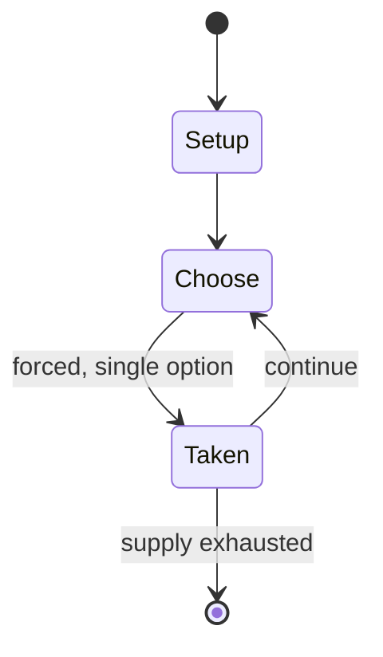

# Ayoayo

*traditional mancala*

`ayoayo` &nbsp; state: **DEEPENED** &nbsp; method: **heuristic**

## Found layer (recorded, not trusted)

| field | value |
| --- | --- |
| wikidata | Q97260584 |
| wikipedia | Ayoayo |
| genres (source) | -- |
| instance of (source) | board game, mancala |
| country of origin | -- |

## Declared layer (orders bench work)

| field | value |
| --- | --- |
| year created | -- |
| epoch | -- |
| region | -- |
| media | MANCALA |
| players | -- |
| age band | -- |
| exogenous process | -- |
| loss shape | -- |
| live axes | TRADE |
| horizon | -- |
| scoring shape | -- |
| information | -- |
| interaction | COMPETITIVE |
| turn structure | -- |
| tractability | SAMPLING_ONLY |
| randomness | -- |
| luck factor | 0.35 |
| rules complexity | 2.06 |
| strategic depth | 2.0 |
| novelty | 1.0 |
| solved status | -- |
| strategies | -- |
| algorithms | -- |

## Object model

```
Episode
  players      : ?
  turn_structure: ?
  horizon       : ?
  scoring       : ?

Pits           -- cyclic array of counts
Store          -- player's banked seeds
Offer          -- proposed exchange between two agents
```

## State transition diagram



## Research item -- turn trace

```
# Ayoayo -- simulated turn events
# generated from the DECLARED vector, not from a rulebook.
# structure: exo=None loss=None horizon=None scoring=None axes=TRADE

t=0    SETUP        players=2  pot=0  capacity=6
t=1    FORCED       p1 single legal option taken (pot_gain=+0.8)
t=2    FORCED       p1 single legal option taken (pot_gain=+1.7)
t=3    FORCED       p1 single legal option taken (pot_gain=+0.9)
t=4    TRADE        p1 offers 2:1 exchange to p2
t=5    FORCED       p1 single legal option taken (pot_gain=+0.6)
t=6    FORCED       p1 single legal option taken (pot_gain=+1.5)
t=7    TRADE        p1 offers 2:1 exchange to p2
t=8    FORCED       p1 single legal option taken (pot_gain=+1.8)
t=9    TRADE        p1 offers 2:1 exchange to p2
t=10   FORCED       p1 single legal option taken (pot_gain=+1.6)
t=11   FORCED       p1 single legal option taken (pot_gain=+1.0)
t=12   TRADE        p1 offers 2:1 exchange to p2
t=13   FORCED       p1 single legal option taken (pot_gain=+1.5)
t=14   FORCED       p1 single legal option taken (pot_gain=+1.7)
t=15   TRADE        p1 offers 2:1 exchange to p2
t=16   FORCED       p1 single legal option taken (pot_gain=+1.2)
t=17   TRADE        p1 offers 2:1 exchange to p2
t=18   FORCED       p1 single legal option taken (pot_gain=+1.2)
t=19   TRADE        p1 offers 2:1 exchange to p2
t=20   FORCED       p1 single legal option taken (pot_gain=+1.3)
t=21   TRADE        p1 offers 2:1 exchange to p2
t=22   FORCED       p1 single legal option taken (pot_gain=+1.7)
t=23   ENDTURN      turn passes to p2
t=24   FORCED       p2 single legal option taken (pot_gain=+1.5)
t=25   FORCED       p2 single legal option taken (pot_gain=+1.2)
t=26   FORCED       p2 single legal option taken (pot_gain=+1.4)

terminal: VARIABLE
```

## Conditions

| kind | threshold | effect | trigger |
| --- | --- | --- | --- |
| TERMINATE | -- | -- | When one of the players cannot move anymore, the game is over. |

## Source extract

Ayo (Yoruba: Ayò Ọlọ́pọ́n) is a traditional mancala played by the Yoruba people in Nigeria. It
is very close to the Oware game that spread to the Americas with the Atlantic slave trade. Among
modern mancalas, which are most often derived from Warri, the Kalah is a notable one that has
essentially the same rules as Ayo. There are games with identical rules also in other areas of
Africa. One such game is Endodoi, played by the Maasai people of Kenya and Tanzania.   == Rules
== The Ayoayo (Ayo) board comprises two rows of six holes each, and 48 seeds are used; at the
beginning, 4 seeds are placed in each hole. These are exactly the same equipment and setup as
those of Awari and many other 2-row mancalas such as Layli Goobalay. Each player owns one of the
rows. Each turn the player takes all seeds from one of the holes and relay sows them
counterclockwise. During each individual sowing, the starting hole is skipped (i.e., no seeds
are dropped there even if more than 12 seeds are to be sown). When the last seed is sown in an
empty hole, the player captures any seen in the opposing hole if this hole belongs to the
player. When one of the players cannot move anymore, the game is over. The

<sub>Wikipedia, CC BY-SA. Retained as evidence for the structural
classification above. Every rule inferred from it is HYPOTHESIZED
until audited against a rulebook.</sub>
