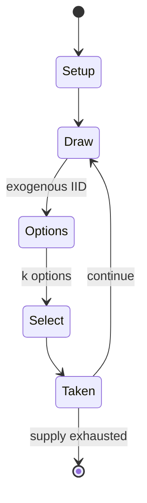

# Azul (board game)

`azul_board_game` &nbsp; state: **DEEPENED** &nbsp; method: **heuristic**

## Found layer (recorded, not trusted)

| field | value |
| --- | --- |
| wikidata | Q44367843 |
| wikipedia | Azul (board game) |
| genres (source) | -- |
| instance of (source) | -- |
| country of origin | -- |

## Declared layer (orders bench work)

| field | value |
| --- | --- |
| year created | 2017 |
| epoch | CONTEMPORARY |
| region | -- |
| media | BOARD, TILE |
| players | 2 |
| age band | -- |
| exogenous process | IID |
| loss shape | -- |
| live axes | SELECT |
| horizon | -- |
| scoring shape | SET_COLLECTION_CONVEX |
| information | -- |
| interaction | SOLITAIRE |
| turn structure | -- |
| tractability | SAMPLING_ONLY |
| randomness | DICE |
| luck factor | 0.35 |
| rules complexity | 1.73 |
| strategic depth | 2.25 |
| novelty | 0.5066 |
| solved status | -- |
| strategies | set_collection |
| algorithms | -- |

## Object model

```
Episode
  players      : 2
  turn_structure: ?
  horizon       : ?
  scoring       : SET_COLLECTION_CONVEX

Board          -- spatial substrate; cells carry position and occupancy
Piece          -- movable token owned by a player
TileBag        -- unordered draw source
Layout         -- placed tiles and their adjacencies
OptionSet      -- the choices available after an exogenous draw
```

## State transition diagram



## Research item -- turn trace

```
# Azul (board game) -- simulated turn events
# generated from the DECLARED vector, not from a rulebook.
# structure: exo=IID loss=None horizon=None scoring=SET_COLLECTION_CONVEX axes=SELECT

t=0    SETUP        players=2  pot=0  capacity=5
t=1    DRAW         p1 roll from d6 pool -> outcome #6  (p=0.277)
t=2    SELECT       p1 1 options; take #1  (pot_gain=+3.2, capacity=-0)
t=3    DRAW         p1 roll from d6 pool -> outcome #5  (p=0.049)
t=4    SELECT       p1 4 options; take #4  (pot_gain=+0.5, capacity=-2)
t=5    DRAW         p1 roll from d6 pool -> outcome #4  (p=0.047)
t=6    SELECT       p1 2 options; take #2  (pot_gain=+2.0, capacity=-1)
t=7    DRAW         p1 roll from d6 pool -> outcome #2  (p=0.250)
t=8    SELECT       p1 2 options; take #2  (pot_gain=+1.5, capacity=-0)
t=9    ENDTURN      turn passes to p2
t=10   DRAW         p2 roll from d6 pool -> outcome #1  (p=0.132)
t=11   SELECT       p2 4 options; take #4  (pot_gain=+1.5, capacity=-2)
t=12   DRAW         p2 roll from d6 pool -> outcome #6  (p=0.211)
t=13   SELECT       p2 3 options; take #3  (pot_gain=+2.0, capacity=-2)
t=14   DRAW         p2 roll from d6 pool -> outcome #6  (p=0.141)
t=15   SELECT       p2 2 options; take #2  (pot_gain=+2.7, capacity=-1)
t=16   DRAW         p2 roll from d6 pool -> outcome #1  (p=0.241)
t=17   SELECT       p2 1 options; take #1  (pot_gain=+2.1, capacity=-2)
t=18   DRAW         p2 roll from d6 pool -> outcome #5  (p=0.161)
t=19   SELECT       p2 4 options; take #2  (pot_gain=+2.5, capacity=-2)
t=20   DRAW         p2 roll from d6 pool -> outcome #3  (p=0.027)
t=21   SELECT       p2 4 options; take #3  (pot_gain=+1.8, capacity=-1)
t=22   DRAW         p2 roll from d6 pool -> outcome #3  (p=0.209)
t=23   SELECT       p2 3 options; take #2  (pot_gain=+2.6, capacity=-1)
t=24   DRAW         p2 roll from d6 pool -> outcome #5  (p=0.222)
t=25   SELECT       p2 4 options; take #2  (pot_gain=+1.9, capacity=-1)
t=26   DRAW         p2 roll from d6 pool -> outcome #1  (p=0.193)
t=27   SELECT       p2 3 options; take #1  (pot_gain=+1.8, capacity=-0)
t=28   ENDTURN      turn passes to p1

terminal: VARIABLE
```

## Conditions

| kind | threshold | effect | trigger |
| --- | --- | --- | --- |
| BOUNDARY | 1 player | -- | Rounds continue until at least one player has made a row of tiles all the way across their 5x5 board. |

## Source extract

Azul (Portuguese for "blue") is an abstract strategy board game designed by Michael Kiesling and
released by Plan B Games in 2017. Based on Portuguese tiles called azulejos, in Azul players
collect sets of similarly colored tiles which they place on their player board. When a row is
filled, one of the tiles is moved into a square pattern on the right side of the player board,
where it garners points depending on where it is placed in relation to other tiles on the board.
== Gameplay ==  From two to four players collect tiles to fill up a 5x5 squares player board.
Players collect tiles by taking all the tiles of one colour from a repository, or from the
centre of the table, and placing them in a row, taking turns until all the tiles for that round
are taken. At that point, one tile from every filled row moves over to each player's 5x5 board,
while the rest of the tiles in the filled row are discarded. Each tile scores based on where it
is placed in relation to other tiles on the board. Rounds continue until at least one player has
made a row of tiles all the way across their 5x5 board.  Additional points are awarded at the
end of the game for each complete row or column, and for e

<sub>Wikipedia, CC BY-SA. Retained as evidence for the structural
classification above. Every rule inferred from it is HYPOTHESIZED
until audited against a rulebook.</sub>
