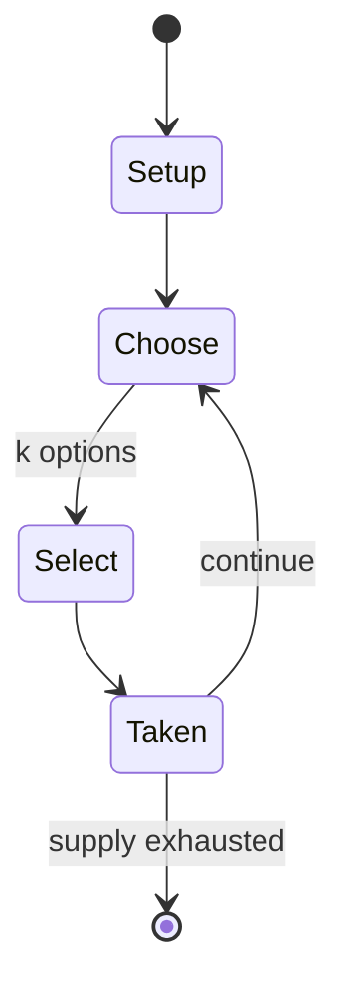

# Bōku

*abstract strategy game*

`b_ku` &nbsp; state: **DEEPENED** &nbsp; method: **heuristic**

## Found layer (recorded, not trusted)

| field | value |
| --- | --- |
| wikidata | Q1022106 |
| wikipedia | Bōku |
| genres (source) | -- |
| instance of (source) | abstract strategy game |
| country of origin | -- |

## Declared layer (orders bench work)

| field | value |
| --- | --- |
| year created | -- |
| epoch | -- |
| region | -- |
| media | ABSTRACT, BOARD |
| players | -- |
| age band | -- |
| exogenous process | -- |
| loss shape | -- |
| live axes | SELECT |
| horizon | -- |
| scoring shape | -- |
| information | -- |
| interaction | COMPETITIVE |
| turn structure | -- |
| tractability | SAMPLING_ONLY |
| randomness | -- |
| luck factor | 0.35 |
| rules complexity | 2.02 |
| strategic depth | 2.0 |
| novelty | 0.3553 |
| solved status | -- |
| strategies | -- |
| algorithms | -- |

## Object model

```
Episode
  players      : ?
  turn_structure: ?
  horizon       : ?
  scoring       : ?

Board          -- spatial substrate; cells carry position and occupancy
Piece          -- movable token owned by a player
OptionSet      -- the choices available after an exogenous draw
```

## State transition diagram



## Research item -- turn trace

```
# Bōku -- simulated turn events
# generated from the DECLARED vector, not from a rulebook.
# structure: exo=None loss=None horizon=None scoring=None axes=SELECT

t=0    SETUP        players=2  pot=0  capacity=6
t=1    SELECT       p1 4 options; take #3  (pot_gain=+1.1, capacity=-0)
t=2    SELECT       p1 2 options; take #2  (pot_gain=+3.5, capacity=-0)
t=3    SELECT       p1 3 options; take #2  (pot_gain=+1.8, capacity=-1)
t=4    ENDTURN      turn passes to p2
t=5    SELECT       p2 2 options; take #2  (pot_gain=+2.5, capacity=-2)
t=6    SELECT       p2 2 options; take #1  (pot_gain=+1.2, capacity=-2)
t=7    SELECT       p2 3 options; take #2  (pot_gain=+3.1, capacity=-2)
t=8    SELECT       p2 2 options; take #1  (pot_gain=+1.4, capacity=-2)
t=9    SELECT       p2 1 options; take #1  (pot_gain=+1.1, capacity=-2)
t=10   SELECT       p2 2 options; take #2  (pot_gain=+2.8, capacity=-2)
t=11   ENDTURN      turn passes to p1
t=12   SELECT       p1 3 options; take #2  (pot_gain=+2.7, capacity=-2)
t=13   ENDTURN      turn passes to p2
t=14   SELECT       p2 3 options; take #3  (pot_gain=+2.6, capacity=-2)
t=15   SELECT       p2 1 options; take #1  (pot_gain=+2.3, capacity=-0)
t=16   SELECT       p2 1 options; take #1  (pot_gain=+3.1, capacity=-1)
t=17   SELECT       p2 1 options; take #1  (pot_gain=+1.7, capacity=-2)
t=18   SELECT       p2 1 options; take #1  (pot_gain=+2.8, capacity=-1)
t=19   SELECT       p2 2 options; take #1  (pot_gain=+1.0, capacity=-1)
t=20   SELECT       p2 2 options; take #2  (pot_gain=+3.1, capacity=-0)
t=21   SELECT       p2 4 options; take #3  (pot_gain=+3.3, capacity=-1)
t=22   SELECT       p2 2 options; take #2  (pot_gain=+1.2, capacity=-2)
t=23   SELECT       p2 3 options; take #1  (pot_gain=+1.0, capacity=-2)
t=24   ENDTURN      turn passes to p1
t=25   SELECT       p1 3 options; take #2  (pot_gain=+2.0, capacity=-1)
t=26   SELECT       p1 1 options; take #1  (pot_gain=+2.8, capacity=-1)
t=27   ENDTURN      turn passes to p2

terminal: VARIABLE
```

## Source extract

Bōku is an abstract strategy board game played with marbles on a perforated hexagonal board with
80 spaces. The object of the game is to arrange five marbles in a row. The game has also been
sold under the name Bollox, and later Bolix and won a Mensa Select award in 1999. Invented by
Rob Nelson, the former Portland Mavericks left-handed pitcher and creator of Big League Chew
bubblegum. The idea for the game came to Nelson in 1991 when he was in London pitching for the
Enfield Spartans. Along with good friend and owner of the Spartans Malcolm Needs they developed
and marketed the game. Distributed by the London Games Company in Europe and Cadaco Toys in
North America, for a time it enjoyed the position of being the best selling two player strategy
games in both Harrods and Hamleys. The game was awarded a Mensa International Gold Star.   ==
Rules == Bōku belongs to the class of connection games ("n-in-a-row" games) similar to Gomoku or
Connect Four. It has two main rules:  the game is won by putting five marbles into a row if a
player traps two of the opponent's marbles between two of their own, the player may remove one
of the sandwiched marbles (and the opponent may not put a marbl

<sub>Wikipedia, CC BY-SA. Retained as evidence for the structural
classification above. Every rule inferred from it is HYPOTHESIZED
until audited against a rulebook.</sub>
