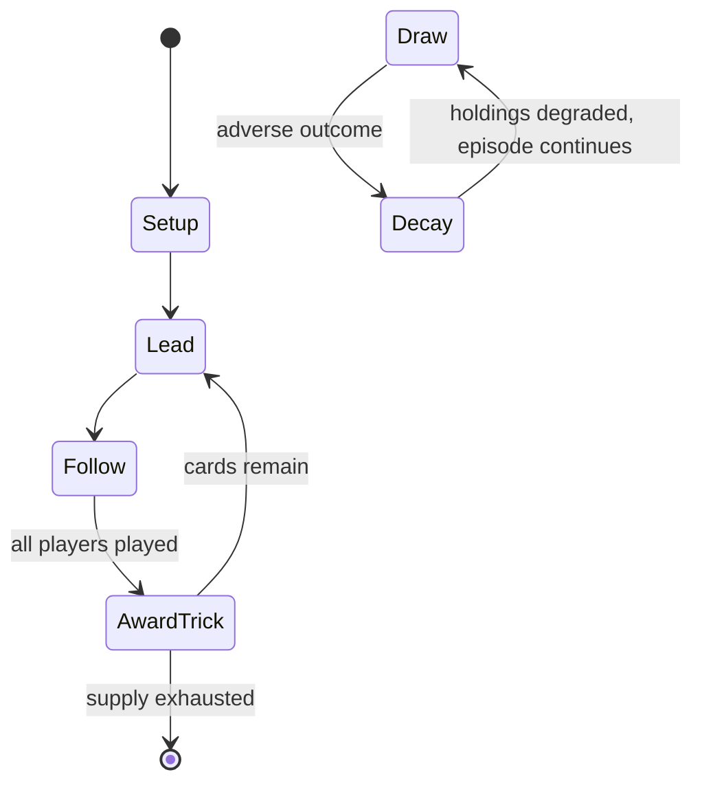

# Bête

`b_te` &nbsp; state: **DEEPENED** &nbsp; method: **heuristic**

## Found layer (recorded, not trusted)

| field | value |
| --- | --- |
| wikidata | Q65066169 |
| wikipedia | Bête |
| genres (source) | -- |
| instance of (source) | -- |
| country of origin | -- |

## Declared layer (orders bench work)

| field | value |
| --- | --- |
| year created | -- |
| epoch | -- |
| region | -- |
| media | CARD, TRICK_TAKING |
| players | -- |
| age band | -- |
| exogenous process | -- |
| loss shape | PARTIAL_DECAY |
| live axes | BID, DISCARD |
| horizon | -- |
| scoring shape | -- |
| information | -- |
| interaction | -- |
| turn structure | TRICK_ROUND |
| tractability | SAMPLING_ONLY |
| randomness | -- |
| luck factor | 0.35 |
| rules complexity | 2.61 |
| strategic depth | 2.25 |
| novelty | 0.6039 |
| solved status | -- |
| strategies | spatial_packing |
| algorithms | -- |

## Object model

```
Episode
  players      : ?
  turn_structure: TRICK_ROUND
  horizon       : ?
  scoring       : ?

Deck           -- ordered multiset, drawn without replacement
Hand           -- private multiset held by one player
DiscardPile    -- public accumulation of spent cards
Trick          -- one card per player; a winner is determined
Trump          -- suit that dominates the ordering
Auction        -- priced competition resolving to one winner
DiscardChoice  -- what is given up to satisfy a limit
```

## State transition diagram



## Research item -- turn trace

```
# Bête -- simulated turn events
# generated from the DECLARED vector, not from a rulebook.
# structure: exo=None loss=PARTIAL_DECAY horizon=None scoring=None axes=BID,DISCARD

t=0    SETUP        players=2  pot=0  capacity=4
t=1    FORCED       p1 single legal option taken (pot_gain=+1.8)
t=2    FORCED       p1 single legal option taken (pot_gain=+2.0)
t=3    DISCARD      p1 discards to hand limit
t=4    FORCED       p1 single legal option taken (pot_gain=+0.5)
t=5    DISCARD      p1 discards to hand limit
t=6    ENDTURN      turn passes to p2
t=7    FORCED       p2 single legal option taken (pot_gain=+1.2)
t=8    BID          p2 sealed bid of 8 against 1 rivals
t=9    DISCARD      p2 discards to hand limit
t=10   FORCED       p2 single legal option taken (pot_gain=+1.6)
t=11   DISCARD      p2 discards to hand limit
t=12   ENDTURN      turn passes to p1
t=13   FORCED       p1 single legal option taken (pot_gain=+1.3)
t=14   BID          p1 sealed bid of 3 against 1 rivals
t=15   DISCARD      p1 discards to hand limit
t=16   ENDTURN      turn passes to p2
t=17   FORCED       p2 single legal option taken (pot_gain=+1.1)
t=18   ENDTURN      turn passes to p1
t=19   FORCED       p1 single legal option taken (pot_gain=+0.6)
t=20   FORCED       p1 single legal option taken (pot_gain=+1.8)
t=21   DISCARD      p1 discards to hand limit
t=22   ENDTURN      turn passes to p2
t=23   FORCED       p2 single legal option taken (pot_gain=+1.6)
t=24   DISCARD      p2 discards to hand limit
t=25   FORCED       p2 single legal option taken (pot_gain=+0.6)
t=26   BID          p2 sealed bid of 2 against 1 rivals
t=27   DISCARD      p2 discards to hand limit

terminal: VARIABLE
```

## Conditions

| kind | threshold | effect | trigger |
| --- | --- | --- | --- |
| BOUNDARY | 5 tricks | -- | Within each deal, the player who becomes the declarer aims to win three of the five tricks or at least the first two, if no one else makes three. |
| WIN | -- | -- | The rules for Bête remained substantially the same for about two centuries, but by 1828, the name seems to have merely become a synonym for the game of Mouche, a game which differed in allowing players to drop out of a d |
| WIN | -- | -- | Player D wins the game and collects 34 jetons: |
| PENALTY | -- | -- | It is named after the bête, a term that referred to the penalty for failing to take the required number of tricks or for various infringements. |
| PENALTY | -- | -- | The term, bête, came to be used in both French and German in various other card games as the name for the stake on a game, the penalty for losing and the loser himself. |
| PENALTY | -- | -- | The 1690 edition of Dictionaire Universel calls it "jeu de la Beste" and states that virevole or dévole was a term used in the game to refer to a player who undertook to win every trick, but failed to win any and had to  |
| PENALTY | -- | -- | Meanwhile the defenders try to prevent the declarer winning, forcing him to pay the penalty known as the bête. |
| PENALTY | -- | -- | The penalty for revoking, or failing to play the appropriate suit when able, is a single bête. |
| PENALTY | -- | -- | If the declarer loses, he 'makes the bête', that is he pays the penalty known as the bête. |
| PENALTY | -- | -- | A type of penalty which a player incurs in various situations, e.g. if he renounces, or if he does not take the tricks required to win. |
| PENALTY | -- | -- | faire la bête = "make the bête" i.e. lose the deal (and pay a penalty equal to the stake) |
| PENALTY | -- | -- | This doubles the win and the penalty for the contre player. |

## Source extract

Bête, la Bête (French: Jeu de la Bête), Beste or la Beste (Jeu de la Beste), originally known as
Homme or l'Homme (Jeu de l'Homme), was an old, French, trick-taking card game, usually for three
to five players. It was a derivative of Triomphe created by introducing the concept of bidding.
Its earlier name gives away its descent from the 16th-century Spanish game of Ombre. It is the
"earliest recorded multi-player version of Triomphe". During the 17th century, the Ombre concept
of bidding was incorporated into Triomphe resulting in the game initially called l'Homme ("Man")
and, later, la Beste or la Bête (German Labet, Dutch LaBate, English Beast). La Bête, or just
Bête or Beast in English, later gave rise to the variants of Mouche and Mistigri, the latter
still being played today. It may also have been antecedent to the games of the Rams family
although it does not share their characteristic of allowing players to drop out of the current
deal if they consider their hand to be too poor. Bête was a gambling game, often played for
small stakes, but was also played as a social and family game. It is named after the bête, a
term that referred to the penalty for failing to take the requi

<sub>Wikipedia, CC BY-SA. Retained as evidence for the structural
classification above. Every rule inferred from it is HYPOTHESIZED
until audited against a rulebook.</sub>
