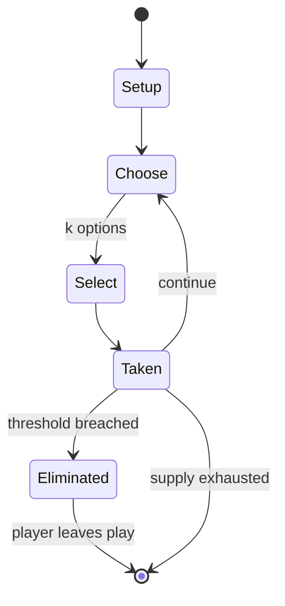

# Ba-awa

*mancala from Ghana*

`ba_awa` &nbsp; state: **DEEPENED** &nbsp; method: **heuristic**

## Found layer (recorded, not trusted)

| field | value |
| --- | --- |
| wikidata | Q268563 |
| wikipedia | Ba-awa |
| genres (source) | -- |
| instance of (source) | board game, mancala |
| country of origin | Ghana |

## Declared layer (orders bench work)

| field | value |
| --- | --- |
| year created | -- |
| epoch | -- |
| region | AFRICA |
| media | MANCALA |
| players | -- |
| age band | -- |
| exogenous process | -- |
| loss shape | ELIMINATION |
| live axes | SELECT |
| horizon | -- |
| scoring shape | -- |
| information | -- |
| interaction | -- |
| turn structure | STRICT_TURN |
| tractability | SAMPLING_ONLY |
| randomness | -- |
| luck factor | 0.35 |
| rules complexity | 2.11 |
| strategic depth | 2.0 |
| novelty | 0.559 |
| solved status | -- |
| strategies | -- |
| algorithms | -- |

## Object model

```
Episode
  players      : ?
  turn_structure: STRICT_TURN
  horizon       : ?
  scoring       : ?

Pits           -- cyclic array of counts
Store          -- player's banked seeds
OptionSet      -- the choices available after an exogenous draw
```

## State transition diagram



## Research item -- turn trace

```
# Ba-awa -- simulated turn events
# generated from the DECLARED vector, not from a rulebook.
# structure: exo=None loss=ELIMINATION horizon=None scoring=None axes=SELECT

t=0    SETUP        players=2  pot=0  capacity=7
t=1    SELECT       p1 1 options; take #1  (pot_gain=+3.0, capacity=-0)
t=2    SELECT       p1 1 options; take #1  (pot_gain=+2.5, capacity=-1)
t=3    SELECT       p1 4 options; take #3  (pot_gain=+3.2, capacity=-1)
t=4    SELECT       p1 3 options; take #2  (pot_gain=+3.4, capacity=-0)
t=5    ENDTURN      turn passes to p2
t=6    SELECT       p2 3 options; take #2  (pot_gain=+0.9, capacity=-0)
t=7    SELECT       p2 1 options; take #1  (pot_gain=+2.7, capacity=-1)
t=8    SELECT       p2 2 options; take #2  (pot_gain=+1.6, capacity=-1)
t=9    SELECT       p2 3 options; take #3  (pot_gain=+3.3, capacity=-2)
t=10   ENDTURN      turn passes to p1
t=11   SELECT       p1 1 options; take #1  (pot_gain=+0.8, capacity=-0)
t=12   ENDTURN      turn passes to p2
t=13   SELECT       p2 2 options; take #1  (pot_gain=+0.8, capacity=-2)
t=14   ENDTURN      turn passes to p1
t=15   SELECT       p1 3 options; take #2  (pot_gain=+2.3, capacity=-0)
t=16   SELECT       p1 1 options; take #1  (pot_gain=+1.4, capacity=-0)
t=17   SELECT       p1 3 options; take #1  (pot_gain=+1.1, capacity=-0)
t=18   ENDTURN      turn passes to p2
t=19   SELECT       p2 1 options; take #1  (pot_gain=+1.3, capacity=-1)
t=20   SELECT       p2 2 options; take #2  (pot_gain=+1.3, capacity=-2)
t=21   SELECT       p2 1 options; take #1  (pot_gain=+1.5, capacity=-1)
t=22   ENDTURN      turn passes to p1
t=23   SELECT       p1 2 options; take #2  (pot_gain=+2.7, capacity=-1)
t=24   ENDTURN      turn passes to p2
t=25   SELECT       p2 1 options; take #1  (pot_gain=+0.7, capacity=-2)
t=26   SELECT       p2 1 options; take #1  (pot_gain=+2.0, capacity=-0)

terminal: VARIABLE
```

## Conditions

| kind | threshold | effect | trigger |
| --- | --- | --- | --- |
| ELIMINATE | -- | -- | If at any time during sowing, a pit has exactly four seeds, all four are immediately captured and removed from play. |
| TERMINATE | -- | -- | When there are just eight seeds left on the board, the player who began the game takes these and the game ends. |

## Source extract

Ba-awa is a variant of the game of mancala originating in Ghana. Although played in some of the
same regions as Oware, it is simpler and in traditional societies is considered a game for women
and children. Ba-awa is related to games j'erin and obridjie played in Nigeria. It is also
similar to mancala game anywoli played at the Ethiopian-Sudanese border.    == Rules == These
are the rules as used by the Twi, an Akan people from Ghana.   === Equipment === The Ba-awa
board has six pits in front of each player, and (optionally) one pit at each end which stores
captured seeds.   The only pieces are 48 undifferentiated seeds or other small objects.   ===
Setup === Typically, several games are played in a row. At the beginning of the first game four
seeds are placed in each pit except the end pits.  Subsequent games also begin with four seeds
in each pit, however the ownership of the pits may have changed.   === Object === The nominal
object of a match is to gain control of all the pits on the board; however, this is so hard the
game is usually only played to ten or eleven pits.   === Sowing === Players take turns moving
the seeds.  On a turn, a player chooses one of the pits under their

<sub>Wikipedia, CC BY-SA. Retained as evidence for the structural
classification above. Every rule inferred from it is HYPOTHESIZED
until audited against a rulebook.</sub>
