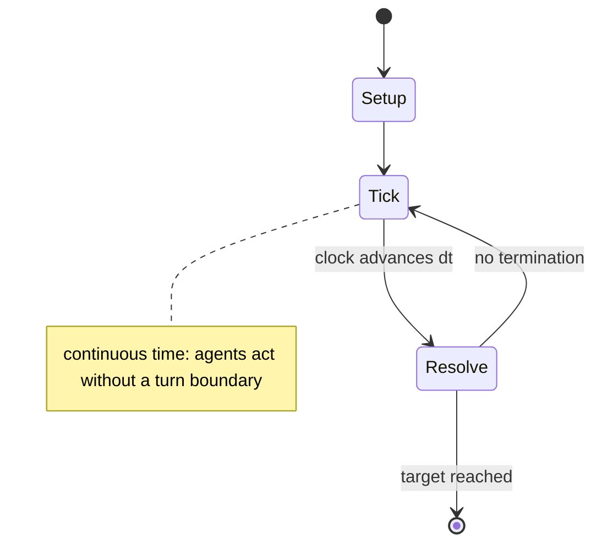

# Backgammon

`backgammon` &nbsp; state: **DEEPENED** &nbsp; method: **heuristic**

## Found layer (recorded, not trusted)

| field | value |
| --- | --- |
| wikidata | Q11411 |
| wikipedia | Backgammon |
| genres (source) | -- |
| instance of (source) | -- |
| country of origin | -- |

## Declared layer (orders bench work)

| field | value |
| --- | --- |
| year created | -2600 |
| epoch | DEEP_ANTIQUITY |
| region | -- |
| media | BOARD, DICE |
| players | -- |
| age band | -- |
| exogenous process | IID |
| loss shape | -- |
| live axes | SELECT |
| horizon | RACE_TO_TARGET |
| scoring shape | RACE_POSITION |
| information | SIMULTANEOUS |
| interaction | COMPETITIVE |
| turn structure | REAL_TIME |
| tractability | EXACT_WITH_CUT |
| randomness | DICE |
| luck factor | 0.58 |
| rules complexity | 2.42 |
| strategic depth | 2.67 |
| novelty | 0.6819 |
| solved status | -- |
| strategies | opening_theory, probability_estimation |
| algorithms | opening_book |

## Object model

```
Episode
  players      : ?
  turn_structure: REAL_TIME
  horizon       : RACE_TO_TARGET
  scoring       : RACE_POSITION

Board          -- spatial substrate; cells carry position and occupancy
Piece          -- movable token owned by a player
DicePool       -- n dice, each an iid categorical draw
Roll           -- realised outcome of a pool
OptionSet      -- the choices available after an exogenous draw
```

## State transition diagram



## Research item -- clock trace

```
# Backgammon -- simulated clock trace (no turn boundary)
# generated from the DECLARED vector, not from a rulebook.
# structure: exo=IID loss=None horizon=RACE_TO_TARGET scoring=RACE_POSITION axes=SELECT

clk=0.000s  START        agents=4  clock=free running
clk=1.737s  CONTEST      a1 and a2 contend for the same resource
clk=2.838s  SCORE        a3 scores (+2)
clk=5.012s  STOPPAGE     clock halts; state frozen
clk=6.546s  INFRACTION   a4 commits infraction (count=1)
clk=8.869s  ACTION       a3 acts continuously; no turn boundary crossed
clk=11.386s  ACTION       a4 acts continuously; no turn boundary crossed
clk=12.315s  CONTEST      a2 and a3 contend for the same resource
clk=13.940s  INFRACTION   a2 commits infraction (count=1)
clk=16.923s  INFRACTION   a1 commits infraction (count=1)
clk=17.679s  CONTEST      a4 and a1 contend for the same resource
clk=19.755s  SCORE        a2 scores (+3)
clk=22.181s  ACTION       a4 acts continuously; no turn boundary crossed
clk=24.693s  STOPPAGE     clock halts; state frozen
clk=27.508s  CONTEST      a1 and a2 contend for the same resource
clk=29.011s  ACTION       a2 acts continuously; no turn boundary crossed
clk=31.810s  ACTION       a2 acts continuously; no turn boundary crossed
clk=32.141s  CONTEST      a4 and a1 contend for the same resource
clk=33.692s  ACTION       a4 acts continuously; no turn boundary crossed
clk=34.185s  CONTEST      a2 and a3 contend for the same resource
clk=36.338s  ACTION       a2 acts continuously; no turn boundary crossed
clk=39.059s  SCORE        a4 scores (+2)
clk=40.897s  ACTION       a3 acts continuously; no turn boundary crossed
clk=41.196s  CONTEST      a2 and a3 contend for the same resource
clk=41.570s  INFRACTION   a2 commits infraction (count=2)
clk=44.256s  INFRACTION   a1 commits infraction (count=2)
clk=45.853s  ACTION       a3 acts continuously; no turn boundary crossed

note: elapsed time, not move count, is the episode's ordering variable.
```

## Conditions

| kind | threshold | effect | trigger |
| --- | --- | --- | --- |
| TERMINATE | 100 points | -- | If the doubling cube was accessible they could offer the cube and increase their equity to 1: either their opponent passes the cube and the game is over, or their opponent takes the cube and loses 100 points per 100 game |
| BOUNDARY | 6 points | -- | If the opponent's home board is completely "closed" (i.e. all six points are each occupied by two or more pieces), there is no roll that will allow a player to enter a piece from the bar, and that player stops rolling an |
| BOUNDARY | 15 pieces | -- | A player who bears off all fifteen pieces when the opponent has borne off at least one, wins a single game worth 1 point. |
| BOUNDARY | 1 piece | -- | If all fifteen have been borne off before the opponent gets at least one piece off, this is a gammon or double game worth 2 points. |
| WIN | -- | awarded to the first player to reach a certain n | As the playing time for each individual game is short, it is often played in matches where victory is awarded to the first player to reach a certain number of points. |
| WIN | -- | -- | The first player to bear off all fifteen of their own pieces wins the game. |
| WIN | -- | -- | In a match, the objective is not to win the maximum possible number of points, but rather to simply reach the score needed to win the match, so optimal play may depend on the match score. |
| LOSE | -- | -- | If the opponent drops the doubled stakes, they lose the game at the current value of the doubling cube. |
| LOSE | -- | -- | Misere (backgammon to lose) is a variant of backgammon in which the objective is to lose the game. |
| BOUNDARY | -- | -- | It is the most widespread Western member of the large family of tables games, whose ancestors date back at least 1,600 years. |
| BOUNDARY | -- | -- | The dimensions of a board when opened, for a tournament game, should be at a minimum of 44 cm by 55 cm to a maximum of 66 cm by 88 cm. |
| BOUNDARY | -- | -- | If the Crawford rule is in effect, then another option is the "Holland rule", named after Tim Holland, which stipulates that after the Crawford game, a player cannot double until after at least two rolls have been played |
| BOUNDARY | -- | -- | For instance, only allowing a maximum of five men on any point (Britain) or disallowing "hit-and-run" in the home board (Middle East). |
| BOUNDARY | -- | -- | The live cube model assumes a maximum value for sole cube access (i.e. that the taker may use the cube most efficiently by either raising the stakes or doubling out the opponent). |
| PENALTY | -- | -- | If one or both numbers do not allow a legal move, the player forfeits that portion of the roll and the turn ends. |

## Source extract

Backgammon is a two-player board game played with counters and dice on tables boards. It is the
most widespread Western member of the large family of tables games, whose ancestors date back at
least 1,600 years. The earliest record of backgammon itself dates to 17th-century England, being
descended from the 16th-century game of Irish. Backgammon is a two-player game of contrary
movement in which each player has 15 pieces known traditionally as men (short for "tablemen"),
but increasingly known as "checkers" in the United States in recent decades. The backgammon
table pieces move along 24 "points" according to the roll of two dice. The objective of the game
is to move the 15 pieces around the board and be first to bear off, i.e., remove them from the
board. The achievement of this while the opponent is still a long way behind results in a triple
win known as a backgammon, hence the name of the game. Backgammon involves a combination of
strategy and luck from rolling of the dice. While the dice may determine the outcome of a single
game, the better player will accumulate the better record over a series of many games. With each
roll of the dice, players must choose from numerous optio

<sub>Wikipedia, CC BY-SA. Retained as evidence for the structural
classification above. Every rule inferred from it is HYPOTHESIZED
until audited against a rulebook.</sub>
