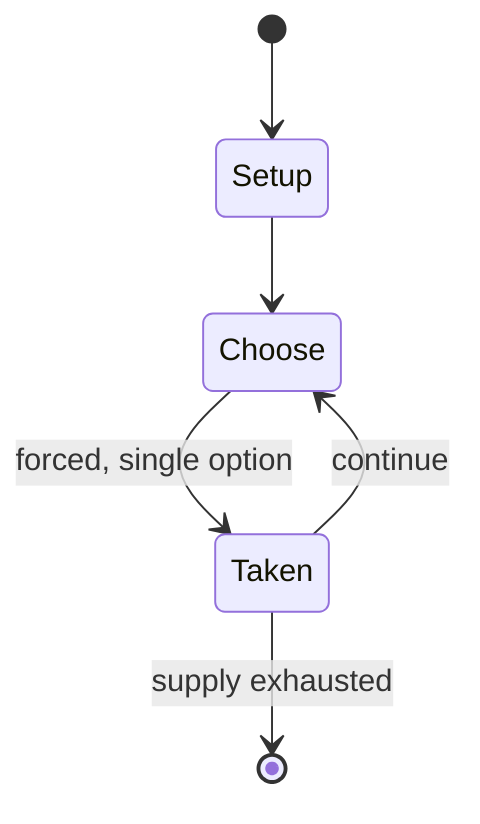

# Bagh-Chal

`bagh_chal` &nbsp; state: **DEEPENED** &nbsp; method: **heuristic**

## Found layer (recorded, not trusted)

| field | value |
| --- | --- |
| wikidata | -- |
| wikipedia | Bagh-Chal |
| genres (source) | -- |
| instance of (source) | -- |
| country of origin | -- |

## Declared layer (orders bench work)

| field | value |
| --- | --- |
| year created | -- |
| epoch | -- |
| region | -- |
| media | BOARD |
| players | -- |
| age band | -- |
| exogenous process | -- |
| loss shape | -- |
| live axes | SPATIAL |
| horizon | -- |
| scoring shape | -- |
| information | ASYMMETRIC |
| interaction | SOLITAIRE |
| turn structure | -- |
| tractability | SAMPLING_ONLY |
| randomness | -- |
| luck factor | 0.35 |
| rules complexity | 2.11 |
| strategic depth | 2.25 |
| novelty | 0.5807 |
| solved status | -- |
| strategies | sacrifice |
| algorithms | -- |

## Object model

```
Episode
  players      : ?
  turn_structure: ?
  horizon       : ?
  scoring       : ?

Board          -- spatial substrate; cells carry position and occupancy
Piece          -- movable token owned by a player
Placement      -- position subject to geometric legality
```

## State transition diagram



## Research item -- turn trace

```
# Bagh-Chal -- simulated turn events
# generated from the DECLARED vector, not from a rulebook.
# structure: exo=None loss=None horizon=None scoring=None axes=SPATIAL

t=0    SETUP        players=2  pot=0  capacity=3
t=1    FORCED       p1 single legal option taken (pot_gain=+0.7)
t=2    SPATIAL      p1 places at (0,0); adjacency legal
t=3    FORCED       p1 single legal option taken (pot_gain=+0.6)
t=4    ENDTURN      turn passes to p2
t=5    FORCED       p2 single legal option taken (pot_gain=+1.8)
t=6    SPATIAL      p2 places at (4,5); adjacency legal
t=7    ENDTURN      turn passes to p1
t=8    FORCED       p1 single legal option taken (pot_gain=+1.7)
t=9    SPATIAL      p1 places at (4,2); adjacency legal
t=10   ENDTURN      turn passes to p2
t=11   FORCED       p2 single legal option taken (pot_gain=+1.2)
t=12   ENDTURN      turn passes to p1
t=13   FORCED       p1 single legal option taken (pot_gain=+1.2)
t=14   FORCED       p1 single legal option taken (pot_gain=+0.9)
t=15   ENDTURN      turn passes to p2
t=16   FORCED       p2 single legal option taken (pot_gain=+1.4)
t=17   SPATIAL      p2 places at (0,5); adjacency legal
t=18   FORCED       p2 single legal option taken (pot_gain=+0.6)
t=19   FORCED       p2 single legal option taken (pot_gain=+1.8)
t=20   FORCED       p2 single legal option taken (pot_gain=+1.7)
t=21   SPATIAL      p2 places at (2,7); adjacency legal
t=22   FORCED       p2 single legal option taken (pot_gain=+1.1)
t=23   FORCED       p2 single legal option taken (pot_gain=+1.1)
t=24   SPATIAL      p2 places at (1,2); adjacency legal
t=25   FORCED       p2 single legal option taken (pot_gain=+1.3)
t=26   FORCED       p2 single legal option taken (pot_gain=+1.4)
t=27   SPATIAL      p2 places at (1,6); adjacency legal

terminal: VARIABLE
```

## Conditions

| kind | threshold | effect | trigger |
| --- | --- | --- | --- |
| TERMINATE | -- | -- | The game is over when either the tigers capture five goats or the goats have blocked the tigers from being able to move. |

## Source extract

Bagh-chal (Nepali:  bāgh cāl, Newar: धुँ कासा dhun kasa meaning "tiger game") is a strategic,
two-player board game that originated in Nepal. The game is asymmetric in that one player
controls four tigers and the other player controls up to twenty goats. The tigers 'hunt' the
goats while the goats attempt to block the tigers' movements. This game is also seen in southern
India with a different board, but the rules are the same. This game is popular in rural areas of
the country.   == Overview == The game is played on a 5×5 point grid, like alquerque. Pieces are
positioned at the intersection of the lines and not inside the areas delimited by them.
Directions of valid movement between these points are connected by lines. The game play takes
place in two phases. In the first phase the goats are placed on the board while the tigers are
moved. In the second phase both the goats and the tigers are moved. For the tigers, the
objective is to "capture" five goats to win. Capturing is performed as in alquerque and
draughts, by jumping over the goats, although capturing is not obligatory. The goats win by
blocking all the tigers' legal moves. Bagh-chal has many similarities to the Indian gam

<sub>Wikipedia, CC BY-SA. Retained as evidence for the structural
classification above. Every rule inferred from it is HYPOTHESIZED
until audited against a rulebook.</sub>
