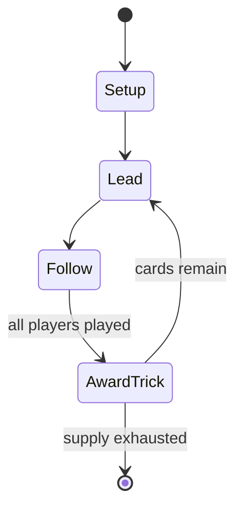

# Baloot

*variant of Belote popular in Gulf Arab countries*

`baloot` &nbsp; state: **DEEPENED** &nbsp; method: **heuristic**

## Found layer (recorded, not trusted)

| field | value |
| --- | --- |
| wikidata | Q1787445 |
| wikipedia | Baloot |
| genres (source) | -- |
| instance of (source) | trick-taking game |
| country of origin | -- |

## Declared layer (orders bench work)

| field | value |
| --- | --- |
| year created | -- |
| epoch | -- |
| region | -- |
| media | CARD, TRICK_TAKING |
| players | -- |
| age band | -- |
| exogenous process | DEPLETING_DECK |
| loss shape | -- |
| live axes | SELECT |
| horizon | -- |
| scoring shape | -- |
| information | -- |
| interaction | COMPETITIVE |
| turn structure | TRICK_ROUND |
| tractability | SAMPLING_ONLY |
| randomness | DECK_SHUFFLE |
| luck factor | 0.35 |
| rules complexity | 2.14 |
| strategic depth | 2.0 |
| novelty | 0.5194 |
| solved status | -- |
| strategies | probability_estimation, spatial_packing |
| algorithms | -- |

## Object model

```
Episode
  players      : ?
  turn_structure: TRICK_ROUND
  horizon       : ?
  scoring       : ?

Deck           -- ordered multiset, drawn without replacement
Hand           -- private multiset held by one player
DiscardPile    -- public accumulation of spent cards
Trick          -- one card per player; a winner is determined
Trump          -- suit that dominates the ordering
OptionSet      -- the choices available after an exogenous draw
```

## State transition diagram



## Research item -- turn trace

```
# Baloot -- simulated turn events
# generated from the DECLARED vector, not from a rulebook.
# structure: exo=DEPLETING_DECK loss=None horizon=None scoring=None axes=SELECT

t=0    SETUP        players=2  pot=0  capacity=7
t=1    DRAW         p1 draw from deck -> outcome #2  (p=0.207)
t=2    SELECT       p1 3 options; take #1  (pot_gain=+2.5, capacity=-2)
t=3    DRAW         p1 draw from deck -> outcome #6  (p=0.152)
t=4    SELECT       p1 3 options; take #3  (pot_gain=+2.0, capacity=-2)
t=5    ENDTURN      turn passes to p2
t=6    DRAW         p2 draw from deck -> outcome #4  (p=0.123)
t=7    SELECT       p2 2 options; take #2  (pot_gain=+2.9, capacity=-1)
t=8    DRAW         p2 draw from deck -> outcome #5  (p=0.070)
t=9    SELECT       p2 2 options; take #1  (pot_gain=+3.0, capacity=-2)
t=10   ENDTURN      turn passes to p1
t=11   DRAW         p1 draw from deck -> outcome #4  (p=0.173)
t=12   SELECT       p1 3 options; take #3  (pot_gain=+2.2, capacity=-2)
t=13   DRAW         p1 draw from deck -> outcome #5  (p=0.118)
t=14   SELECT       p1 4 options; take #4  (pot_gain=+2.8, capacity=-0)
t=15   DRAW         p1 draw from deck -> outcome #5  (p=0.249)
t=16   SELECT       p1 3 options; take #1  (pot_gain=+2.1, capacity=-0)
t=17   ENDTURN      turn passes to p2
t=18   DRAW         p2 draw from deck -> outcome #4  (p=0.209)
t=19   SELECT       p2 4 options; take #4  (pot_gain=+2.5, capacity=-0)
t=20   DRAW         p2 draw from deck -> outcome #2  (p=0.135)
t=21   SELECT       p2 2 options; take #2  (pot_gain=+1.0, capacity=-1)
t=22   DRAW         p2 draw from deck -> outcome #4  (p=0.260)
t=23   SELECT       p2 3 options; take #2  (pot_gain=+0.6, capacity=-2)
t=24   ENDTURN      turn passes to p1
t=25   DRAW         p1 draw from deck -> outcome #3  (p=0.010)
t=26   SELECT       p1 1 options; take #1  (pot_gain=+2.6, capacity=-1)

terminal: VARIABLE
```

## Conditions

| kind | threshold | effect | trigger |
| --- | --- | --- | --- |
| WIN | 152 points | -- | Or he/she should play one of the Judges cards in case of Hokom rounds. each trick score should be added to the total scores until one of the team reaches the 152 points and win the game. |

## Source extract

Baloot (Arabic: بلوت, romanized: balūt), is a popular trick card game played in the Arabian
Peninsula, which is similar to the French game Belote.   == The game == There are four players
in partnerships of two teams. A standard 32-card Piquet pack is used, eight for each player.
There are two contracts: Hokum and Sun (from the French sans). The card ranking is:   === Sun
(suit) ===   === Hokom (Trump) === Assume the Hokom suit is the Sherya (Clubs) ♣ (for example)
== Starting the game ==  The two members of each team are seated across each other at a table in
such a way that no player can see the cards of other players . The first dealer is chosen at
random and after each hand the turn to deal passes to the right.  The cards are shuffled by the
dealer, and cut by the player on the left.  The player on the left of the dealer can either say
"go" without cutting the deck, shuffling it (just once), take the first card as the public card,
can give the bottom three cards to the teammate or keep them for themselves, or take the top
three cards to themselves. If the dealer gives a player a card and was mistakenly flipped, the
player has no right to refuse it, unless it is an Ace, then t

<sub>Wikipedia, CC BY-SA. Retained as evidence for the structural
classification above. Every rule inferred from it is HYPOTHESIZED
until audited against a rulebook.</sub>
