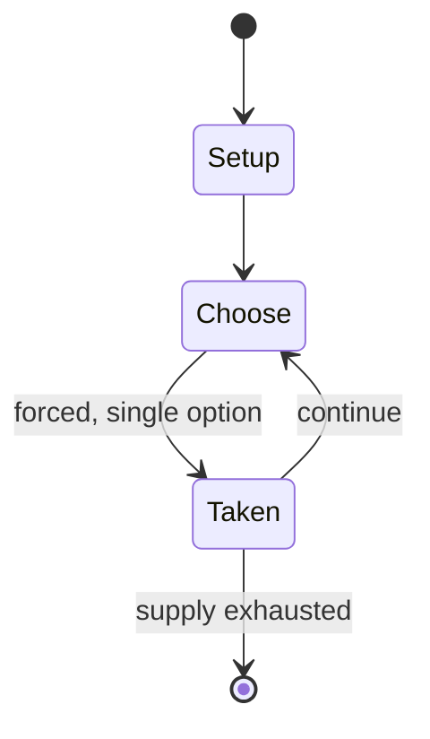

# Bando (sport)

`bando_sport` &nbsp; state: **DEEPENED** &nbsp; method: **heuristic**

## Found layer (recorded, not trusted)

| field | value |
| --- | --- |
| wikidata | Q4854656 |
| wikipedia | Bando (sport) |
| genres (source) | -- |
| instance of (source) | -- |
| country of origin | -- |

## Declared layer (orders bench work)

| field | value |
| --- | --- |
| year created | -- |
| epoch | -- |
| region | -- |
| media | SPORT |
| players | -- |
| age band | -- |
| exogenous process | -- |
| loss shape | -- |
| live axes | - |
| horizon | -- |
| scoring shape | SET_COLLECTION_CONVEX |
| information | -- |
| interaction | COMPETITIVE |
| turn structure | -- |
| tractability | SAMPLING_ONLY |
| randomness | -- |
| luck factor | 0.35 |
| rules complexity | 1.72 |
| strategic depth | 2.0 |
| novelty | 0.3528 |
| solved status | -- |
| strategies | route_optimisation, set_collection |
| algorithms | -- |

## Object model

```
Episode
  players      : ?
  turn_structure: ?
  horizon       : ?
  scoring       : SET_COLLECTION_CONVEX

Pitch          -- bounded physical region
Player         -- embodied agent with a foul count
Clock          -- counts down; stoppages are rule events
Official       -- detects infractions and applies penalties
```

## State transition diagram



## Research item -- turn trace

```
# Bando (sport) -- simulated turn events
# generated from the DECLARED vector, not from a rulebook.
# structure: exo=None loss=None horizon=None scoring=SET_COLLECTION_CONVEX axes=-

t=0    SETUP        players=2  pot=0  capacity=8
t=1    FORCED       p1 single legal option taken (pot_gain=+1.6)
t=2    FORCED       p1 single legal option taken (pot_gain=+1.6)
t=3    ENDTURN      turn passes to p2
t=4    FORCED       p2 single legal option taken (pot_gain=+1.1)
t=5    FORCED       p2 single legal option taken (pot_gain=+0.7)
t=6    FORCED       p2 single legal option taken (pot_gain=+0.5)
t=7    FORCED       p2 single legal option taken (pot_gain=+0.8)
t=8    FORCED       p2 single legal option taken (pot_gain=+1.5)
t=9    FORCED       p2 single legal option taken (pot_gain=+1.7)
t=10   FORCED       p2 single legal option taken (pot_gain=+1.8)
t=11   FORCED       p2 single legal option taken (pot_gain=+1.9)
t=12   FORCED       p2 single legal option taken (pot_gain=+1.7)
t=13   FORCED       p2 single legal option taken (pot_gain=+1.1)
t=14   FORCED       p2 single legal option taken (pot_gain=+1.1)
t=15   FORCED       p2 single legal option taken (pot_gain=+0.9)
t=16   FORCED       p2 single legal option taken (pot_gain=+0.9)
t=17   ENDTURN      turn passes to p1
t=18   FORCED       p1 single legal option taken (pot_gain=+1.2)
t=19   ENDTURN      turn passes to p2
t=20   FORCED       p2 single legal option taken (pot_gain=+1.7)
t=21   FORCED       p2 single legal option taken (pot_gain=+1.6)
t=22   FORCED       p2 single legal option taken (pot_gain=+1.4)
t=23   FORCED       p2 single legal option taken (pot_gain=+1.4)
t=24   FORCED       p2 single legal option taken (pot_gain=+1.8)
t=25   FORCED       p2 single legal option taken (pot_gain=+0.7)
t=26   ENDTURN      turn passes to p1

terminal: VARIABLE
```

## Source extract

Bando is a team sport – related to field hockey, hurling, shinty, and bandy – which was first
recorded in Wales in the eighteenth century. A bando game is played on a large level field
between teams of up to thirty players each of them equipped with a bando: a curve-ended stick
resembling that used in field hockey. Although no formal rules are known, the objective of the
game was to strike a ball between two marks which served as goals at either end of the pitch.
Popular in Glamorgan in the nineteenth century, the sport all but vanished by the end of the
century.   == History == Bando is believed to have common origins with games like bandy. The
game was first recorded in the late eighteenth century, and in 1797 a traveller en route from
Cowbridge to Pyle noted "the extraordinary barrenness" of the locality in ash and elm trees,
hard woods ideal for bando bats, and came across hordes of people hastening to the sea shore to
watch a game of bando. Whereas the sticks were made of hard wood, the ball, known as a "colby",
was normally of yew, box or crabapple. The sport was often played between local villages, with
fierce rivalries in the west of Glamorgan between Baglan, Aberavon and M

<sub>Wikipedia, CC BY-SA. Retained as evidence for the structural
classification above. Every rule inferred from it is HYPOTHESIZED
until audited against a rulebook.</sub>
