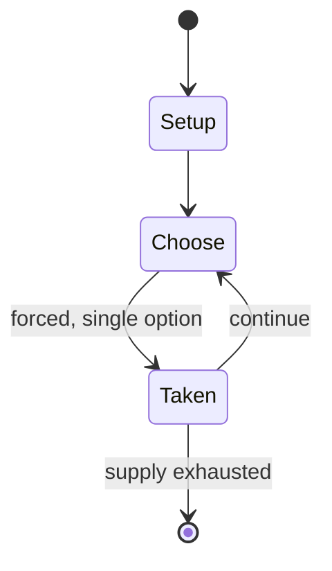

# Bang!

*party game*

`bang` &nbsp; state: **DEEPENED** &nbsp; method: **heuristic**

## Found layer (recorded, not trusted)

| field | value |
| --- | --- |
| wikidata | Q4854891 |
| wikipedia | Bang! (drama game) |
| genres (source) | -- |
| instance of (source) | party game |
| country of origin | -- |

## Declared layer (orders bench work)

| field | value |
| --- | --- |
| year created | -- |
| epoch | -- |
| region | -- |
| media | PARTY |
| players | -- |
| age band | -- |
| exogenous process | -- |
| loss shape | -- |
| live axes | - |
| horizon | -- |
| scoring shape | -- |
| information | -- |
| interaction | -- |
| turn structure | -- |
| tractability | SAMPLING_ONLY |
| randomness | -- |
| luck factor | 0.35 |
| rules complexity | 1.86 |
| strategic depth | 2.0 |
| novelty | 0.0938 |
| solved status | -- |
| strategies | tableau_building |
| algorithms | -- |

## Object model

```
Episode
  players      : ?
  turn_structure: ?
  horizon       : ?
  scoring       : ?

State          -- opaque; no medium or axis evidence was found
Player         -- an agent that selects among legal successors
```

## State transition diagram



## Research item -- turn trace

```
# Bang! -- simulated turn events
# generated from the DECLARED vector, not from a rulebook.
# structure: exo=None loss=None horizon=None scoring=None axes=-

t=0    SETUP        players=2  pot=0  capacity=5
t=1    FORCED       p1 single legal option taken (pot_gain=+0.9)
t=2    ENDTURN      turn passes to p2
t=3    FORCED       p2 single legal option taken (pot_gain=+0.8)
t=4    FORCED       p2 single legal option taken (pot_gain=+2.0)
t=5    ENDTURN      turn passes to p1
t=6    FORCED       p1 single legal option taken (pot_gain=+2.0)
t=7    FORCED       p1 single legal option taken (pot_gain=+1.9)
t=8    FORCED       p1 single legal option taken (pot_gain=+0.8)
t=9    FORCED       p1 single legal option taken (pot_gain=+2.0)
t=10   ENDTURN      turn passes to p2
t=11   FORCED       p2 single legal option taken (pot_gain=+1.8)
t=12   ENDTURN      turn passes to p1
t=13   FORCED       p1 single legal option taken (pot_gain=+0.7)
t=14   FORCED       p1 single legal option taken (pot_gain=+0.6)
t=15   FORCED       p1 single legal option taken (pot_gain=+1.6)
t=16   ENDTURN      turn passes to p2
t=17   FORCED       p2 single legal option taken (pot_gain=+0.8)
t=18   ENDTURN      turn passes to p1
t=19   FORCED       p1 single legal option taken (pot_gain=+0.9)
t=20   FORCED       p1 single legal option taken (pot_gain=+0.7)
t=21   FORCED       p1 single legal option taken (pot_gain=+0.8)
t=22   FORCED       p1 single legal option taken (pot_gain=+1.2)
t=23   FORCED       p1 single legal option taken (pot_gain=+2.0)
t=24   ENDTURN      turn passes to p2
t=25   FORCED       p2 single legal option taken (pot_gain=+1.6)
t=26   FORCED       p2 single legal option taken (pot_gain=+0.8)
t=27   ENDTURN      turn passes to p1

terminal: VARIABLE
```

## Conditions

| kind | threshold | effect | trigger |
| --- | --- | --- | --- |
| BOUNDARY | -- | -- | Tableaux are frozen scenes and usually involve at least three levels. |

## Source extract

There are many methods for teaching drama. Each strategy involves varying levels of student
participation.   == Drama games == Drama games, activities and exercises are often used to
introduce students to drama. These activities tend to be less intrusive and are highly
participatory (e.g. Bang). There are several books that have been written on using drama games.
Games for Actors and Non-Actors by Augusto Boal includes writings on his life work as well as
hundreds of games. There are also smaller books. For example, Drama Games by Bernie Warren is an
excellent pocket book for someone looking to try drama games for the first time.   == Choral
speaking == Choral dramatization involves students reading aloud by assigning parts to each
group member, and can use texts such as rhymes, poetry and picture books. Students can
experiment with voice, sound gesture and movement.   == Tableaux == Tableaux involve students
creating visual pictures with their bodies, emphasizing key details and relationships. Tableaux
are frozen scenes and usually involve at least three levels. Students focus on a focal point,
facial expressions, and body language. This technique is useful for maturing participan

<sub>Wikipedia, CC BY-SA. Retained as evidence for the structural
classification above. Every rule inferred from it is HYPOTHESIZED
until audited against a rulebook.</sub>
