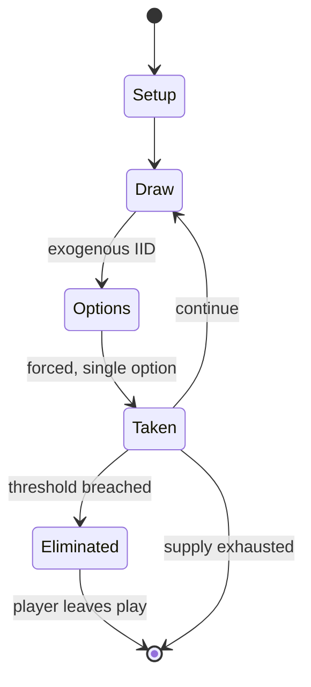

# Bang! (card game)

`bang_card_game` &nbsp; state: **DEEPENED** &nbsp; method: **heuristic**

## Found layer (recorded, not trusted)

| field | value |
| --- | --- |
| wikidata | Q17277 |
| wikipedia | Bang! (card game) |
| genres (source) | -- |
| instance of (source) | -- |
| country of origin | -- |

## Declared layer (orders bench work)

| field | value |
| --- | --- |
| year created | 2002 |
| epoch | CONTEMPORARY |
| region | -- |
| media | CARD, DICE, TILE, VIDEO |
| players | -- |
| age band | -- |
| exogenous process | IID |
| loss shape | ELIMINATION |
| live axes | DISCARD |
| horizon | -- |
| scoring shape | -- |
| information | IMPERFECT |
| interaction | TRAITOR |
| turn structure | PHASE_STRUCTURED |
| tractability | SAMPLING_ONLY |
| randomness | DICE |
| luck factor | 0.58 |
| rules complexity | 4.3 |
| strategic depth | 2.12 |
| novelty | 0.7624 |
| solved status | -- |
| strategies | deduction |
| algorithms | -- |

## Object model

```
Episode
  players      : ?
  turn_structure: PHASE_STRUCTURED
  horizon       : ?
  scoring       : ?

Deck           -- ordered multiset, drawn without replacement
Hand           -- private multiset held by one player
DiscardPile    -- public accumulation of spent cards
DicePool       -- n dice, each an iid categorical draw
Roll           -- realised outcome of a pool
TileBag        -- unordered draw source
Layout         -- placed tiles and their adjacencies
WorldState     -- simulation state advanced by the engine
Avatar         -- player-controlled agent
Clock          -- frame or tick counter
DiscardChoice  -- what is given up to satisfy a limit
```

## State transition diagram



## Research item -- turn trace

```
# Bang! (card game) -- simulated turn events
# generated from the DECLARED vector, not from a rulebook.
# structure: exo=IID loss=ELIMINATION horizon=None scoring=None axes=DISCARD

t=0    SETUP        players=2  pot=0  capacity=8
t=1    DRAW         p1 roll from d6 pool -> outcome #1  (p=0.136)
t=2    FORCED       p1 single legal option taken (pot_gain=+0.6)
t=3    DRAW         p1 roll from d6 pool -> outcome #6  (p=0.122)
t=4    FORCED       p1 single legal option taken (pot_gain=+1.6)
t=5    DRAW         p1 roll from d6 pool -> outcome #6  (p=0.069)
t=6    FORCED       p1 single legal option taken (pot_gain=+0.5)
t=7    DRAW         p1 roll from d6 pool -> outcome #6  (p=0.060)
t=8    FORCED       p1 single legal option taken (pot_gain=+0.6)
t=9    DISCARD      p1 discards to hand limit
t=10   DRAW         p1 roll from d6 pool -> outcome #1  (p=0.110)
t=11   FORCED       p1 single legal option taken (pot_gain=+0.9)
t=12   DISCARD      p1 discards to hand limit
t=13   DRAW         p1 roll from d6 pool -> outcome #1  (p=0.066)
t=14   FORCED       p1 single legal option taken (pot_gain=+1.7)
t=15   DISCARD      p1 discards to hand limit
t=16   ENDTURN      turn passes to p2
t=17   DRAW         p2 roll from d6 pool -> outcome #2  (p=0.201)
t=18   FORCED       p2 single legal option taken (pot_gain=+0.6)
t=19   ENDTURN      turn passes to p1
t=20   DRAW         p1 roll from d6 pool -> outcome #6  (p=0.001)
t=21   FORCED       p1 single legal option taken (pot_gain=+1.8)
t=22   DRAW         p1 roll from d6 pool -> outcome #3  (p=0.117)
t=23   FORCED       p1 single legal option taken (pot_gain=+1.9)
t=24   DISCARD      p1 discards to hand limit
t=25   DRAW         p1 roll from d6 pool -> outcome #1  (p=0.050)
t=26   FORCED       p1 single legal option taken (pot_gain=+1.2)

terminal: VARIABLE
```

## Conditions

| kind | threshold | effect | trigger |
| --- | --- | --- | --- |
| ELIMINATE | -- | -- | Play: Play cards to heal or buff the player's character (any number can be played, although some have timing limitations), or attack other players in an attempt to eliminate them. |
| ELIMINATE | -- | out of the game | A player who loses their last bullet is considered dead; they are out of the game with their role card revealed. |
| ELIMINATE | -- | -- | For example, if the Sheriff player eliminates a Deputy, that player must discard all the cards in hand and in play. |
| ELIMINATE | -- | -- | It also introduces a new role mechanic called the Shadow-Gunslinger, which allows an eliminated player to return to the game as if they were still alive. |
| TERMINATE | -- | -- | The game ends as soon as the Sheriff dies or the last Outlaw and/or Renegade dies, after which the winners are determined. |
| TERMINATE | -- | -- | Players who are already dead when the game ends are still considered to have won if their team's win condition is met. |
| PENALTY | -- | -- | Penalties and rewards also apply to encourage the social deduction aspects of the game. |

## Source extract

Bang! is a Spaghetti Western-themed social deduction card game designed by Emiliano Sciarra and
released by Italian publisher DV Giochi in 2002. In 2004, Bang! won the Origins Award for Best
Traditional Card Game of 2003 and Best Graphic Design of a Card Game or Expansion. The game is
known worldwide as Bang!, except in France, where it was known as Wanted! until September 2009.
== Overview == The game is played by four to seven players (up to eight players with variants
and expansions). Each player receives a unique character card with special abilities and a
number of 'bullets' (representing life points), and takes one of the four roles with different
objectives:  Sheriff (always one), whose objective is to kill all Outlaws and the Renegade(s);
the player with this role has one extra bullet (life point), which is added to their max life
point count, and reveals their role card to all players. Deputy (from zero to two), whose
objective is the same as the Sheriff's. Outlaw (from two to three), whose objective is to kill
the Sheriff. Renegade (one in the base game; an expansion can add an extra one), whose objective
is to be the last player still in play, with the Sheriff being th

<sub>Wikipedia, CC BY-SA. Retained as evidence for the structural
classification above. Every rule inferred from it is HYPOTHESIZED
until audited against a rulebook.</sub>
