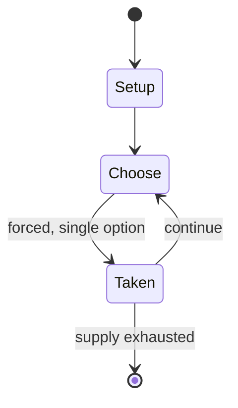

# Bao

*board game*

`bao` &nbsp; state: **DEEPENED** &nbsp; method: **heuristic**

## Found layer (recorded, not trusted)

| field | value |
| --- | --- |
| wikidata | Q807050 |
| wikipedia | Bao (game) |
| genres (source) | -- |
| instance of (source) | board game, mancala |
| country of origin | -- |

## Declared layer (orders bench work)

| field | value |
| --- | --- |
| year created | -- |
| epoch | -- |
| region | -- |
| media | BOARD, MANCALA |
| players | 2 |
| age band | -- |
| exogenous process | NONE |
| loss shape | OPPORTUNITY_ONLY |
| live axes | ORDER, SPATIAL |
| horizon | VARIABLE |
| scoring shape | -- |
| information | PERFECT |
| interaction | COMPETITIVE |
| turn structure | PHASE_STRUCTURED |
| tractability | SAMPLING_ONLY |
| randomness | NONE |
| luck factor | 0.35 |
| rules complexity | 3.21 |
| strategic depth | 2.0 |
| novelty | 0.4978 |
| solved status | -- |
| strategies | -- |
| algorithms | -- |

## Object model

```
Episode
  players      : 2
  turn_structure: PHASE_STRUCTURED
  horizon       : VARIABLE
  scoring       : ?

Board          -- spatial substrate; cells carry position and occupancy
Piece          -- movable token owned by a player
Pits           -- cyclic array of counts
Store          -- player's banked seeds
Sequence       -- the permutation under the player's control
Placement      -- position subject to geometric legality
```

## State transition diagram



## Research item -- turn trace

```
# Bao -- simulated turn events
# generated from the DECLARED vector, not from a rulebook.
# structure: exo=NONE loss=OPPORTUNITY_ONLY horizon=VARIABLE scoring=None axes=ORDER,SPATIAL

t=0    SETUP        players=2  pot=0  capacity=3
t=1    FORCED       p1 single legal option taken (pot_gain=+1.7)
t=2    SPATIAL      p1 places at (6,4); adjacency legal
t=3    ENDTURN      turn passes to p2
t=4    FORCED       p2 single legal option taken (pot_gain=+0.9)
t=5    SPATIAL      p2 places at (6,5); adjacency legal
t=6    FORCED       p2 single legal option taken (pot_gain=+1.9)
t=7    FORCED       p2 single legal option taken (pot_gain=+0.8)
t=8    FORCED       p2 single legal option taken (pot_gain=+1.6)
t=9    SPATIAL      p2 places at (2,3); adjacency legal
t=10   FORCED       p2 single legal option taken (pot_gain=+1.4)
t=11   FORCED       p2 single legal option taken (pot_gain=+0.9)
t=12   SPATIAL      p2 places at (2,3); adjacency legal
t=13   FORCED       p2 single legal option taken (pot_gain=+0.5)
t=14   SPATIAL      p2 places at (7,4); adjacency legal
t=15   ENDTURN      turn passes to p1
t=16   FORCED       p1 single legal option taken (pot_gain=+0.6)
t=17   FORCED       p1 single legal option taken (pot_gain=+1.7)
t=18   ENDTURN      turn passes to p2
t=19   FORCED       p2 single legal option taken (pot_gain=+1.9)
t=20   SPATIAL      p2 places at (2,7); adjacency legal
t=21   ENDTURN      turn passes to p1
t=22   FORCED       p1 single legal option taken (pot_gain=+0.6)
t=23   SPATIAL      p1 places at (3,1); adjacency legal
t=24   FORCED       p1 single legal option taken (pot_gain=+1.9)
t=25   SPATIAL      p1 places at (6,2); adjacency legal
t=26   ENDTURN      turn passes to p2

terminal: VARIABLE
```

## Conditions

| kind | threshold | effect | trigger |
| --- | --- | --- | --- |
| TERMINATE | -- | -- | In any case, the turn ends when the last seed in a sowing is dropped in an empty pit. |
| TERMINATE | -- | -- | The game ends when a player is left without seeds in his or her inner row, or when he or she cannot move anymore. |
| LOSE | -- | -- | In both cases, this player loses the game. |
| BOUNDARY | -- | -- | In the mtaji phase, the player will begin his or her turn taking all the seeds from any pit that has at least 2 seeds, and sows them (either clockwise or counterclockwise). |

## Source extract

Bao is a traditional mancala board game played in most of East Africa including Burundi, Kenya,
Rwanda, Tanzania, Comoros, Malawi, as well as some areas of DR Congo. It is most popular among
the Swahili people of Tanzania and Kenya; the name itself "Bao" is the Swahili word for "board"
or "board game". In Tanzania, and especially Zanzibar, a "bao master" (called bingwa, "master";
but also fundi, "artist") is held in high respect. In Malawi, a close variant of the game is
known as Bawo, which is the Yao equivalent of the Swahili name. In Burundi it is called Ikibugu
or Urubuguzo. Bao is well known to be a prominent mancala in terms of complexity and strategical
depth, and it has raised interest in scholars of several disciplines, including game theory,
complexity theory, and psychology. Official tournaments are held in Tanzania, Zanzibar, Lamu
(Kenya), and Malawi, and both mainland Tanzania and Zanzibar have their Bao societies, such as
the Chama cha Bao founded in 1966. In Zanzibar and Tanzania there are two versions of Bao. The
main version, which is also the most complex and most appreciated, is called Bao la kiswahili
("Bao of the Swahili people"). The simplified version is call

<sub>Wikipedia, CC BY-SA. Retained as evidence for the structural
classification above. Every rule inferred from it is HYPOTHESIZED
until audited against a rulebook.</sub>
