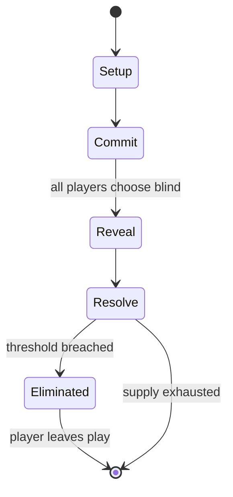

# Barbarian Kings

*1980 board game published by Simulations Publications, Inc.*

`barbarian_kings` &nbsp; state: **DEEPENED** &nbsp; method: **heuristic**

## Found layer (recorded, not trusted)

| field | value |
| --- | --- |
| wikidata | Q48997993 |
| wikipedia | Barbarian Kings |
| genres (source) | -- |
| instance of (source) | board game |
| country of origin | -- |

## Declared layer (orders bench work)

| field | value |
| --- | --- |
| year created | 1980 |
| epoch | DIGITAL |
| region | -- |
| media | BOARD |
| players | 2-5 |
| age band | -- |
| exogenous process | -- |
| loss shape | ELIMINATION |
| live axes | COMMIT_BLIND |
| horizon | -- |
| scoring shape | -- |
| information | SIMULTANEOUS |
| interaction | -- |
| turn structure | SIMULTANEOUS |
| tractability | SAMPLING_ONLY |
| randomness | DICE |
| luck factor | 0.58 |
| rules complexity | 1.98 |
| strategic depth | 1.87 |
| novelty | 0.6777 |
| solved status | -- |
| strategies | -- |
| algorithms | -- |

## Object model

```
Episode
  players      : 2-5
  turn_structure: SIMULTANEOUS
  horizon       : ?
  scoring       : ?

Board          -- spatial substrate; cells carry position and occupancy
Piece          -- movable token owned by a player
SealedChoice   -- irrevocable choice made without observation
```

## State transition diagram



## Research item -- turn trace

```
# Barbarian Kings -- simulated turn events
# generated from the DECLARED vector, not from a rulebook.
# structure: exo=None loss=ELIMINATION horizon=None scoring=None axes=COMMIT_BLIND

t=0    SETUP        players=2  pot=0  capacity=4
t=1    FORCED       p1 single legal option taken (pot_gain=+0.9)
t=2    FORCED       p1 single legal option taken (pot_gain=+0.8)
t=3    FORCED       p1 single legal option taken (pot_gain=+1.6)
t=4    FORCED       p1 single legal option taken (pot_gain=+0.6)
t=5    FORCED       p1 single legal option taken (pot_gain=+1.7)
t=6    FORCED       p1 single legal option taken (pot_gain=+0.5)
t=7    ENDTURN      turn passes to p2
t=8    FORCED       p2 single legal option taken (pot_gain=+1.1)
t=9    FORCED       p2 single legal option taken (pot_gain=+0.7)
t=10   FORCED       p2 single legal option taken (pot_gain=+0.8)
t=11   FORCED       p2 single legal option taken (pot_gain=+0.8)
t=12   FORCED       p2 single legal option taken (pot_gain=+0.8)
t=13   FORCED       p2 single legal option taken (pot_gain=+1.5)
t=14   ENDTURN      turn passes to p1
t=15   FORCED       p1 single legal option taken (pot_gain=+1.8)
t=16   FORCED       p1 single legal option taken (pot_gain=+1.0)
t=17   FORCED       p1 single legal option taken (pot_gain=+0.7)
t=18   FORCED       p1 single legal option taken (pot_gain=+1.1)
t=19   FORCED       p1 single legal option taken (pot_gain=+1.1)
t=20   FORCED       p1 single legal option taken (pot_gain=+1.7)
t=21   FORCED       p1 single legal option taken (pot_gain=+0.9)
t=22   FORCED       p1 single legal option taken (pot_gain=+0.9)
t=23   ENDTURN      turn passes to p2
t=24   FORCED       p2 single legal option taken (pot_gain=+1.9)
t=25   ENDTURN      turn passes to p1
t=26   FORCED       p1 single legal option taken (pot_gain=+1.0)

terminal: VARIABLE
```

## Conditions

| kind | threshold | effect | trigger |
| --- | --- | --- | --- |
| ELIMINATE | -- | -- | Possible results are elimination of one of the armies, retreat or draw. |

## Source extract

Barbarian Kings is a fantasy board game published by Simulations Publications, Inc. (SPI) in
1980.   == Description ==   === Components === The original pull-out game came with   100 die-
cut counters 11" x 17" paper map rulebook The boxed edition added a six-sided die. The 2001
edition published by Jolly Games replaced the cardboard counters with wooden pieces.   ==
Gameplay == Barbarian Kings is a fantasy game of conquest for 2–5 players where kings vie for
control of the continent of Allaven. Players build armies based on the pieces of territory they
own. Movement is simultaneous, and armies that meet do not have to fight. If combat does occur,
it is resolved by comparing the strengths of the two armies, rolling a single die, and
consulting a Combat Results Table. Possible results are elimination of one of the armies,
retreat or draw. Kings and wizards can also cast spells that have various in-game effects.    ==
Publication history == Barbarian Kings, designed by Greg Costikyan, and with cover art, graphic
design and cartography by Redmond A. Simonsen, was first published by SPI as a pull-out game in
Issue #3 of Ares. SPI subsequently released it as a boxed game later the same y

<sub>Wikipedia, CC BY-SA. Retained as evidence for the structural
classification above. Every rule inferred from it is HYPOTHESIZED
until audited against a rulebook.</sub>
