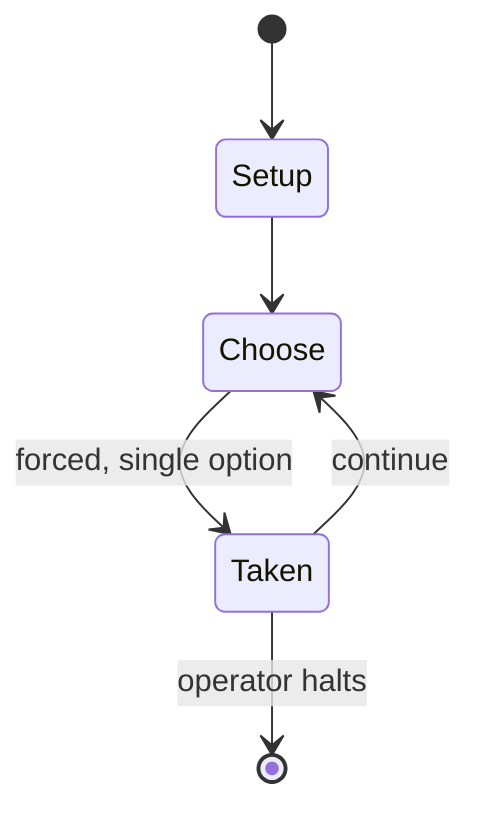

# Barbarossa: The Russo-German War 1941-45

*1969 board wargame*

`barbarossa_the_russo_german_war_1941_45` &nbsp; state: **DEEPENED** &nbsp; method: **heuristic**

## Found layer (recorded, not trusted)

| field | value |
| --- | --- |
| wikidata | Q111948933 |
| wikipedia | Barbarossa: The Russo-German War 1941–45 |
| genres (source) | -- |
| instance of (source) | board game, wargame |
| country of origin | -- |

## Declared layer (orders bench work)

| field | value |
| --- | --- |
| year created | -- |
| epoch | -- |
| region | -- |
| media | BOARD, WARGAME |
| players | 2 |
| age band | -- |
| exogenous process | -- |
| loss shape | -- |
| live axes | SPATIAL |
| horizon | OPEN_ENDED |
| scoring shape | -- |
| information | ASYMMETRIC |
| interaction | COMPETITIVE |
| turn structure | PHASE_STRUCTURED |
| tractability | SAMPLING_ONLY |
| randomness | -- |
| luck factor | -- |
| rules complexity | 4.01 |
| strategic depth | 2.0 |
| novelty | 0.6824 |
| solved status | -- |
| strategies | -- |
| algorithms | -- |

## Object model

```
Episode
  players      : 2
  turn_structure: PHASE_STRUCTURED
  horizon       : OPEN_ENDED
  scoring       : ?

Board          -- spatial substrate; cells carry position and occupancy
Piece          -- movable token owned by a player
Placement      -- position subject to geometric legality
```

## State transition diagram



## Research item -- turn trace

```
# Barbarossa: The Russo-German War 1941-45 -- simulated turn events
# generated from the DECLARED vector, not from a rulebook.
# structure: exo=None loss=None horizon=OPEN_ENDED scoring=None axes=SPATIAL

t=0    SETUP        players=2  pot=0  capacity=5
t=1    FORCED       p1 single legal option taken (pot_gain=+1.2)
t=2    SPATIAL      p1 places at (3,2); adjacency legal
t=3    FORCED       p1 single legal option taken (pot_gain=+1.2)
t=4    SPATIAL      p1 places at (3,1); adjacency legal
t=5    FORCED       p1 single legal option taken (pot_gain=+1.2)
t=6    FORCED       p1 single legal option taken (pot_gain=+0.7)
t=7    ENDTURN      turn passes to p2
t=8    FORCED       p2 single legal option taken (pot_gain=+1.5)
t=9    SPATIAL      p2 places at (3,0); adjacency legal
t=10   FORCED       p2 single legal option taken (pot_gain=+1.1)
t=11   FORCED       p2 single legal option taken (pot_gain=+0.9)
t=12   ENDTURN      turn passes to p1
t=13   FORCED       p1 single legal option taken (pot_gain=+1.2)
t=14   SPATIAL      p1 places at (1,3); adjacency legal
t=15   FORCED       p1 single legal option taken (pot_gain=+1.9)
t=16   ENDTURN      turn passes to p2
t=17   FORCED       p2 single legal option taken (pot_gain=+1.3)
t=18   FORCED       p2 single legal option taken (pot_gain=+1.9)
t=19   ENDTURN      turn passes to p1
t=20   FORCED       p1 single legal option taken (pot_gain=+1.6)
t=21   FORCED       p1 single legal option taken (pot_gain=+1.4)
t=22   FORCED       p1 single legal option taken (pot_gain=+0.6)
t=23   SPATIAL      p1 places at (1,7); adjacency legal
t=24   FORCED       p1 single legal option taken (pot_gain=+0.7)
t=25   FORCED       p1 single legal option taken (pot_gain=+1.7)
t=26   FORCED       p1 single legal option taken (pot_gain=+1.8)
t=27   ENDTURN      turn passes to p2

terminal: OPEN_ENDED
```

## Source extract

Barbarossa: The Russo-German War 1941–45 is a board wargame published by Simulations
Publications Inc. (SPI) in 1969 that simulates the conflict between Germany and the Soviet Union
on the Eastern Front of World War II. This was only SPI's second game produced during a
preliminary round of "Test Series" games, and proved to be the most popular. Despite the title,
taken from the German operational name for their initial invasion of the Soviet Union, the game
covers the entire Eastern Front campaign from the German invasion in 1941 (Operation Barbarossa)
to the Fall of Berlin in 1945.   == Background == On 22 June 1941, less than two years after
signing the non-aggression Molotov–Ribbentrop Pact with the Soviet Union, Germany attacked
across a wide front, with several strategic goals in mind: the capture of Moscow, Leningrad and
Stalingrad, and the acquisition of the Caucasus oilfields and agricultural lands. Although the
Germans exploited the element of surprise and quickly realized large geographical gains through
the summer and fall of 1941, their offensive thrusts came to a halt short of their objectives
due to their long supply lines and the oncoming winter. Although the German

<sub>Wikipedia, CC BY-SA. Retained as evidence for the structural
classification above. Every rule inferred from it is HYPOTHESIZED
until audited against a rulebook.</sub>
