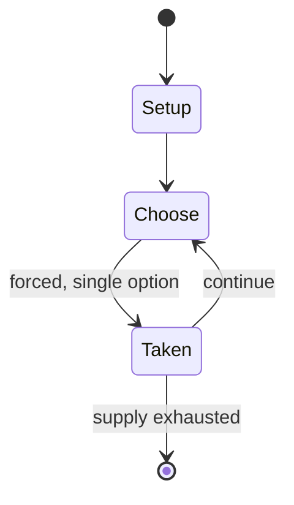

# Baseball

`baseball` &nbsp; state: **DEEPENED** &nbsp; method: **heuristic**

## Found layer (recorded, not trusted)

| field | value |
| --- | --- |
| wikidata | Q5369 |
| wikipedia | Baseball |
| genres (source) | -- |
| instance of (source) | -- |
| country of origin | -- |

## Declared layer (orders bench work)

| field | value |
| --- | --- |
| year created | 1997 |
| epoch | DIGITAL |
| region | -- |
| media | SPORT |
| players | -- |
| age band | CHILD |
| exogenous process | NONE |
| loss shape | OPPORTUNITY_ONLY |
| live axes | ORDER |
| horizon | -- |
| scoring shape | -- |
| information | PERFECT |
| interaction | COMPETITIVE |
| turn structure | STRICT_TURN |
| tractability | SAMPLING_ONLY |
| randomness | NONE |
| luck factor | 0.02 |
| rules complexity | 2.14 |
| strategic depth | 2.4 |
| novelty | 0.6389 |
| solved status | -- |
| strategies | sacrifice, signalling |
| algorithms | -- |

## Object model

```
Episode
  players      : ?
  turn_structure: STRICT_TURN
  horizon       : ?
  scoring       : ?

Pitch          -- bounded physical region
Player         -- embodied agent with a foul count
Clock          -- counts down; stoppages are rule events
Official       -- detects infractions and applies penalties
Sequence       -- the permutation under the player's control
```

## State transition diagram



## Research item -- turn trace

```
# Baseball -- simulated turn events
# generated from the DECLARED vector, not from a rulebook.
# structure: exo=NONE loss=OPPORTUNITY_ONLY horizon=None scoring=None axes=ORDER

t=0    SETUP        players=2  pot=0  capacity=5
t=1    FORCED       p1 single legal option taken (pot_gain=+0.7)
t=2    FORCED       p1 single legal option taken (pot_gain=+1.8)
t=3    ENDTURN      turn passes to p2
t=4    FORCED       p2 single legal option taken (pot_gain=+0.9)
t=5    FORCED       p2 single legal option taken (pot_gain=+0.7)
t=6    FORCED       p2 single legal option taken (pot_gain=+0.9)
t=7    FORCED       p2 single legal option taken (pot_gain=+1.4)
t=8    FORCED       p2 single legal option taken (pot_gain=+1.3)
t=9    ENDTURN      turn passes to p1
t=10   FORCED       p1 single legal option taken (pot_gain=+0.7)
t=11   FORCED       p1 single legal option taken (pot_gain=+1.1)
t=12   FORCED       p1 single legal option taken (pot_gain=+0.8)
t=13   FORCED       p1 single legal option taken (pot_gain=+1.8)
t=14   FORCED       p1 single legal option taken (pot_gain=+0.7)
t=15   FORCED       p1 single legal option taken (pot_gain=+0.9)
t=16   ENDTURN      turn passes to p2
t=17   FORCED       p2 single legal option taken (pot_gain=+0.6)
t=18   FORCED       p2 single legal option taken (pot_gain=+1.4)
t=19   ENDTURN      turn passes to p1
t=20   FORCED       p1 single legal option taken (pot_gain=+1.0)
t=21   ENDTURN      turn passes to p2
t=22   FORCED       p2 single legal option taken (pot_gain=+1.8)
t=23   FORCED       p2 single legal option taken (pot_gain=+0.8)
t=24   FORCED       p2 single legal option taken (pot_gain=+0.8)
t=25   FORCED       p2 single legal option taken (pot_gain=+1.6)
t=26   ENDTURN      turn passes to p1

terminal: VARIABLE
```

## Conditions

| kind | threshold | effect | trigger |
| --- | --- | --- | --- |
| PENALTY | 2 strikes | -- | Any pitch which does not pass through the strike zone is called a ball, unless the batter either swings and misses at the pitch, or hits the pitch into foul territory; an exception generally occurs if the ball is hit int |
| BOUNDARY | -- | -- | A runner may circle the bases only once per plate appearance and thus can score at most a single run per batting turn. |
| BOUNDARY | -- | -- | At most levels of organized play, two coaches are stationed on the field when the team is at bat: the first base coach and third base coach, who occupy designated coaches' boxes, just outside the foul lines. |
| PENALTY | -- | -- | The game is played on a field whose primary boundaries, the foul lines, extend forward from home plate at 45-degree angles. |
| PENALTY | -- | -- | The 90-degree area within the foul lines is referred to as fair territory; the 270-degree area outside them is foul territory. |
| PENALTY | -- | -- | The fair territory between home plate and the outfield boundary is baseball's field of play, though significant events can take place in foul territory, as well. |
| PENALTY | -- | -- | If the ball is hit in the air within the foul lines over the entire outfield (and outfield fence, if there is one), or if the batter-runner otherwise safely circles all the bases, it is a home run: the batter and any run |
| PENALTY | -- | -- | If a ball hit into play rolls foul before passing through the infield, it becomes dead and any runners must return to the base they occupied when the play began. |
| PENALTY | -- | -- | In the playoffs, six umpires are used: one at each base and two in the outfield along the foul lines. |
| PENALTY | -- | -- | There had long been suspicions that the dramatic increase in power hitting was fueled in large part by the abuse of illegal steroids (as well as by the dilution of pitching talent due to expansion), but the issue only be |
| PENALTY | -- | -- | Similarly, there are no regulations at all concerning the dimensions of foul territory. |
| PENALTY | -- | -- | Thus a foul fly ball may be entirely out of play in a park with little space between the foul lines and the stands, but a foulout in a park with more expansive foul ground. |
| PENALTY | -- | -- | A fence in foul territory that is close to the outfield line will tend to direct balls that strike it back toward the fielders, while one that is farther away may actually prompt more collisions, as outfielders run full  |

## Source extract

Baseball is a bat-and-ball sport played between two teams of nine players each, taking turns
batting and fielding. The game occurs over the course of several plays, with each play beginning
when a player on the fielding team, called the pitcher, throws a ball that a player on the
batting team, called the batter, tries to hit with a bat. The objective of the offensive team
(batting team) is to hit the ball into the field of play, away from the other team's players,
allowing its players to run the bases, having them advance counter-clockwise around four bases
to score what are called "runs". The objective of the defensive team (fielding team) is to
prevent batters from becoming runners, and to prevent runners advancing around the bases. A run
is scored when a runner legally advances around the bases in order and touches home plate (the
place where the player started as a batter). The initial objective of the batting team is to
have a player reach first base safely; this occurs either when the batter hits the ball and
reaches first base before an opponent retrieves the ball and touches the base, or when the
pitcher persists in throwing the ball out of the batter's reach. Players on th

<sub>Wikipedia, CC BY-SA. Retained as evidence for the structural
classification above. Every rule inferred from it is HYPOTHESIZED
until audited against a rulebook.</sub>
