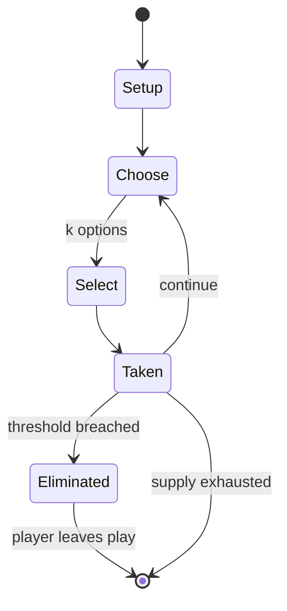

# Batman: Arkham Asylum

`batman_arkham_asylum` &nbsp; state: **DEEPENED** &nbsp; method: **heuristic**

## Found layer (recorded, not trusted)

| field | value |
| --- | --- |
| wikidata | Q746228 |
| wikipedia | Batman: Arkham Asylum |
| genres (source) | -- |
| instance of (source) | -- |
| country of origin | -- |

## Declared layer (orders bench work)

| field | value |
| --- | --- |
| year created | 2023 |
| epoch | CONTEMPORARY |
| region | -- |
| media | PUZZLE, VIDEO |
| players | -- |
| age band | -- |
| exogenous process | -- |
| loss shape | ELIMINATION |
| live axes | ORDER, SELECT, TIMING |
| horizon | -- |
| scoring shape | -- |
| information | -- |
| interaction | COMPETITIVE |
| turn structure | -- |
| tractability | SAMPLING_ONLY |
| randomness | HIDDEN_INFO |
| luck factor | 0.35 |
| rules complexity | 3.28 |
| strategic depth | 2.75 |
| novelty | 0.5098 |
| solved status | -- |
| strategies | probability_estimation, route_optimisation, tempo |
| algorithms | -- |

## Object model

```
Episode
  players      : ?
  turn_structure: ?
  horizon       : ?
  scoring       : ?

Configuration  -- the arrangement to be resolved
Constraint     -- predicate a legal configuration must satisfy
WorldState     -- simulation state advanced by the engine
Avatar         -- player-controlled agent
Clock          -- frame or tick counter
Sequence       -- the permutation under the player's control
OptionSet      -- the choices available after an exogenous draw
Initiative     -- who acts, and when, relative to others
```

## State transition diagram



## Research item -- turn trace

```
# Batman: Arkham Asylum -- simulated turn events
# generated from the DECLARED vector, not from a rulebook.
# structure: exo=None loss=ELIMINATION horizon=None scoring=None axes=ORDER,SELECT,TIMING

t=0    SETUP        players=2  pot=0  capacity=5
t=1    SELECT       p1 1 options; take #1  (pot_gain=+0.8, capacity=-2)
t=2    SELECT       p1 3 options; take #3  (pot_gain=+3.3, capacity=-1)
t=3    SELECT       p1 1 options; take #1  (pot_gain=+2.2, capacity=-2)
t=4    SELECT       p1 2 options; take #1  (pot_gain=+1.9, capacity=-2)
t=5    SELECT       p1 3 options; take #1  (pot_gain=+1.2, capacity=-1)
t=6    SELECT       p1 4 options; take #1  (pot_gain=+2.4, capacity=-2)
t=7    ENDTURN      turn passes to p2
t=8    SELECT       p2 4 options; take #2  (pot_gain=+2.1, capacity=-0)
t=9    SELECT       p2 3 options; take #3  (pot_gain=+0.8, capacity=-1)
t=10   SELECT       p2 4 options; take #1  (pot_gain=+2.4, capacity=-1)
t=11   SELECT       p2 1 options; take #1  (pot_gain=+1.9, capacity=-2)
t=12   SELECT       p2 1 options; take #1  (pot_gain=+2.9, capacity=-0)
t=13   SELECT       p2 4 options; take #2  (pot_gain=+1.6, capacity=-1)
t=14   SELECT       p2 3 options; take #1  (pot_gain=+3.0, capacity=-2)
t=15   SELECT       p2 3 options; take #2  (pot_gain=+1.9, capacity=-2)
t=16   ENDTURN      turn passes to p1
t=17   SELECT       p1 3 options; take #3  (pot_gain=+2.8, capacity=-2)
t=18   ENDTURN      turn passes to p2
t=19   SELECT       p2 4 options; take #1  (pot_gain=+3.2, capacity=-2)
t=20   SELECT       p2 1 options; take #1  (pot_gain=+1.1, capacity=-2)
t=21   SELECT       p2 4 options; take #4  (pot_gain=+1.0, capacity=-1)
t=22   ENDTURN      turn passes to p1
t=23   SELECT       p1 1 options; take #1  (pot_gain=+3.3, capacity=-0)
t=24   SELECT       p1 3 options; take #2  (pot_gain=+2.6, capacity=-1)
t=25   SELECT       p1 2 options; take #2  (pot_gain=+2.4, capacity=-0)
t=26   SELECT       p1 4 options; take #2  (pot_gain=+2.9, capacity=-0)

terminal: VARIABLE
```

## Conditions

| kind | threshold | effect | trigger |
| --- | --- | --- | --- |
| ELIMINATE | -- | -- | Combat focuses on chaining attacks together against numerous foes while avoiding damage, while stealth allows Batman to conceal himself around an area, using gadgets and the environment to silently eliminate enemies. |
| ELIMINATE | -- | -- | Enemies react to Batman's elimination of their allies, which raises their fear level and alters their behavior; for example, they will adopt new patrol routes, requiring the player to adapt to the changing situation. |
| ELIMINATE | -- | -- | The maps focus on the completion of specific goals, such as eliminating successive waves of enemies in combat, and subduing patrolling enemies while using stealth. |
| ELIMINATE | -- | -- | Others wrote about the way in which enemies react with fear to the elimination of their allies, but some reviewers criticized the AI for allowing Batman to easily escape when discovered, and for being oblivious to Batman |
| BOUNDARY | -- | -- | The maximum security area was designed to feel claustrophobic and was retrofitted like a bunker, and the Arkham mansion displays a High Gothic style. |

## Source extract

Batman: Arkham Asylum is a 2009 action-adventure game developed by Rocksteady Studios and
published by Eidos Interactive in conjunction with Warner Bros. Interactive Entertainment. Based
on the DC Comics superhero Batman and written by veteran Batman writer Paul Dini, Arkham Asylum
was inspired by the long-running comic book mythos. In the game's main storyline, Batman battles
his archenemy, the  Joker, who instigates an elaborate plot to seize control of Arkham Asylum,
trap Batman inside with many of his incarcerated foes, and threaten Gotham City with hidden
bombs. The game is presented from the third-person perspective with a primary focus on Batman's
combat and stealth abilities, detective skills, and gadgets that can be used in combat and
exploration. Batman can freely move around the Arkham Asylum facility, interacting with
characters and undertaking missions, and unlocking new areas by progressing through the main
story or obtaining new equipment. The player is able to deviate away from the main story to
unlock additional content and collectible items. Combat focuses on chaining attacks together
against numerous foes while avoiding damage, while stealth allows Batman to conc

<sub>Wikipedia, CC BY-SA. Retained as evidence for the structural
classification above. Every rule inferred from it is HYPOTHESIZED
until audited against a rulebook.</sub>
