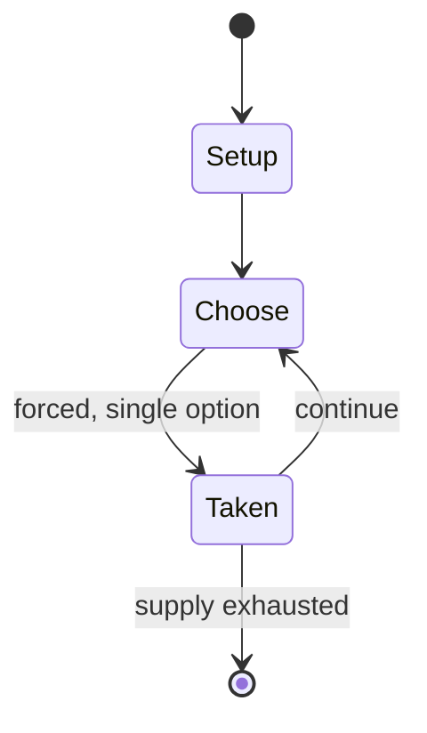

# Batoo

*video game series*

`batoo` &nbsp; state: **DEEPENED** &nbsp; method: **heuristic**

## Found layer (recorded, not trusted)

| field | value |
| --- | --- |
| wikidata | Q4869502 |
| wikipedia | Batoo |
| genres (source) | -- |
| instance of (source) | go variant, video game |
| country of origin | South Korea |

## Declared layer (orders bench work)

| field | value |
| --- | --- |
| year created | -- |
| epoch | -- |
| region | EAST_ASIA |
| media | BOARD, GAMBLING, VIDEO |
| players | -- |
| age band | -- |
| exogenous process | -- |
| loss shape | -- |
| live axes | BID |
| horizon | -- |
| scoring shape | -- |
| information | -- |
| interaction | COMPETITIVE |
| turn structure | -- |
| tractability | SAMPLING_ONLY |
| randomness | HIDDEN_INFO |
| luck factor | 0.35 |
| rules complexity | 2.08 |
| strategic depth | 2.0 |
| novelty | 0.3499 |
| solved status | -- |
| strategies | -- |
| algorithms | -- |

## Object model

```
Episode
  players      : ?
  turn_structure: ?
  horizon       : ?
  scoring       : ?

Board          -- spatial substrate; cells carry position and occupancy
Piece          -- movable token owned by a player
WorldState     -- simulation state advanced by the engine
Avatar         -- player-controlled agent
Clock          -- frame or tick counter
Auction        -- priced competition resolving to one winner
```

## State transition diagram



## Research item -- turn trace

```
# Batoo -- simulated turn events
# generated from the DECLARED vector, not from a rulebook.
# structure: exo=None loss=None horizon=None scoring=None axes=BID

t=0    SETUP        players=2  pot=0  capacity=5
t=1    FORCED       p1 single legal option taken (pot_gain=+0.9)
t=2    BID          p1 sealed bid of 9 against 1 rivals
t=3    FORCED       p1 single legal option taken (pot_gain=+1.5)
t=4    ENDTURN      turn passes to p2
t=5    FORCED       p2 single legal option taken (pot_gain=+1.2)
t=6    BID          p2 sealed bid of 5 against 1 rivals
t=7    FORCED       p2 single legal option taken (pot_gain=+0.8)
t=8    BID          p2 sealed bid of 1 against 1 rivals
t=9    FORCED       p2 single legal option taken (pot_gain=+1.7)
t=10   FORCED       p2 single legal option taken (pot_gain=+2.0)
t=11   ENDTURN      turn passes to p1
t=12   FORCED       p1 single legal option taken (pot_gain=+0.7)
t=13   FORCED       p1 single legal option taken (pot_gain=+0.7)
t=14   BID          p1 sealed bid of 3 against 1 rivals
t=15   FORCED       p1 single legal option taken (pot_gain=+1.2)
t=16   FORCED       p1 single legal option taken (pot_gain=+0.9)
t=17   BID          p1 sealed bid of 2 against 1 rivals
t=18   ENDTURN      turn passes to p2
t=19   FORCED       p2 single legal option taken (pot_gain=+0.5)
t=20   BID          p2 sealed bid of 4 against 1 rivals
t=21   FORCED       p2 single legal option taken (pot_gain=+1.8)
t=22   FORCED       p2 single legal option taken (pot_gain=+0.8)
t=23   FORCED       p2 single legal option taken (pot_gain=+0.9)
t=24   BID          p2 sealed bid of 5 against 1 rivals
t=25   ENDTURN      turn passes to p1
t=26   FORCED       p1 single legal option taken (pot_gain=+1.5)
t=27   BID          p1 sealed bid of 8 against 1 rivals
t=28   ENDTURN      turn passes to p2

terminal: VARIABLE
```

## Conditions

| kind | threshold | effect | trigger |
| --- | --- | --- | --- |
| LOSE | -- | -- | If more than 3 25-second intervals are taken by any player during the game, that player loses the game. |

## Source extract

Batoo is a Korean variant of the board game Go. The name stems from a combination of the Korean
words baduk (“Go”) and juntoo (“battle”). It is played entirely in cyberspace, and differs from
Go in a number of ways, most noticeably in the way in which certain areas of the board are worth
different point values. The other principal difference is that both players place three stones
before the game begins, and may also place a special “hidden stone”, which affects the board as
a regular stone but is invisible to the opponent. It was launched in November 2008; in April
2021 a new server at foh.epizy.com started to manage Batoo games.   == Gameplay == Batoo is
usually played on an 11x11 board, although some games may take place on boards as large as
13x13. Boards in Batoo usually have plus-point and minus-point spots. When a player plays on
these spots, they will either gain or lose five points. Different "maps" will have different
plus-point locations and minus-point locations. Before the game begins, both players place a
"base build", consisting of three marked stones. When players are making their base-builds, they
cannot see their opponent's base build. If there is any overlap, a m

<sub>Wikipedia, CC BY-SA. Retained as evidence for the structural
classification above. Every rule inferred from it is HYPOTHESIZED
until audited against a rulebook.</sub>
