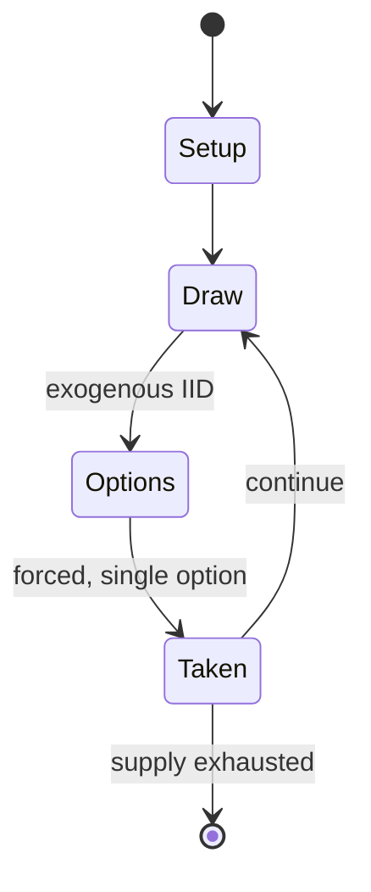

# Battle Dome

*pinball board game*

`battle_dome` &nbsp; state: **DEEPENED** &nbsp; method: **heuristic**

## Found layer (recorded, not trusted)

| field | value |
| --- | --- |
| wikidata | Q11327904 |
| wikipedia | Battle Dome (toy) |
| genres (source) | -- |
| instance of (source) | board game |
| country of origin | -- |

## Declared layer (orders bench work)

| field | value |
| --- | --- |
| year created | 2024 |
| epoch | CONTEMPORARY |
| region | -- |
| media | BOARD, VIDEO |
| players | -- |
| age band | -- |
| exogenous process | IID |
| loss shape | -- |
| live axes | - |
| horizon | VARIABLE |
| scoring shape | NEGATIVE_AVOIDANCE |
| information | -- |
| interaction | -- |
| turn structure | -- |
| tractability | SAMPLING_ONLY |
| randomness | SPINNER |
| luck factor | 0.42 |
| rules complexity | 1.86 |
| strategic depth | 2.0 |
| novelty | 0.6562 |
| solved status | -- |
| strategies | -- |
| algorithms | -- |

## Object model

```
Episode
  players      : ?
  turn_structure: ?
  horizon       : VARIABLE
  scoring       : NEGATIVE_AVOIDANCE

Board          -- spatial substrate; cells carry position and occupancy
Piece          -- movable token owned by a player
WorldState     -- simulation state advanced by the engine
Avatar         -- player-controlled agent
Clock          -- frame or tick counter
```

## State transition diagram



## Research item -- turn trace

```
# Battle Dome -- simulated turn events
# generated from the DECLARED vector, not from a rulebook.
# structure: exo=IID loss=None horizon=VARIABLE scoring=NEGATIVE_AVOIDANCE axes=-

t=0    SETUP        players=2  pot=0  capacity=5
t=1    DRAW         p1 roll from d6 pool -> outcome #1  (p=0.128)
t=2    FORCED       p1 single legal option taken (pot_gain=+0.6)
t=3    DRAW         p1 roll from d6 pool -> outcome #1  (p=0.267)
t=4    FORCED       p1 single legal option taken (pot_gain=+1.5)
t=5    ENDTURN      turn passes to p2
t=6    DRAW         p2 roll from d6 pool -> outcome #1  (p=0.034)
t=7    FORCED       p2 single legal option taken (pot_gain=+0.7)
t=8    DRAW         p2 roll from d6 pool -> outcome #5  (p=0.170)
t=9    FORCED       p2 single legal option taken (pot_gain=+1.1)
t=10   ENDTURN      turn passes to p1
t=11   DRAW         p1 roll from d6 pool -> outcome #4  (p=0.120)
t=12   FORCED       p1 single legal option taken (pot_gain=+1.4)
t=13   ENDTURN      turn passes to p2
t=14   DRAW         p2 roll from d6 pool -> outcome #6  (p=0.153)
t=15   FORCED       p2 single legal option taken (pot_gain=+1.7)
t=16   DRAW         p2 roll from d6 pool -> outcome #5  (p=0.016)
t=17   FORCED       p2 single legal option taken (pot_gain=+1.9)
t=18   DRAW         p2 roll from d6 pool -> outcome #4  (p=0.216)
t=19   FORCED       p2 single legal option taken (pot_gain=+1.8)
t=20   DRAW         p2 roll from d6 pool -> outcome #4  (p=0.033)
t=21   FORCED       p2 single legal option taken (pot_gain=+1.9)
t=22   DRAW         p2 roll from d6 pool -> outcome #5  (p=0.182)
t=23   FORCED       p2 single legal option taken (pot_gain=+1.0)
t=24   DRAW         p2 roll from d6 pool -> outcome #4  (p=0.191)
t=25   FORCED       p2 single legal option taken (pot_gain=+0.6)
t=26   DRAW         p2 roll from d6 pool -> outcome #5  (p=0.252)
t=27   FORCED       p2 single legal option taken (pot_gain=+0.9)

terminal: VARIABLE
```

## Conditions

| kind | threshold | effect | trigger |
| --- | --- | --- | --- |
| TERMINATE | -- | -- | The game ends when all the balls entered all goals. |

## Source extract

The Battle Dome (バトルドーム, Batoru Dōmu) was a pinball board game from the American company Anjar.
It was released from Tsukuda Original in Japan, in which the company was taken over by Pal Box
and Megahouse. On 29 July 2010, Megahouse renewed the toy as Action Battle Dome.   == Overview
== The game consists as a pinball game from two to four players.  The game starts when the
player puts the balls in the upper part, the balls are dropped at regular intervals by the
mainspring. The aim is to not have the balls in the player's goal. The game ends when all the
balls entered all goals. In Action Battle Dome, the balls stay in the mechanism called the
stocker, in which the ball is not counted. The yellow balls are worth one point and the black
(blue when the body color is blue) balls worth five, and the player with the lowest score wins.
In Action Battle Dome, yellow balls are worth one point and red balls worth three.   == Products
== American Battle Dome (アメリカンバトルドーム, Amerikan Batoru Dōmu) Sold in October 1994 by Tsukuda
Original. The main body colour is black and the balls are yellow and black. The spinners
(S-shape mechanisms attached to the dome) are coloured yellow-green. This versi

<sub>Wikipedia, CC BY-SA. Retained as evidence for the structural
classification above. Every rule inferred from it is HYPOTHESIZED
until audited against a rulebook.</sub>
