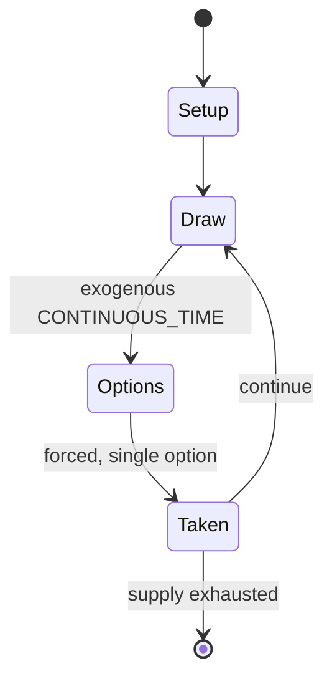

# Battleship (game)

`battleship_game` &nbsp; state: **DEEPENED** &nbsp; method: **heuristic**

## Found layer (recorded, not trusted)

| field | value |
| --- | --- |
| wikidata | Q953491 |
| wikipedia | Battleship (game) |
| genres (source) | -- |
| instance of (source) | -- |
| country of origin | -- |

## Declared layer (orders bench work)

| field | value |
| --- | --- |
| year created | 1931 |
| epoch | MODERN |
| region | -- |
| media | BOARD, VIDEO |
| players | 2 |
| age band | -- |
| exogenous process | CONTINUOUS_TIME |
| loss shape | -- |
| live axes | SPATIAL |
| horizon | -- |
| scoring shape | -- |
| information | SIMULTANEOUS |
| interaction | COMPETITIVE |
| turn structure | STRICT_TURN |
| tractability | SAMPLING_ONLY |
| randomness | HIDDEN_INFO |
| luck factor | 0.35 |
| rules complexity | 2.16 |
| strategic depth | 2.0 |
| novelty | 0.4937 |
| solved status | -- |
| strategies | route_optimisation |
| algorithms | -- |

## Object model

```
Episode
  players      : 2
  turn_structure: STRICT_TURN
  horizon       : ?
  scoring       : ?

Board          -- spatial substrate; cells carry position and occupancy
Piece          -- movable token owned by a player
WorldState     -- simulation state advanced by the engine
Avatar         -- player-controlled agent
Clock          -- frame or tick counter
Placement      -- position subject to geometric legality
```

## State transition diagram



## Research item -- turn trace

```
# Battleship (game) -- simulated turn events
# generated from the DECLARED vector, not from a rulebook.
# structure: exo=CONTINUOUS_TIME loss=None horizon=None scoring=None axes=SPATIAL

t=0    SETUP        players=2  pot=0  capacity=5
t=1    DRAW         p1 tick from clock -> outcome #3  (p=0.121)
t=2    FORCED       p1 single legal option taken (pot_gain=+1.5)
t=3    ENDTURN      turn passes to p2
t=4    DRAW         p2 tick from clock -> outcome #1  (p=0.087)
t=5    FORCED       p2 single legal option taken (pot_gain=+1.4)
t=6    SPATIAL      p2 places at (3,3); adjacency legal
t=7    DRAW         p2 tick from clock -> outcome #4  (p=0.217)
t=8    FORCED       p2 single legal option taken (pot_gain=+1.4)
t=9    ENDTURN      turn passes to p1
t=10   DRAW         p1 tick from clock -> outcome #5  (p=0.049)
t=11   FORCED       p1 single legal option taken (pot_gain=+1.1)
t=12   DRAW         p1 tick from clock -> outcome #6  (p=0.071)
t=13   FORCED       p1 single legal option taken (pot_gain=+1.7)
t=14   DRAW         p1 tick from clock -> outcome #2  (p=0.204)
t=15   FORCED       p1 single legal option taken (pot_gain=+1.6)
t=16   SPATIAL      p1 places at (2,4); adjacency legal
t=17   DRAW         p1 tick from clock -> outcome #3  (p=0.238)
t=18   FORCED       p1 single legal option taken (pot_gain=+0.5)
t=19   SPATIAL      p1 places at (2,1); adjacency legal
t=20   DRAW         p1 tick from clock -> outcome #1  (p=0.057)
t=21   FORCED       p1 single legal option taken (pot_gain=+0.7)
t=22   DRAW         p1 tick from clock -> outcome #3  (p=0.265)
t=23   FORCED       p1 single legal option taken (pot_gain=+1.3)
t=24   SPATIAL      p1 places at (6,6); adjacency legal
t=25   DRAW         p1 tick from clock -> outcome #6  (p=0.034)
t=26   FORCED       p1 single legal option taken (pot_gain=+0.9)

terminal: VARIABLE
```

## Conditions

| kind | threshold | effect | trigger |
| --- | --- | --- | --- |
| WIN | -- | -- | A minigame version of Battleship was used in the third season of The Hub's Family Game Night, which uses a 5×5 grid and the first team to sink three ships wins the game. |
| TERMINATE | -- | -- | If all of a player's ships have been sunk, the game is over and their opponent wins. |

## Source extract

Battleship (also known as Battleships) is a strategy type guessing game for two players. It is
played on ruled grids (paper or board) on which each player's fleet of warships are marked.  The
locations of the fleets are concealed from the other player. Players alternate turns calling
"shots" at the other player's ships, and the objective of the game is to destroy the opposing
player's fleet. Battleship is known worldwide as a pencil and paper game which dates from World
War I. It was published by various companies as a pad-and-pencil game in the 1930s and was
released as a plastic board game by Milton Bradley in 1967.  The game has spawned electronic
versions, video games, smart device apps and a film.   == History == Parallels have been drawn
to E. I. Horsman's 1890 game Basilinda, and the game is said to have been played by Russian
officers before World War I. In 1907 the game playing was mentioned in the diary of Russian poet
Ryurik Ivnev. The first commercial version of the game was Salvo, published in 1931 in the
United States by the Starex company. Other versions of the game were printed in the 1930s and
1940s, including the Strathmore Company's Combat: The Battleship Game, M

<sub>Wikipedia, CC BY-SA. Retained as evidence for the structural
classification above. Every rule inferred from it is HYPOTHESIZED
until audited against a rulebook.</sub>
