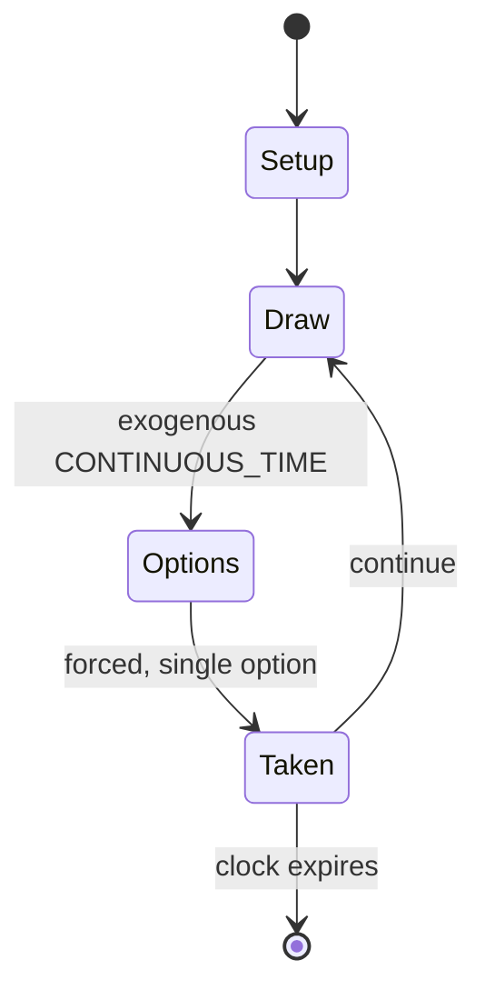

# Bejeweled (video game)

`bejeweled_video_game` &nbsp; state: **DEEPENED** &nbsp; method: **heuristic**

## Found layer (recorded, not trusted)

| field | value |
| --- | --- |
| wikidata | Q814975 |
| wikipedia | Bejeweled (video game) |
| genres (source) | -- |
| instance of (source) | -- |
| country of origin | -- |

## Declared layer (orders bench work)

| field | value |
| --- | --- |
| year created | 2000 |
| epoch | CONTEMPORARY |
| region | -- |
| media | VIDEO |
| players | -- |
| age band | -- |
| exogenous process | CONTINUOUS_TIME |
| loss shape | OPPORTUNITY_ONLY |
| live axes | SPATIAL |
| horizon | CLOCK_LIMITED |
| scoring shape | -- |
| information | PERFECT |
| interaction | COMPETITIVE |
| turn structure | -- |
| tractability | SAMPLING_ONLY |
| randomness | REAL_TIME_PHYSICAL |
| luck factor | 0.3 |
| rules complexity | 2.05 |
| strategic depth | 2.0 |
| novelty | 0.6351 |
| solved status | -- |
| strategies | signalling, spatial_packing |
| algorithms | -- |

## Object model

```
Episode
  players      : ?
  turn_structure: ?
  horizon       : CLOCK_LIMITED
  scoring       : ?

WorldState     -- simulation state advanced by the engine
Avatar         -- player-controlled agent
Clock          -- frame or tick counter
Placement      -- position subject to geometric legality
```

## State transition diagram



## Research item -- turn trace

```
# Bejeweled (video game) -- simulated turn events
# generated from the DECLARED vector, not from a rulebook.
# structure: exo=CONTINUOUS_TIME loss=OPPORTUNITY_ONLY horizon=CLOCK_LIMITED scoring=None axes=SPATIAL

t=0    SETUP        players=2  pot=0  capacity=4
t=1    DRAW         p1 tick from clock -> outcome #6  (p=0.143)
t=2    FORCED       p1 single legal option taken (pot_gain=+1.7)
t=3    ENDTURN      turn passes to p2
t=4    DRAW         p2 tick from clock -> outcome #5  (p=0.235)
t=5    FORCED       p2 single legal option taken (pot_gain=+1.2)
t=6    DRAW         p2 tick from clock -> outcome #1  (p=0.155)
t=7    FORCED       p2 single legal option taken (pot_gain=+2.0)
t=8    SPATIAL      p2 places at (6,3); adjacency legal
t=9    ENDTURN      turn passes to p1
t=10   DRAW         p1 tick from clock -> outcome #1  (p=0.170)
t=11   FORCED       p1 single legal option taken (pot_gain=+0.8)
t=12   DRAW         p1 tick from clock -> outcome #3  (p=0.079)
t=13   FORCED       p1 single legal option taken (pot_gain=+1.3)
t=14   DRAW         p1 tick from clock -> outcome #2  (p=0.294)
t=15   FORCED       p1 single legal option taken (pot_gain=+1.2)
t=16   DRAW         p1 tick from clock -> outcome #5  (p=0.082)
t=17   FORCED       p1 single legal option taken (pot_gain=+1.0)
t=18   SPATIAL      p1 places at (5,6); adjacency legal
t=19   ENDTURN      turn passes to p2
t=20   DRAW         p2 tick from clock -> outcome #5  (p=0.081)
t=21   FORCED       p2 single legal option taken (pot_gain=+1.1)
t=22   DRAW         p2 tick from clock -> outcome #6  (p=0.162)
t=23   FORCED       p2 single legal option taken (pot_gain=+1.2)
t=24   SPATIAL      p2 places at (1,6); adjacency legal
t=25   DRAW         p2 tick from clock -> outcome #2  (p=0.055)
t=26   FORCED       p2 single legal option taken (pot_gain=+1.0)

terminal: CLOCK_LIMITED
```

## Conditions

| kind | threshold | effect | trigger |
| --- | --- | --- | --- |
| TERMINATE | -- | -- | Untimed mode revolves around attempting to reach a high score and ends when no further matches are possible; timed mode involves trying to gain points to prevent a timer bar from reaching the end. |
| BOUNDARY | -- | -- | The addictiveness of Astraware's PDA versions were positively received by Maximum PC and Hyper. |

## Source extract

Bejeweled is a match-three video game developed and published by PopCap Games. Bejeweled
involves lining up three or more multi-colored gems to clear them from the game board. The game
was inspired by a similar browser game, titled Colors Game. Originally released in 2000 under
the title Diamond Mine as a browser game on the team's official website, Bejeweled was licensed
to be hosted on MSN Games under its current name. PopCap released a retail version titled
Bejeweled Deluxe in May 2001. Bejeweled has since been ported to many platforms, particularly
mobile devices. The game has been commercially successful, having sold over 10 million copies
and been downloaded more than 150 million times. It is credited with popularizing match-three
video games and launching the casual games industry, which grew to be worth $3 billion within a
decade. The game was followed by a commercially successful series of sequels and spin-offs.   ==
Gameplay == Bejeweled is a match-three video game. Gameplay centers around gaining points by
swapping two adjacent gems within a tile-based grid to create lines of three or more matching
gems, which will disappear and allow gems from above to fall and occupy t

<sub>Wikipedia, CC BY-SA. Retained as evidence for the structural
classification above. Every rule inferred from it is HYPOTHESIZED
until audited against a rulebook.</sub>
