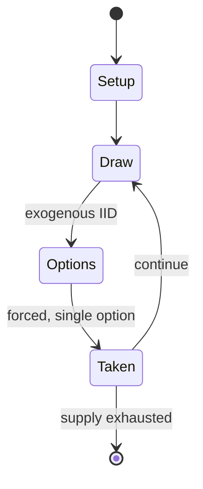

# Bell and hammer

*Bell and hammer is a 19th century board game that was popular in Europe*

`bell_and_hammer` &nbsp; state: **DEEPENED** &nbsp; method: **heuristic**

## Found layer (recorded, not trusted)

| field | value |
| --- | --- |
| wikidata | Q1531832 |
| wikipedia | Bell and Hammer |
| genres (source) | -- |
| instance of (source) | dice game |
| country of origin | -- |

## Declared layer (orders bench work)

| field | value |
| --- | --- |
| year created | -- |
| epoch | -- |
| region | -- |
| media | BOARD, DICE |
| players | -- |
| age band | -- |
| exogenous process | IID |
| loss shape | -- |
| live axes | - |
| horizon | -- |
| scoring shape | -- |
| information | -- |
| interaction | -- |
| turn structure | -- |
| tractability | EXACT_WITH_CUT |
| randomness | DICE |
| luck factor | 0.58 |
| rules complexity | 1.66 |
| strategic depth | 1.87 |
| novelty | 0.6405 |
| solved status | -- |
| strategies | -- |
| algorithms | -- |

## Object model

```
Episode
  players      : ?
  turn_structure: ?
  horizon       : ?
  scoring       : ?

Board          -- spatial substrate; cells carry position and occupancy
Piece          -- movable token owned by a player
DicePool       -- n dice, each an iid categorical draw
Roll           -- realised outcome of a pool
```

## State transition diagram



## Research item -- turn trace

```
# Bell and hammer -- simulated turn events
# generated from the DECLARED vector, not from a rulebook.
# structure: exo=IID loss=None horizon=None scoring=None axes=-

t=0    SETUP        players=2  pot=0  capacity=8
t=1    DRAW         p1 roll from d6 pool -> outcome #6  (p=0.226)
t=2    FORCED       p1 single legal option taken (pot_gain=+0.9)
t=3    ENDTURN      turn passes to p2
t=4    DRAW         p2 roll from d6 pool -> outcome #4  (p=0.279)
t=5    FORCED       p2 single legal option taken (pot_gain=+1.4)
t=6    DRAW         p2 roll from d6 pool -> outcome #3  (p=0.270)
t=7    FORCED       p2 single legal option taken (pot_gain=+1.8)
t=8    DRAW         p2 roll from d6 pool -> outcome #5  (p=0.012)
t=9    FORCED       p2 single legal option taken (pot_gain=+1.2)
t=10   DRAW         p2 roll from d6 pool -> outcome #1  (p=0.217)
t=11   FORCED       p2 single legal option taken (pot_gain=+0.7)
t=12   DRAW         p2 roll from d6 pool -> outcome #4  (p=0.023)
t=13   FORCED       p2 single legal option taken (pot_gain=+0.6)
t=14   ENDTURN      turn passes to p1
t=15   DRAW         p1 roll from d6 pool -> outcome #6  (p=0.131)
t=16   FORCED       p1 single legal option taken (pot_gain=+0.7)
t=17   DRAW         p1 roll from d6 pool -> outcome #6  (p=0.213)
t=18   FORCED       p1 single legal option taken (pot_gain=+1.6)
t=19   DRAW         p1 roll from d6 pool -> outcome #3  (p=0.145)
t=20   FORCED       p1 single legal option taken (pot_gain=+0.7)
t=21   DRAW         p1 roll from d6 pool -> outcome #6  (p=0.186)
t=22   FORCED       p1 single legal option taken (pot_gain=+2.0)
t=23   DRAW         p1 roll from d6 pool -> outcome #1  (p=0.000)
t=24   FORCED       p1 single legal option taken (pot_gain=+1.2)
t=25   DRAW         p1 roll from d6 pool -> outcome #6  (p=0.208)
t=26   FORCED       p1 single legal option taken (pot_gain=+1.9)

terminal: VARIABLE
```

## Source extract

Bell and Hammer or Whitehorse is a dice game, which was quite popular in Europe in the 19th and
early 20th centuries. It is often assumed that the inventor was the Viennese art dealer Heinrich
Friedrich Müller (1779-1848), but although Müller contributed greatly to the spread of the game,
there is no evidence that he was the inventor. In German, the game is known as Glocke und Hammer
or Schimmel. Especially among the Jewish population, it was a very popular pastime during the
Hanukkah festival, as well as the Dreidel game. After the Second World War, the game almost
completely disappeared.   == References ==   == External links == Schimmel rules and history

<sub>Wikipedia, CC BY-SA. Retained as evidence for the structural
classification above. Every rule inferred from it is HYPOTHESIZED
until audited against a rulebook.</sub>
