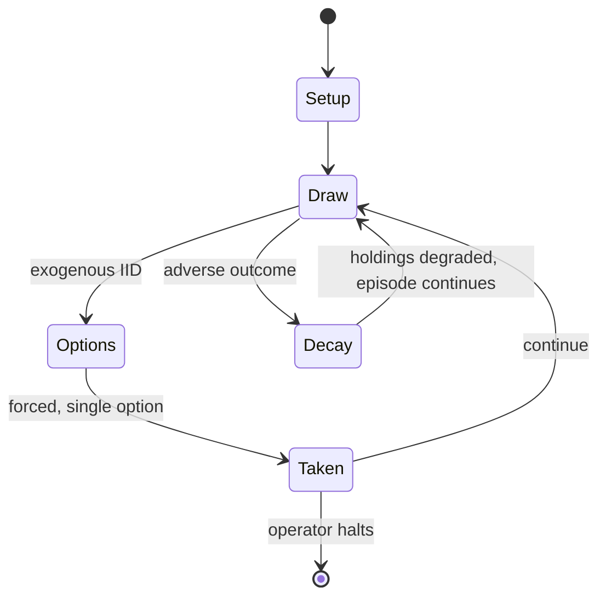

# Berserk

*Russian trading card game*

`berserk` &nbsp; state: **DEEPENED** &nbsp; method: **heuristic**

## Found layer (recorded, not trusted)

| field | value |
| --- | --- |
| wikidata | Q4085191 |
| wikipedia | Berserk (card game) |
| genres (source) | -- |
| instance of (source) | collectible card game |
| country of origin | Russia |

## Declared layer (orders bench work)

| field | value |
| --- | --- |
| year created | 2003 |
| epoch | CONTEMPORARY |
| region | EUROPE_EAST |
| media | BOARD, CARD, COLLECTIBLE, DICE |
| players | 2 |
| age band | -- |
| exogenous process | IID |
| loss shape | PARTIAL_DECAY |
| live axes | SPATIAL, TRADE |
| horizon | OPEN_ENDED |
| scoring shape | RACE_POSITION |
| information | IMPERFECT |
| interaction | COMPETITIVE |
| turn structure | -- |
| tractability | EXACT_WITH_CUT |
| randomness | DICE |
| luck factor | 0.58 |
| rules complexity | 3.38 |
| strategic depth | 2.87 |
| novelty | 0.782 |
| solved status | -- |
| strategies | area_control, deduction, signalling, spatial_packing |
| algorithms | -- |

## Object model

```
Episode
  players      : 2
  turn_structure: ?
  horizon       : OPEN_ENDED
  scoring       : RACE_POSITION

Board          -- spatial substrate; cells carry position and occupancy
Piece          -- movable token owned by a player
Deck           -- ordered multiset, drawn without replacement
Hand           -- private multiset held by one player
DiscardPile    -- public accumulation of spent cards
DicePool       -- n dice, each an iid categorical draw
Roll           -- realised outcome of a pool
Placement      -- position subject to geometric legality
Offer          -- proposed exchange between two agents
```

## State transition diagram



## Research item -- turn trace

```
# Berserk -- simulated turn events
# generated from the DECLARED vector, not from a rulebook.
# structure: exo=IID loss=PARTIAL_DECAY horizon=OPEN_ENDED scoring=RACE_POSITION axes=SPATIAL,TRADE

t=0    SETUP        players=2  pot=0  capacity=6
t=1    DRAW         p1 roll from d6 pool -> outcome #2  (p=0.155)
t=2    FORCED       p1 single legal option taken (pot_gain=+1.9)
t=3    TRADE        p1 offers 2:1 exchange to p2
t=4    SPATIAL      p1 places at (6,7); adjacency legal
t=5    DRAW         p1 roll from d6 pool -> outcome #3  (p=0.079)
t=6    FORCED       p1 single legal option taken (pot_gain=+0.9)
t=7    DRAW         p1 roll from d6 pool -> outcome #1  (p=0.135)
t=8    FORCED       p1 single legal option taken (pot_gain=+1.1)
t=9    DRAW         p1 roll from d6 pool -> outcome #5  (p=0.001)
t=10   FORCED       p1 single legal option taken (pot_gain=+0.6)
t=11   DRAW         p1 roll from d6 pool -> outcome #5  (p=0.190)
t=12   FORCED       p1 single legal option taken (pot_gain=+0.5)
t=13   DRAW         p1 roll from d6 pool -> outcome #4  (p=0.217)
t=14   FORCED       p1 single legal option taken (pot_gain=+1.6)
t=15   DRAW         p1 roll from d6 pool -> outcome #6  (p=0.178)
t=16   FORCED       p1 single legal option taken (pot_gain=+0.7)
t=17   DRAW         p1 roll from d6 pool -> outcome #2  (p=0.222)
t=18   FORCED       p1 single legal option taken (pot_gain=+1.0)
t=19   ENDTURN      turn passes to p2
t=20   DRAW         p2 roll from d6 pool -> outcome #6  (p=0.158)
t=21   FORCED       p2 single legal option taken (pot_gain=+0.8)
t=22   TRADE        p2 offers 2:1 exchange to p1
t=23   DRAW         p2 roll from d6 pool -> outcome #4  (p=0.101)
t=24   FORCED       p2 single legal option taken (pot_gain=+0.8)
t=25   TRADE        p2 offers 2:1 exchange to p1
t=26   SPATIAL      p2 places at (1,4); adjacency legal

terminal: OPEN_ENDED
```

## Conditions

| kind | threshold | effect | trigger |
| --- | --- | --- | --- |
| BOUNDARY | 50 cards | -- | In order to play, both players require a deck of 30 to 50 cards, which must have no more than 3 of the same card. |
| PENALTY | -- | -- | Players are also issued a penalty of 1 gold crystal for every element in their army past the first one. |
| PENALTY | -- | -- | Additionally, player may declare any amount of mulligans for an additional penalty of 1 gold crystal each. |
| PENALTY | -- | -- | The lower line contains technical information - the card artist, date of production, card number, set symbol, and rarity of the card (as color of the set symbol). |

## Source extract

Berserk  is a collectible card game developed and published by Hobby World. It was originally
released in 2003, and ran until its closure in 2015. It was relaunched in 2023 with updated
rules and design. The game takes place in a fantasy world of Laar, and features many fantastic
creatures and characters.   == Gameplay ==   === Setup === In Berserk players take on the roles
of duelling wizards, called "Ungars". In order to play, both players require a deck of 30 to 50
cards, which must have no more than 3 of the same card. The players then roll the dice and the
winner decides who will act first. Players shuffle their decks, and take 15 cards from them.
Then they hire cards from their hand by deducting the cards' price from their pool of gold and
silver crystals. Initially, the first player has 24 gold and 22 silver crystals, and the second
player has 1 more of each - 25 gold and 23 silver. Players are also issued a penalty of 1 gold
crystal for every element in their army past the first one. Additionally, player may declare any
amount of mulligans for an additional penalty of 1 gold crystal each. After hiring their armies,
players lay them on their half of the battlefield face-down

<sub>Wikipedia, CC BY-SA. Retained as evidence for the structural
classification above. Every rule inferred from it is HYPOTHESIZED
until audited against a rulebook.</sub>
