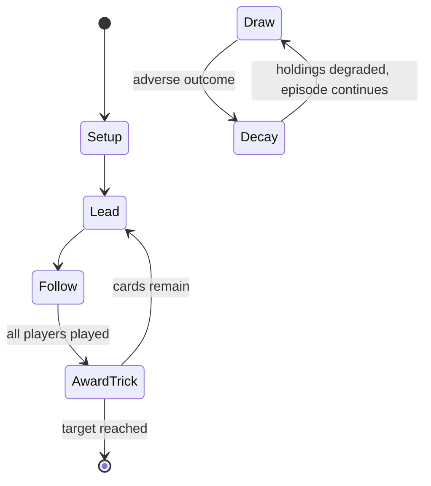

# Bezique

*card game*

`bezique` &nbsp; state: **DEEPENED** &nbsp; method: **heuristic**

## Found layer (recorded, not trusted)

| field | value |
| --- | --- |
| wikidata | Q1019517 |
| wikipedia | Bezique |
| genres (source) | -- |
| instance of (source) | card game, trick-taking game |
| country of origin | -- |

## Declared layer (orders bench work)

| field | value |
| --- | --- |
| year created | -- |
| epoch | -- |
| region | -- |
| media | CARD, TRICK_TAKING |
| players | 2 |
| age band | -- |
| exogenous process | DEPLETING_DECK |
| loss shape | PARTIAL_DECAY |
| live axes | ORDER |
| horizon | RACE_TO_TARGET |
| scoring shape | SET_COLLECTION_CONVEX |
| information | -- |
| interaction | COMPETITIVE |
| turn structure | TRICK_ROUND |
| tractability | EXACT_WITH_CUT |
| randomness | DECK_SHUFFLE |
| luck factor | 0.48 |
| rules complexity | 2.35 |
| strategic depth | 2.5 |
| novelty | 0.7096 |
| solved status | -- |
| strategies | set_collection, spatial_packing |
| algorithms | -- |

## Object model

```
Episode
  players      : 2
  turn_structure: TRICK_ROUND
  horizon       : RACE_TO_TARGET
  scoring       : SET_COLLECTION_CONVEX

Deck           -- ordered multiset, drawn without replacement
Hand           -- private multiset held by one player
DiscardPile    -- public accumulation of spent cards
Trick          -- one card per player; a winner is determined
Trump          -- suit that dominates the ordering
Sequence       -- the permutation under the player's control
```

## State transition diagram



## Research item -- turn trace

```
# Bezique -- simulated turn events
# generated from the DECLARED vector, not from a rulebook.
# structure: exo=DEPLETING_DECK loss=PARTIAL_DECAY horizon=RACE_TO_TARGET scoring=SET_COLLECTION_CONVEX axes=ORDER

t=0    SETUP        players=2  pot=0  capacity=3
t=1    DRAW         p1 draw from deck -> outcome #3  (p=0.014)
t=2    FORCED       p1 single legal option taken (pot_gain=+0.8)
t=3    DRAW         p1 draw from deck -> outcome #1  (p=0.175)
t=4    FORCED       p1 single legal option taken (pot_gain=+1.7)
t=5    ENDTURN      turn passes to p2
t=6    DRAW         p2 draw from deck -> outcome #2  (p=0.041)
t=7    FORCED       p2 single legal option taken (pot_gain=+1.0)
t=8    DRAW         p2 draw from deck -> outcome #5  (p=0.204)
t=9    FORCED       p2 single legal option taken (pot_gain=+1.9)
t=10   DRAW         p2 draw from deck -> outcome #6  (p=0.080)
t=11   FORCED       p2 single legal option taken (pot_gain=+1.6)
t=12   DRAW         p2 draw from deck -> outcome #4  (p=0.159)
t=13   FORCED       p2 single legal option taken (pot_gain=+0.7)
t=14   DRAW         p2 draw from deck -> outcome #6  (p=0.158)
t=15   FORCED       p2 single legal option taken (pot_gain=+0.6)
t=16   DRAW         p2 draw from deck -> outcome #6  (p=0.057)
t=17   FORCED       p2 single legal option taken (pot_gain=+1.3)
t=18   DRAW         p2 draw from deck -> outcome #4  (p=0.048)
t=19   FORCED       p2 single legal option taken (pot_gain=+0.8)
t=20   DRAW         p2 draw from deck -> outcome #2  (p=0.276)
t=21   FORCED       p2 single legal option taken (pot_gain=+1.4)
t=22   DRAW         p2 draw from deck -> outcome #5  (p=0.172)
t=23   FORCED       p2 single legal option taken (pot_gain=+0.6)
t=24   DRAW         p2 draw from deck -> outcome #1  (p=0.168)
t=25   FORCED       p2 single legal option taken (pot_gain=+0.7)
t=26   DRAW         p2 draw from deck -> outcome #2  (p=0.146)
t=27   FORCED       p2 single legal option taken (pot_gain=+0.9)
t=28   ENDTURN      turn passes to p1

terminal: RACE_TO_TARGET
```

## Conditions

| kind | threshold | effect | trigger |
| --- | --- | --- | --- |
| WIN | 000 points | -- | Traditionally, the first player to reach 1,000 points wins, which normally involves an average of three to four rounds being played. |

## Source extract

Bezique () or bésigue (French: [beziɡ]) is a 19th-century French melding and trick-taking card
game for two players, which was imported to Britain and is still played today. The game is
derived from piquet, possibly via marriage (sixty-six) and briscan, with additional scoring
features, notably the peculiar liaison of the Q♠ and J♦ that is also a feature of  pinochle,
Binokel, and similarly named games that vary by country.   == History == An early theory that
appeared in the 1864 edition of The American Hoyle was that bezique originated in Sweden as the
result of a royal competition. This much repeated, but unsubstantiated, tale is recounted thus:
What is known is that the first rules – for a game played with a single pack of 32 cards –
appeared in Paris in 1847 where Méry described it as a new game. Another early theory was that
bezique was developed in France from piquet and that the word "bezique", formerly bésique or
bésigue, was known in France in the 17th century, coming probably from the Italian card game
bazzica. More recently, French historians traced the origins of bezique to a game called bezi or
bezit, which descended through a form of single bezique also known as cin

<sub>Wikipedia, CC BY-SA. Retained as evidence for the structural
classification above. Every rule inferred from it is HYPOTHESIZED
until audited against a rulebook.</sub>
