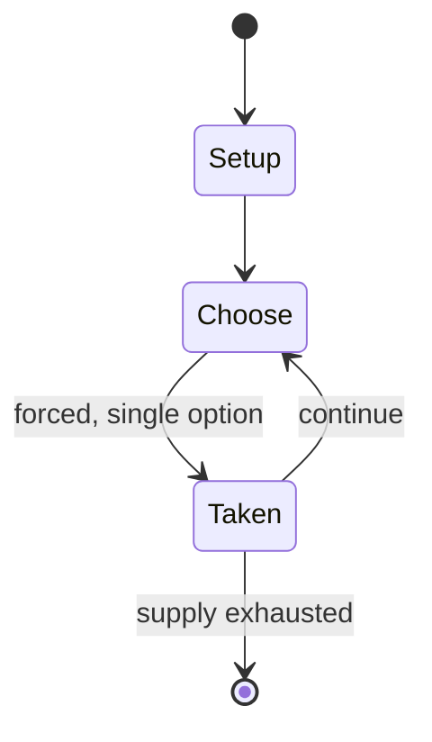

# Big Shot

*pinball machine*

`big_shot` &nbsp; state: **DEEPENED** &nbsp; method: **heuristic**

## Found layer (recorded, not trusted)

| field | value |
| --- | --- |
| wikidata | Q4906328 |
| wikipedia | Big Shot (pinball) |
| genres (source) | -- |
| instance of (source) | pinball machine game, video game |
| country of origin | -- |

## Declared layer (orders bench work)

| field | value |
| --- | --- |
| year created | 1973 |
| epoch | DIGITAL |
| region | -- |
| media | VIDEO |
| players | -- |
| age band | -- |
| exogenous process | -- |
| loss shape | -- |
| live axes | - |
| horizon | -- |
| scoring shape | -- |
| information | -- |
| interaction | COMPETITIVE |
| turn structure | -- |
| tractability | SAMPLING_ONLY |
| randomness | -- |
| luck factor | 0.35 |
| rules complexity | 1.69 |
| strategic depth | 2.0 |
| novelty | 0.3528 |
| solved status | -- |
| strategies | -- |
| algorithms | -- |

## Object model

```
Episode
  players      : ?
  turn_structure: ?
  horizon       : ?
  scoring       : ?

WorldState     -- simulation state advanced by the engine
Avatar         -- player-controlled agent
Clock          -- frame or tick counter
```

## State transition diagram



## Research item -- turn trace

```
# Big Shot -- simulated turn events
# generated from the DECLARED vector, not from a rulebook.
# structure: exo=None loss=None horizon=None scoring=None axes=-

t=0    SETUP        players=2  pot=0  capacity=3
t=1    FORCED       p1 single legal option taken (pot_gain=+1.8)
t=2    FORCED       p1 single legal option taken (pot_gain=+1.0)
t=3    FORCED       p1 single legal option taken (pot_gain=+1.8)
t=4    FORCED       p1 single legal option taken (pot_gain=+1.4)
t=5    FORCED       p1 single legal option taken (pot_gain=+0.9)
t=6    FORCED       p1 single legal option taken (pot_gain=+0.9)
t=7    FORCED       p1 single legal option taken (pot_gain=+1.8)
t=8    FORCED       p1 single legal option taken (pot_gain=+1.4)
t=9    FORCED       p1 single legal option taken (pot_gain=+1.5)
t=10   FORCED       p1 single legal option taken (pot_gain=+0.7)
t=11   FORCED       p1 single legal option taken (pot_gain=+1.4)
t=12   ENDTURN      turn passes to p2
t=13   FORCED       p2 single legal option taken (pot_gain=+1.3)
t=14   FORCED       p2 single legal option taken (pot_gain=+1.5)
t=15   FORCED       p2 single legal option taken (pot_gain=+0.8)
t=16   FORCED       p2 single legal option taken (pot_gain=+1.6)
t=17   FORCED       p2 single legal option taken (pot_gain=+0.5)
t=18   FORCED       p2 single legal option taken (pot_gain=+1.4)
t=19   FORCED       p2 single legal option taken (pot_gain=+1.4)
t=20   FORCED       p2 single legal option taken (pot_gain=+1.5)
t=21   FORCED       p2 single legal option taken (pot_gain=+1.7)
t=22   FORCED       p2 single legal option taken (pot_gain=+0.7)
t=23   FORCED       p2 single legal option taken (pot_gain=+1.9)
t=24   FORCED       p2 single legal option taken (pot_gain=+0.8)
t=25   FORCED       p2 single legal option taken (pot_gain=+1.4)
t=26   FORCED       p2 single legal option taken (pot_gain=+0.8)

terminal: VARIABLE
```

## Source extract

Big Shot is a pinball machine designed by Ed Krynski and produced by Gottlieb in 1974. It was
created as a two-player version of their 1973 game, Hot Shot. The table has a pool theme. 2,900
units were manufactured.   == Game Play == The goal of the game is to light all 15 billiard ball
lights. The player must hit the ball drop targets on either side of a central bumper to light
its corresponding ball light, except the 8 ball. The 8 ball is lit by either going through the
middle gate or by stopping in the center pit. When stopped in the center pit, a diverter (also
called a gate) will change position, allowing a ball drained in the right outlane to return to
the plunger lane. Once all the ball lights are lit, the special can be achieved by hitting the
target on the special lit side. The light switches sides when the slingshots are hit. Replays
can be achieved by hitting the special lit side and by earning 50,000 points, 64,000 points, and
72,000 points.   == Digital versions == This game is included in the Pinball Hall of Fame: The
Gottlieb Collection for the Nintendo GameCube, Xbox, Wii, PlayStation 2, and PlayStation
Portable. Big Shot was released by the same developer for The Pi

<sub>Wikipedia, CC BY-SA. Retained as evidence for the structural
classification above. Every rule inferred from it is HYPOTHESIZED
until audited against a rulebook.</sub>
