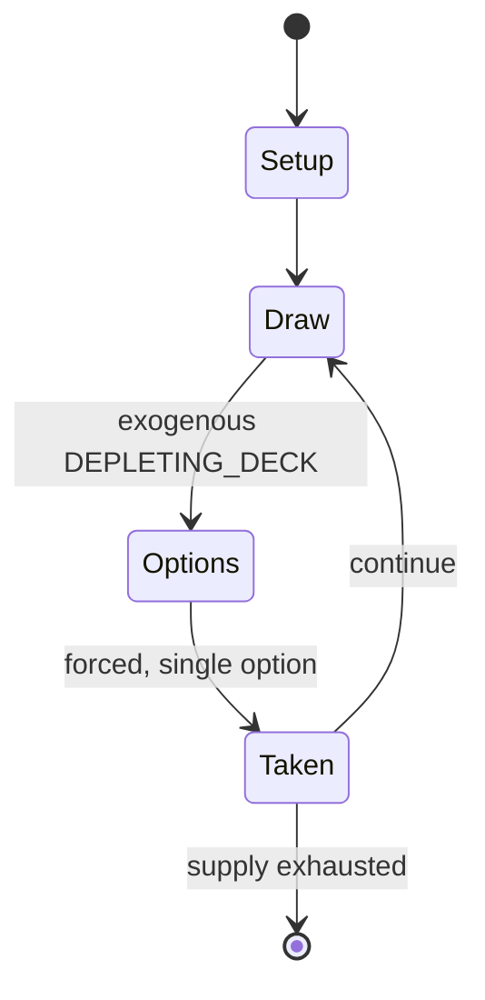

# Bingo (American version)

`bingo_american_version` &nbsp; state: **DEEPENED** &nbsp; method: **heuristic**

## Found layer (recorded, not trusted)

| field | value |
| --- | --- |
| wikidata | Q878160 |
| wikipedia | Bingo (American version) |
| genres (source) | -- |
| instance of (source) | -- |
| country of origin | -- |

## Declared layer (orders bench work)

| field | value |
| --- | --- |
| year created | -- |
| epoch | -- |
| region | -- |
| media | GAMBLING, TILE |
| players | -- |
| age band | -- |
| exogenous process | DEPLETING_DECK |
| loss shape | -- |
| live axes | SPATIAL |
| horizon | -- |
| scoring shape | -- |
| information | -- |
| interaction | COMPETITIVE |
| turn structure | -- |
| tractability | EXACT_WITH_CUT |
| randomness | DECK_SHUFFLE |
| luck factor | 0.48 |
| rules complexity | 2.67 |
| strategic depth | 2.0 |
| novelty | 0.6572 |
| solved status | -- |
| strategies | -- |
| algorithms | -- |

## Object model

```
Episode
  players      : ?
  turn_structure: ?
  horizon       : ?
  scoring       : ?

TileBag        -- unordered draw source
Layout         -- placed tiles and their adjacencies
Placement      -- position subject to geometric legality
```

## State transition diagram



## Research item -- turn trace

```
# Bingo (American version) -- simulated turn events
# generated from the DECLARED vector, not from a rulebook.
# structure: exo=DEPLETING_DECK loss=None horizon=None scoring=None axes=SPATIAL

t=0    SETUP        players=2  pot=0  capacity=7
t=1    DRAW         p1 draw from deck -> outcome #3  (p=0.149)
t=2    FORCED       p1 single legal option taken (pot_gain=+1.6)
t=3    SPATIAL      p1 places at (5,6); adjacency legal
t=4    DRAW         p1 draw from deck -> outcome #4  (p=0.183)
t=5    FORCED       p1 single legal option taken (pot_gain=+1.9)
t=6    ENDTURN      turn passes to p2
t=7    DRAW         p2 draw from deck -> outcome #1  (p=0.131)
t=8    FORCED       p2 single legal option taken (pot_gain=+1.3)
t=9    SPATIAL      p2 places at (2,7); adjacency legal
t=10   DRAW         p2 draw from deck -> outcome #3  (p=0.294)
t=11   FORCED       p2 single legal option taken (pot_gain=+1.3)
t=12   SPATIAL      p2 places at (2,4); adjacency legal
t=13   ENDTURN      turn passes to p1
t=14   DRAW         p1 draw from deck -> outcome #4  (p=0.300)
t=15   FORCED       p1 single legal option taken (pot_gain=+0.5)
t=16   ENDTURN      turn passes to p2
t=17   DRAW         p2 draw from deck -> outcome #1  (p=0.090)
t=18   FORCED       p2 single legal option taken (pot_gain=+1.7)
t=19   DRAW         p2 draw from deck -> outcome #3  (p=0.229)
t=20   FORCED       p2 single legal option taken (pot_gain=+1.8)
t=21   SPATIAL      p2 places at (4,0); adjacency legal
t=22   DRAW         p2 draw from deck -> outcome #3  (p=0.101)
t=23   FORCED       p2 single legal option taken (pot_gain=+2.0)
t=24   ENDTURN      turn passes to p1
t=25   DRAW         p1 draw from deck -> outcome #3  (p=0.297)
t=26   FORCED       p1 single legal option taken (pot_gain=+0.9)
t=27   SPATIAL      p1 places at (5,5); adjacency legal

terminal: VARIABLE
```

## Conditions

| kind | threshold | effect | trigger |
| --- | --- | --- | --- |
| BOUNDARY | -- | -- | For standard bingo games, at least one number in each column or four/five numbers in a single column need to be called for a bingo to be possible. |

## Source extract

Bingo is a game of chance in which each player matches the numbers printed in different
arrangements on cards. The game host (known as a caller) draws balls at random, marking the
selected numbers with tiles. When a player finds that the selected numbers are arranged on their
bingo card in a horizontal, vertical, or diagonal line, they call out "Bingo!" to alert all
participants to a winning card, which prompts the game host (or an associate assisting the host)
to examine the card for verification of the win. Players compete against one another to be the
first to have a winning arrangement for the prize or jackpot. After a winner is declared, the
players clear their number cards of the tiles and the game host begins a new round of play.
Alternative methods of play try to increase participation by creating excitement. Since its
invention in 1929, modern bingo has evolved into multiple variations, with each jurisdiction's
gambling laws regulating how the game is played. There are also nearly unlimited patterns that
may be specified for play. Some games require only one number to be matched, while cover-all
games award the jackpot for covering an entire card. There are even games that

<sub>Wikipedia, CC BY-SA. Retained as evidence for the structural
classification above. Every rule inferred from it is HYPOTHESIZED
until audited against a rulebook.</sub>
