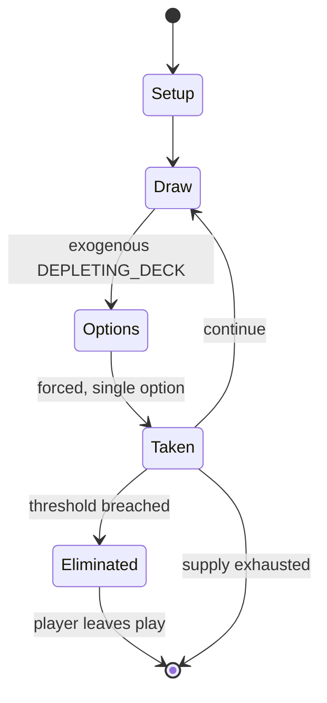

# Bingo (card game)

`bingo_card_game` &nbsp; state: **DEEPENED** &nbsp; method: **heuristic**

## Found layer (recorded, not trusted)

| field | value |
| --- | --- |
| wikidata | Q4914301 |
| wikipedia | Bingo (card game) |
| genres (source) | -- |
| instance of (source) | -- |
| country of origin | -- |

## Declared layer (orders bench work)

| field | value |
| --- | --- |
| year created | -- |
| epoch | -- |
| region | -- |
| media | CARD, GAMBLING |
| players | -- |
| age band | -- |
| exogenous process | DEPLETING_DECK |
| loss shape | ELIMINATION |
| live axes | DISCARD |
| horizon | -- |
| scoring shape | -- |
| information | -- |
| interaction | -- |
| turn structure | -- |
| tractability | EXACT_WITH_CUT |
| randomness | DECK_DEPLETING, HIDDEN_INFO |
| luck factor | 0.53 |
| rules complexity | 2.04 |
| strategic depth | 1.95 |
| novelty | 0.7389 |
| solved status | -- |
| strategies | -- |
| algorithms | -- |

## Object model

```
Episode
  players      : ?
  turn_structure: ?
  horizon       : ?
  scoring       : ?

Deck           -- ordered multiset, drawn without replacement
Hand           -- private multiset held by one player
DiscardPile    -- public accumulation of spent cards
DiscardChoice  -- what is given up to satisfy a limit
```

## State transition diagram



## Research item -- turn trace

```
# Bingo (card game) -- simulated turn events
# generated from the DECLARED vector, not from a rulebook.
# structure: exo=DEPLETING_DECK loss=ELIMINATION horizon=None scoring=None axes=DISCARD

t=0    SETUP        players=2  pot=0  capacity=5
t=1    DRAW         p1 draw from deck -> outcome #1  (p=0.234)
t=2    FORCED       p1 single legal option taken (pot_gain=+0.9)
t=3    DISCARD      p1 discards to hand limit
t=4    DRAW         p1 draw from deck -> outcome #4  (p=0.063)
t=5    FORCED       p1 single legal option taken (pot_gain=+1.6)
t=6    DISCARD      p1 discards to hand limit
t=7    DRAW         p1 draw from deck -> outcome #6  (p=0.289)
t=8    FORCED       p1 single legal option taken (pot_gain=+1.2)
t=9    DISCARD      p1 discards to hand limit
t=10   DRAW         p1 draw from deck -> outcome #4  (p=0.177)
t=11   FORCED       p1 single legal option taken (pot_gain=+1.3)
t=12   DISCARD      p1 discards to hand limit
t=13   DRAW         p1 draw from deck -> outcome #4  (p=0.004)
t=14   FORCED       p1 single legal option taken (pot_gain=+1.1)
t=15   DRAW         p1 draw from deck -> outcome #6  (p=0.120)
t=16   FORCED       p1 single legal option taken (pot_gain=+0.5)
t=17   DISCARD      p1 discards to hand limit
t=18   DRAW         p1 draw from deck -> outcome #5  (p=0.158)
t=19   FORCED       p1 single legal option taken (pot_gain=+0.8)
t=20   DRAW         p1 draw from deck -> outcome #4  (p=0.284)
t=21   FORCED       p1 single legal option taken (pot_gain=+1.6)
t=22   DISCARD      p1 discards to hand limit
t=23   DRAW         p1 draw from deck -> outcome #4  (p=0.297)
t=24   FORCED       p1 single legal option taken (pot_gain=+0.9)
t=25   ENDTURN      turn passes to p2
t=26   DRAW         p2 draw from deck -> outcome #3  (p=0.014)
t=27   FORCED       p2 single legal option taken (pot_gain=+1.9)
t=28   DISCARD      p2 discards to hand limit

terminal: VARIABLE
```

## Conditions

| kind | threshold | effect | trigger |
| --- | --- | --- | --- |
| ELIMINATE | -- | -- | If no player is knocked out after all the center cards have been revealed, then all of the players reveal their remaining cards. |
| ELIMINATE | -- | -- | If no player claims the pot by being knocked out, then the pot is split between high hand and low hand. |

## Source extract

Bingo (also bango) is a card game named by analogy to the game bingo. The game is played with a
bridge deck of 52 cards.    == Rules == The dealer gives each player a number of cards
(typically five), which are held in the hand or placed face-down in front of the player.  The
dealer places the same number of cards face-down in the center of the table. A round of play
consists of betting, followed by the dealer turning over one of the center cards, so that it is
facing-up.  Any card in a player's hand that has the same rank value as the rank of the center
card just turned are now revealed and discarded.  The discards can be placed face-up in front of
the player. Betting rounds continue until a player has all of the cards knocked from their hand.
In analogy to regular bingo, the first player to realize their hand is empty says "bingo" and
claims the pot.  If no player is knocked out after all the center cards have been revealed,
then all of the players reveal their remaining cards.  A winner can be determined by adding the
rank values of cards remaining in the hand. In determining value, jacks are valued at 11,
queens, at 12, kings at 13, and aces at either 1 or 15, depending on wh

<sub>Wikipedia, CC BY-SA. Retained as evidence for the structural
classification above. Every rule inferred from it is HYPOTHESIZED
until audited against a rulebook.</sub>
