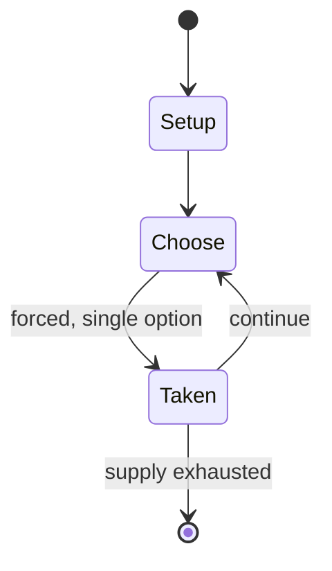

# Biniax

*free/open puzzle video game*

`biniax` &nbsp; state: **DEEPENED** &nbsp; method: **heuristic**

## Found layer (recorded, not trusted)

| field | value |
| --- | --- |
| wikidata | Q15285443 |
| wikipedia | Biniax |
| genres (source) | puzzle video game |
| instance of (source) | video game |
| country of origin | -- |

## Declared layer (orders bench work)

| field | value |
| --- | --- |
| year created | 2005 |
| epoch | CONTEMPORARY |
| region | -- |
| media | PUZZLE, VIDEO |
| players | -- |
| age band | -- |
| exogenous process | -- |
| loss shape | -- |
| live axes | SPATIAL |
| horizon | -- |
| scoring shape | -- |
| information | -- |
| interaction | -- |
| turn structure | -- |
| tractability | SAMPLING_ONLY |
| randomness | -- |
| luck factor | 0.35 |
| rules complexity | 1.99 |
| strategic depth | 2.0 |
| novelty | 0.0896 |
| solved status | -- |
| strategies | -- |
| algorithms | -- |

## Object model

```
Episode
  players      : ?
  turn_structure: ?
  horizon       : ?
  scoring       : ?

Configuration  -- the arrangement to be resolved
Constraint     -- predicate a legal configuration must satisfy
WorldState     -- simulation state advanced by the engine
Avatar         -- player-controlled agent
Clock          -- frame or tick counter
Placement      -- position subject to geometric legality
```

## State transition diagram



## Research item -- turn trace

```
# Biniax -- simulated turn events
# generated from the DECLARED vector, not from a rulebook.
# structure: exo=None loss=None horizon=None scoring=None axes=SPATIAL

t=0    SETUP        players=2  pot=0  capacity=6
t=1    FORCED       p1 single legal option taken (pot_gain=+1.5)
t=2    FORCED       p1 single legal option taken (pot_gain=+0.6)
t=3    FORCED       p1 single legal option taken (pot_gain=+1.3)
t=4    FORCED       p1 single legal option taken (pot_gain=+1.9)
t=5    FORCED       p1 single legal option taken (pot_gain=+0.5)
t=6    SPATIAL      p1 places at (4,1); adjacency legal
t=7    FORCED       p1 single legal option taken (pot_gain=+1.8)
t=8    FORCED       p1 single legal option taken (pot_gain=+0.6)
t=9    FORCED       p1 single legal option taken (pot_gain=+1.8)
t=10   FORCED       p1 single legal option taken (pot_gain=+0.8)
t=11   FORCED       p1 single legal option taken (pot_gain=+1.5)
t=12   FORCED       p1 single legal option taken (pot_gain=+2.0)
t=13   FORCED       p1 single legal option taken (pot_gain=+1.8)
t=14   FORCED       p1 single legal option taken (pot_gain=+0.7)
t=15   SPATIAL      p1 places at (2,4); adjacency legal
t=16   FORCED       p1 single legal option taken (pot_gain=+0.5)
t=17   SPATIAL      p1 places at (7,2); adjacency legal
t=18   FORCED       p1 single legal option taken (pot_gain=+1.6)
t=19   FORCED       p1 single legal option taken (pot_gain=+0.6)
t=20   FORCED       p1 single legal option taken (pot_gain=+1.5)
t=21   ENDTURN      turn passes to p2
t=22   FORCED       p2 single legal option taken (pot_gain=+2.0)
t=23   SPATIAL      p2 places at (7,4); adjacency legal
t=24   FORCED       p2 single legal option taken (pot_gain=+1.0)
t=25   FORCED       p2 single legal option taken (pot_gain=+1.4)
t=26   FORCED       p2 single legal option taken (pot_gain=+1.4)

terminal: VARIABLE
```

## Source extract

Biniax is a series of free and open-source puzzle video games first released on April 17, 2005.
The games Biniax, Biniax 2 and BiniaxMobile are licensed under the zlib license. The first two
are coded in C, and the mobile version is in Java ME.   == Gameplay ==  The game is played on a
7 by 24 grid, which contains empty spaces or pairs of colored elements. There are four colors to
choose from: blue, green, red, and yellow, with each pair composed of elements of different
colors.  At the start of the game, the player is given one element that they can move to any
empty space within the grid. Pairs of elements matching the player's given element can be
selected for removal from the grid. Following a removal, the player is then given a new paired
element. Each removal adds to the player's score.  Over time, the field moves downwards, and the
game concludes when the player exhausts all available moves, rendering further progress
impossible.   == Reception == A 2005 review on AllAboutSymbian rated BinaxMobile 75/100. A
review of Biniax-2 at PlneHry.cz in Czech in 2007 rated it 7/10. In 2007 a Bytten review of
Biniax-2 rated the game with a 70% overall score. Biniax-2 was reviewed in 200

<sub>Wikipedia, CC BY-SA. Retained as evidence for the structural
classification above. Every rule inferred from it is HYPOTHESIZED
until audited against a rulebook.</sub>
