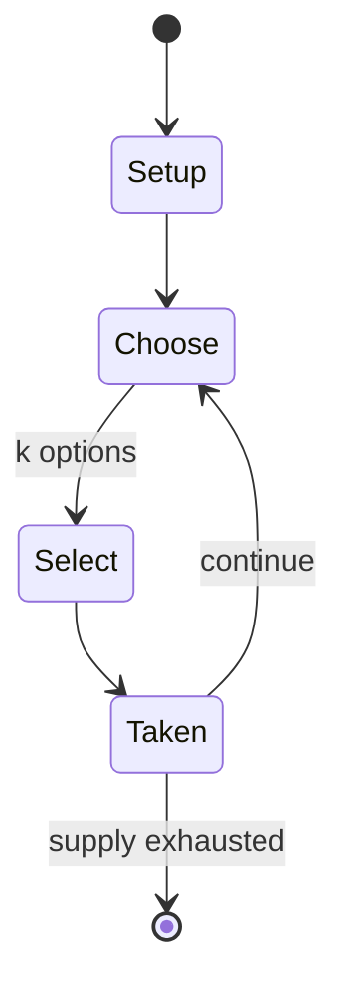

# BioShock

`bioshock` &nbsp; state: **DEEPENED** &nbsp; method: **heuristic**

## Found layer (recorded, not trusted)

| field | value |
| --- | --- |
| wikidata | Q57270 |
| wikipedia | BioShock |
| genres (source) | -- |
| instance of (source) | -- |
| country of origin | -- |

## Declared layer (orders bench work)

| field | value |
| --- | --- |
| year created | 2008 |
| epoch | CONTEMPORARY |
| region | -- |
| media | VIDEO |
| players | -- |
| age band | -- |
| exogenous process | NONE |
| loss shape | OPPORTUNITY_ONLY |
| live axes | SELECT, SPATIAL |
| horizon | -- |
| scoring shape | SURVIVAL |
| information | PERFECT |
| interaction | COMPETITIVE |
| turn structure | -- |
| tractability | SAMPLING_ONLY |
| randomness | NONE |
| luck factor | 0.02 |
| rules complexity | 2.66 |
| strategic depth | 3.15 |
| novelty | 0.6847 |
| solved status | -- |
| strategies | blocking, set_collection, spatial_packing |
| algorithms | -- |

## Object model

```
Episode
  players      : ?
  turn_structure: ?
  horizon       : ?
  scoring       : SURVIVAL

WorldState     -- simulation state advanced by the engine
Avatar         -- player-controlled agent
Clock          -- frame or tick counter
OptionSet      -- the choices available after an exogenous draw
Placement      -- position subject to geometric legality
```

## State transition diagram



## Research item -- turn trace

```
# BioShock -- simulated turn events
# generated from the DECLARED vector, not from a rulebook.
# structure: exo=NONE loss=OPPORTUNITY_ONLY horizon=None scoring=SURVIVAL axes=SELECT,SPATIAL

t=0    SETUP        players=2  pot=0  capacity=5
t=1    SELECT       p1 3 options; take #2  (pot_gain=+0.6, capacity=-2)
t=2    SELECT       p1 1 options; take #1  (pot_gain=+1.0, capacity=-2)
t=3    SELECT       p1 4 options; take #1  (pot_gain=+3.4, capacity=-0)
t=4    SELECT       p1 4 options; take #1  (pot_gain=+0.7, capacity=-0)
t=5    SELECT       p1 2 options; take #1  (pot_gain=+3.1, capacity=-2)
t=6    SPATIAL      p1 places at (1,4); adjacency legal
t=7    SELECT       p1 4 options; take #1  (pot_gain=+1.8, capacity=-0)
t=8    SELECT       p1 2 options; take #2  (pot_gain=+2.0, capacity=-0)
t=9    SELECT       p1 1 options; take #1  (pot_gain=+2.1, capacity=-1)
t=10   SPATIAL      p1 places at (1,5); adjacency legal
t=11   SELECT       p1 3 options; take #1  (pot_gain=+2.7, capacity=-1)
t=12   SPATIAL      p1 places at (4,6); adjacency legal
t=13   SELECT       p1 3 options; take #3  (pot_gain=+1.7, capacity=-1)
t=14   ENDTURN      turn passes to p2
t=15   SELECT       p2 3 options; take #1  (pot_gain=+0.9, capacity=-2)
t=16   ENDTURN      turn passes to p1
t=17   SELECT       p1 3 options; take #3  (pot_gain=+0.5, capacity=-0)
t=18   SPATIAL      p1 places at (4,3); adjacency legal
t=19   SELECT       p1 2 options; take #1  (pot_gain=+0.6, capacity=-1)
t=20   ENDTURN      turn passes to p2
t=21   SELECT       p2 2 options; take #2  (pot_gain=+2.1, capacity=-2)
t=22   SELECT       p2 1 options; take #1  (pot_gain=+2.2, capacity=-0)
t=23   SPATIAL      p2 places at (7,0); adjacency legal
t=24   ENDTURN      turn passes to p1
t=25   SELECT       p1 2 options; take #2  (pot_gain=+2.5, capacity=-2)
t=26   SELECT       p1 2 options; take #1  (pot_gain=+2.5, capacity=-0)
t=27   SPATIAL      p1 places at (2,4); adjacency legal

terminal: VARIABLE
```

## Conditions

| kind | threshold | effect | trigger |
| --- | --- | --- | --- |
| BOUNDARY | -- | -- | If one chooses to harvest Little Sisters, they will get the maximum amount of Adam, but they won't survive the process. |

## Source extract

BioShock is a 2007 first-person shooter video game developed by 2K Boston (later Irrational
Games) and 2K Australia, and published by 2K. The first game in the BioShock series, it was
released for Microsoft Windows and Xbox 360 platforms in August 2007; a PlayStation 3 port by
Irrational, 2K Marin, 2K Australia and Digital Extremes was released in October 2008. The game
follows player character Jack, who discovers the underwater city of Rapture, built by business
magnate Andrew Ryan to be an isolated utopia. The discovery of ADAM, a genetic material which
grants superhuman powers, initiated the city's turbulent decline. Jack attempts to escape
Rapture, fighting its mutated and mechanical denizens, while engaging with the few sane
survivors left and learning of the city's past. The player can defeat foes in several ways by
using weapons, utilizing plasmids that give unique powers, and by turning Rapture's defenses
against them through hacking.  BioShock's concept was developed by Irrational's creative lead,
Ken Levine, and incorporates ideas by 20th century dystopian and utopian thinkers such as Ayn
Rand, George Orwell, and Aldous Huxley, as well as historical figures such as John D

<sub>Wikipedia, CC BY-SA. Retained as evidence for the structural
classification above. Every rule inferred from it is HYPOTHESIZED
until audited against a rulebook.</sub>
