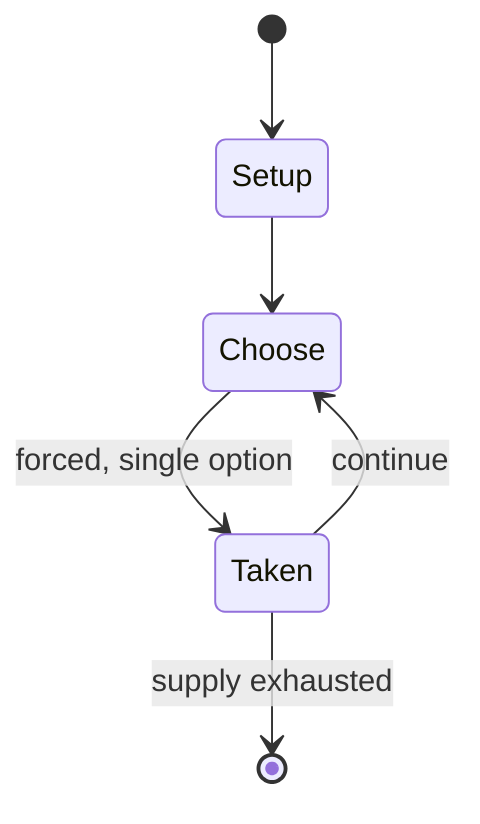

# Birds in a truck riddle

*scientific riddle about weight in motion*

`birds_in_a_truck_riddle` &nbsp; state: **DEEPENED** &nbsp; method: **heuristic**

## Found layer (recorded, not trusted)

| field | value |
| --- | --- |
| wikidata | Q19579897 |
| wikipedia | Birds in a truck riddle |
| genres (source) | -- |
| instance of (source) | riddle |
| country of origin | -- |

## Declared layer (orders bench work)

| field | value |
| --- | --- |
| year created | -- |
| epoch | -- |
| region | -- |
| media | PUZZLE |
| players | -- |
| age band | -- |
| exogenous process | -- |
| loss shape | -- |
| live axes | - |
| horizon | -- |
| scoring shape | -- |
| information | -- |
| interaction | TEAM |
| turn structure | -- |
| tractability | SAMPLING_ONLY |
| randomness | -- |
| luck factor | 0.35 |
| rules complexity | 1.7 |
| strategic depth | 2.0 |
| novelty | 0.0876 |
| solved status | -- |
| strategies | -- |
| algorithms | -- |

## Object model

```
Episode
  players      : ?
  turn_structure: ?
  horizon       : ?
  scoring       : ?

Configuration  -- the arrangement to be resolved
Constraint     -- predicate a legal configuration must satisfy
```

## State transition diagram



## Research item -- turn trace

```
# Birds in a truck riddle -- simulated turn events
# generated from the DECLARED vector, not from a rulebook.
# structure: exo=None loss=None horizon=None scoring=None axes=-

t=0    SETUP        players=2  pot=0  capacity=4
t=1    FORCED       p1 single legal option taken (pot_gain=+1.6)
t=2    ENDTURN      turn passes to p2
t=3    FORCED       p2 single legal option taken (pot_gain=+0.9)
t=4    ENDTURN      turn passes to p1
t=5    FORCED       p1 single legal option taken (pot_gain=+1.6)
t=6    FORCED       p1 single legal option taken (pot_gain=+1.4)
t=7    FORCED       p1 single legal option taken (pot_gain=+1.9)
t=8    FORCED       p1 single legal option taken (pot_gain=+1.4)
t=9    FORCED       p1 single legal option taken (pot_gain=+0.7)
t=10   ENDTURN      turn passes to p2
t=11   FORCED       p2 single legal option taken (pot_gain=+1.5)
t=12   FORCED       p2 single legal option taken (pot_gain=+1.0)
t=13   FORCED       p2 single legal option taken (pot_gain=+1.8)
t=14   FORCED       p2 single legal option taken (pot_gain=+1.2)
t=15   FORCED       p2 single legal option taken (pot_gain=+1.7)
t=16   ENDTURN      turn passes to p1
t=17   FORCED       p1 single legal option taken (pot_gain=+1.7)
t=18   ENDTURN      turn passes to p2
t=19   FORCED       p2 single legal option taken (pot_gain=+0.9)
t=20   ENDTURN      turn passes to p1
t=21   FORCED       p1 single legal option taken (pot_gain=+1.6)
t=22   FORCED       p1 single legal option taken (pot_gain=+1.0)
t=23   FORCED       p1 single legal option taken (pot_gain=+1.8)
t=24   FORCED       p1 single legal option taken (pot_gain=+1.7)
t=25   FORCED       p1 single legal option taken (pot_gain=+1.1)
t=26   FORCED       p1 single legal option taken (pot_gain=+0.6)

terminal: VARIABLE
```

## Source extract

The birds in a truck riddle is a riddle that asks whether a container or a truck carrying birds
changes in weight when the birds inside are flying. The television series MythBusters
investigated the question in a 2007 episode, testing it both with a box of pigeons and again
with a model helicopter. They concluded that the contents being in flight made no difference to
the weight, and theorised that the downdraft of air from the wings or rotors pressed down
against the base of the box with the same force as the resting bird or helicopter. A drone
research team from Stanford University measured the forces involved in a bird's hovering and
found that it created "double the lift during the downstroke [of the wings] so that the birds
did not have to lift their weight during the upstroke", with the amount of lift on the upstroke
being "almost none". They concluded that a truck containing a few birds would fluctuate in
weight over time, but a larger flock flapping at random would cancel one another and leave the
truck's weight unaffected.   == References ==

<sub>Wikipedia, CC BY-SA. Retained as evidence for the structural
classification above. Every rule inferred from it is HYPOTHESIZED
until audited against a rulebook.</sub>
