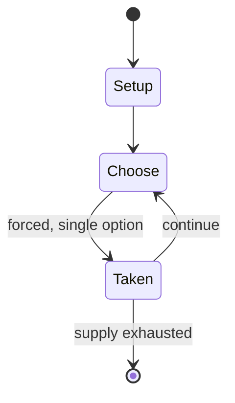

# Black Mesa Inbound

*first chapter of the 1998 video game Half-Life*

`black_mesa_inbound` &nbsp; state: **DEEPENED** &nbsp; method: **heuristic**

## Found layer (recorded, not trusted)

| field | value |
| --- | --- |
| wikidata | Q133296100 |
| wikipedia | Black Mesa Inbound |
| genres (source) | -- |
| instance of (source) | video game chapter |
| country of origin | United States |

## Declared layer (orders bench work)

| field | value |
| --- | --- |
| year created | 1998 |
| epoch | DIGITAL |
| region | NORTH_AMERICA |
| media | VIDEO |
| players | -- |
| age band | -- |
| exogenous process | -- |
| loss shape | -- |
| live axes | ORDER |
| horizon | -- |
| scoring shape | -- |
| information | -- |
| interaction | COMPETITIVE |
| turn structure | -- |
| tractability | SAMPLING_ONLY |
| randomness | HIDDEN_INFO |
| luck factor | 0.35 |
| rules complexity | 2.4 |
| strategic depth | 2.0 |
| novelty | 0.3514 |
| solved status | -- |
| strategies | -- |
| algorithms | -- |

## Object model

```
Episode
  players      : ?
  turn_structure: ?
  horizon       : ?
  scoring       : ?

WorldState     -- simulation state advanced by the engine
Avatar         -- player-controlled agent
Clock          -- frame or tick counter
Sequence       -- the permutation under the player's control
```

## State transition diagram



## Research item -- turn trace

```
# Black Mesa Inbound -- simulated turn events
# generated from the DECLARED vector, not from a rulebook.
# structure: exo=None loss=None horizon=None scoring=None axes=ORDER

t=0    SETUP        players=2  pot=0  capacity=6
t=1    FORCED       p1 single legal option taken (pot_gain=+0.9)
t=2    FORCED       p1 single legal option taken (pot_gain=+1.5)
t=3    FORCED       p1 single legal option taken (pot_gain=+0.6)
t=4    ENDTURN      turn passes to p2
t=5    FORCED       p2 single legal option taken (pot_gain=+1.7)
t=6    FORCED       p2 single legal option taken (pot_gain=+0.8)
t=7    FORCED       p2 single legal option taken (pot_gain=+1.0)
t=8    FORCED       p2 single legal option taken (pot_gain=+2.0)
t=9    FORCED       p2 single legal option taken (pot_gain=+0.8)
t=10   FORCED       p2 single legal option taken (pot_gain=+1.1)
t=11   FORCED       p2 single legal option taken (pot_gain=+0.7)
t=12   ENDTURN      turn passes to p1
t=13   FORCED       p1 single legal option taken (pot_gain=+1.4)
t=14   FORCED       p1 single legal option taken (pot_gain=+0.5)
t=15   FORCED       p1 single legal option taken (pot_gain=+1.4)
t=16   FORCED       p1 single legal option taken (pot_gain=+1.8)
t=17   ENDTURN      turn passes to p2
t=18   FORCED       p2 single legal option taken (pot_gain=+1.1)
t=19   FORCED       p2 single legal option taken (pot_gain=+0.9)
t=20   FORCED       p2 single legal option taken (pot_gain=+0.8)
t=21   ENDTURN      turn passes to p1
t=22   FORCED       p1 single legal option taken (pot_gain=+1.7)
t=23   FORCED       p1 single legal option taken (pot_gain=+1.7)
t=24   ENDTURN      turn passes to p2
t=25   FORCED       p2 single legal option taken (pot_gain=+1.5)
t=26   ENDTURN      turn passes to p1

terminal: VARIABLE
```

## Source extract

The Black Mesa Research Facility (also simply called Black Mesa) is a fictional large
underground laboratory complex that serves as the primary setting for the video game Half-Life
and its expansions, as well as its unofficial remake, Black Mesa. It also features in the wider
Half-Life universe, including the Portal series. Located in the New Mexico desert in a
decommissioned Cold War missile site, it is the former employer of Half-Life's theoretical
physicist protagonist, Gordon Freeman, and a competitor of Aperture Science. While the facility
ostensibly conducts military-industrial research, its secret experiments into teleportation have
caused it to make contact with the alien world of Xen, and its scientists covertly study its
life-forms and materials. In a catastrophic event known as the "Black Mesa Incident", an "anti-
mass spectrometer" experiment conducted on Xen matter causes a Resonance Cascade disaster that
allows aliens to invade Earth, and is the catalyst for the events of the series. Half-Life was
critically acclaimed for its storytelling and level design. At the time, the integration of
narrative into gameplay through scripted sequences and NPCs instead of through cut

<sub>Wikipedia, CC BY-SA. Retained as evidence for the structural
classification above. Every rule inferred from it is HYPOTHESIZED
until audited against a rulebook.</sub>
