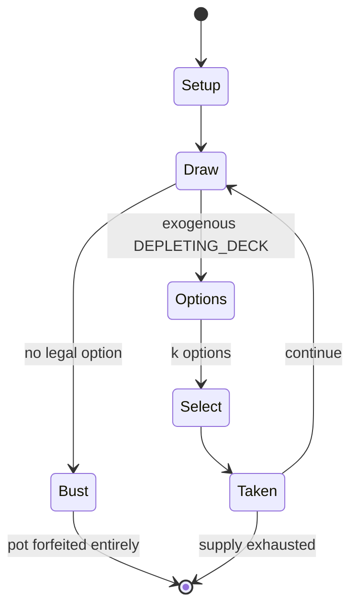

# Blackjack

`blackjack` &nbsp; state: **DEEPENED** &nbsp; method: **heuristic**

## Found layer (recorded, not trusted)

| field | value |
| --- | --- |
| wikidata | Q228044 |
| wikipedia | Blackjack |
| genres (source) | -- |
| instance of (source) | -- |
| country of origin | -- |

## Declared layer (orders bench work)

| field | value |
| --- | --- |
| year created | 1963 |
| epoch | MODERN |
| region | -- |
| media | CARD, GAMBLING |
| players | -- |
| age band | -- |
| exogenous process | DEPLETING_DECK |
| loss shape | TOTAL_RUIN |
| live axes | DISCARD, SELECT |
| horizon | -- |
| scoring shape | -- |
| information | -- |
| interaction | COMPETITIVE |
| turn structure | -- |
| tractability | EXACT_WITH_CUT |
| randomness | DECK_SHUFFLE, HIDDEN_INFO |
| luck factor | 0.53 |
| rules complexity | 3.0 |
| strategic depth | 2.2 |
| novelty | 0.7355 |
| solved status | -- |
| strategies | signalling |
| algorithms | -- |

## Object model

```
Episode
  players      : ?
  turn_structure: ?
  horizon       : ?
  scoring       : ?

Deck           -- ordered multiset, drawn without replacement
Hand           -- private multiset held by one player
DiscardPile    -- public accumulation of spent cards
DiscardChoice  -- what is given up to satisfy a limit
OptionSet      -- the choices available after an exogenous draw
```

## State transition diagram



## Research item -- turn trace

```
# Blackjack -- simulated turn events
# generated from the DECLARED vector, not from a rulebook.
# structure: exo=DEPLETING_DECK loss=TOTAL_RUIN horizon=None scoring=None axes=DISCARD,SELECT

t=0    SETUP        players=2  pot=0  capacity=5
t=1    DRAW         p1 draw from deck -> outcome #3  (p=0.292)
t=2    SELECT       p1 4 options; take #4  (pot_gain=+2.9, capacity=-2)
t=3    DRAW         p1 draw from deck -> outcome #6  (p=0.024)
t=4    SELECT       p1 2 options; take #2  (pot_gain=+3.3, capacity=-2)
t=5    DRAW         p1 draw from deck -> outcome #3  (p=0.026)
t=6    SELECT       p1 4 options; take #4  (pot_gain=+0.7, capacity=-1)
t=7    DISCARD      p1 discards to hand limit
t=8    DRAW         p1 draw from deck -> outcome #5  (p=0.144)
t=9    DEATH        p1 no legal option -- BUST. pot 6.9 -> 0.0
t=10   NOTE         loss_shape=TOTAL_RUIN: entire pot forfeited

terminal: VARIABLE
```

## Conditions

| kind | threshold | effect | trigger |
| --- | --- | --- | --- |
| WIN | -- | -- | A player blackjack wins immediately unless the dealer also has one, in which case the hand is a push. |
| BOUNDARY | -- | -- | Standard blackjack layouts may contain no more than seven wagering areas, while separate requirements apply to certain game variations. |
| PENALTY | -- | -- | Surrender: Forfeit half the bet and end the hand immediately. |
| PENALTY | -- | -- | The "original bets only" rule variation appearing in certain no hole card games states that if the player's hand loses to a dealer blackjack, only the mandatory initial bet ("original") is forfeited, and all optional bet |

## Source extract

Blackjack (formerly black jack or vingt-un) is a casino banking game. It is the most widely
played casino banking game in the world. It uses decks of 52 cards and descends from a global
family of casino banking games known as "twenty-one". This family of card games also includes
the European games vingt-et-un and pontoon, and the Russian game Ochko. The game is a comparing
card game where players compete against the dealer, rather than each other.   == History ==
Blackjack's immediate precursor was the English version of twenty-one called vingt-un, a game of
unknown provenance. The first written reference is found in a book by the Spanish author Miguel
de Cervantes. Cervantes was a gambler, and the protagonists of his "Rinconete y Cortadillo",
from Novelas Ejemplares, are card cheats in Seville. They are proficient at cheating at
veintiuno (Spanish for "twenty-one") and state that the object of the game is to reach 21 points
without going over and that the ace values 1 or 11. The game is played with the Spanish baraja
deck. "Rinconete y Cortadillo" was written between 1601 and 1602, implying that veintiuno was
played in Castile since the beginning of the 17th century or earlier. La

<sub>Wikipedia, CC BY-SA. Retained as evidence for the structural
classification above. Every rule inferred from it is HYPOTHESIZED
until audited against a rulebook.</sub>
