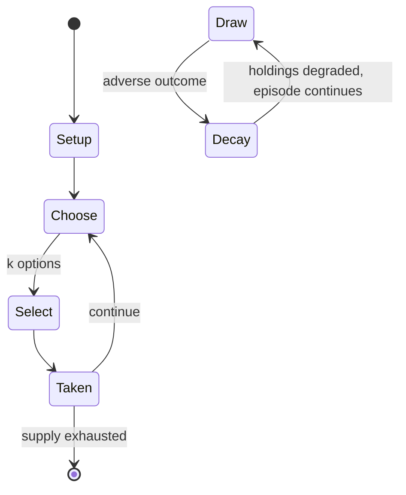

# Blood on the Clocktower

`blood_on_the_clocktower` &nbsp; state: **DEEPENED** &nbsp; method: **heuristic**

## Found layer (recorded, not trusted)

| field | value |
| --- | --- |
| wikidata | Q122227092 |
| wikipedia | Blood on the Clocktower |
| genres (source) | -- |
| instance of (source) | -- |
| country of origin | -- |

## Declared layer (orders bench work)

| field | value |
| --- | --- |
| year created | 2022 |
| epoch | CONTEMPORARY |
| region | -- |
| media | BOARD, PARTY |
| players | -- |
| age band | -- |
| exogenous process | -- |
| loss shape | PARTIAL_DECAY |
| live axes | BLUFF, SELECT, TRADE |
| horizon | VARIABLE |
| scoring shape | SET_COLLECTION_CONVEX |
| information | IMPERFECT |
| interaction | TRAITOR |
| turn structure | PHASE_STRUCTURED |
| tractability | SAMPLING_ONLY |
| randomness | HIDDEN_INFO |
| luck factor | 0.35 |
| rules complexity | 4.25 |
| strategic depth | 2.75 |
| novelty | 0.7624 |
| solved status | -- |
| strategies | area_control, deduction, signalling |
| algorithms | -- |

## Object model

```
Episode
  players      : ?
  turn_structure: PHASE_STRUCTURED
  horizon       : VARIABLE
  scoring       : SET_COLLECTION_CONVEX

Board          -- spatial substrate; cells carry position and occupancy
Piece          -- movable token owned by a player
Belief         -- what an observer is induced to think is true
OptionSet      -- the choices available after an exogenous draw
Offer          -- proposed exchange between two agents
```

## State transition diagram



## Research item -- turn trace

```
# Blood on the Clocktower -- simulated turn events
# generated from the DECLARED vector, not from a rulebook.
# structure: exo=None loss=PARTIAL_DECAY horizon=VARIABLE scoring=SET_COLLECTION_CONVEX axes=BLUFF,SELECT,TRADE

t=0    SETUP        players=2  pot=0  capacity=5
t=1    SELECT       p1 2 options; take #1  (pot_gain=+2.7, capacity=-0)
t=2    SELECT       p1 4 options; take #1  (pot_gain=+1.8, capacity=-1)
t=3    BLUFF        p1 represents a holding it does not have
t=4    SELECT       p1 1 options; take #1  (pot_gain=+2.6, capacity=-2)
t=5    SELECT       p1 4 options; take #3  (pot_gain=+3.0, capacity=-1)
t=6    SELECT       p1 1 options; take #1  (pot_gain=+3.0, capacity=-1)
t=7    ENDTURN      turn passes to p2
t=8    SELECT       p2 4 options; take #1  (pot_gain=+1.9, capacity=-2)
t=9    SELECT       p2 1 options; take #1  (pot_gain=+1.5, capacity=-0)
t=10   TRADE        p2 offers 2:1 exchange to p1
t=11   BLUFF        p2 represents a holding it does not have
t=12   ENDTURN      turn passes to p1
t=13   SELECT       p1 4 options; take #2  (pot_gain=+0.9, capacity=-0)
t=14   SELECT       p1 3 options; take #1  (pot_gain=+1.9, capacity=-0)
t=15   SELECT       p1 4 options; take #4  (pot_gain=+0.6, capacity=-0)
t=16   BLUFF        p1 represents a holding it does not have
t=17   SELECT       p1 1 options; take #1  (pot_gain=+3.3, capacity=-1)
t=18   SELECT       p1 2 options; take #1  (pot_gain=+2.9, capacity=-1)
t=19   TRADE        p1 offers 2:1 exchange to p2
t=20   BLUFF        p1 represents a holding it does not have
t=21   SELECT       p1 2 options; take #1  (pot_gain=+2.3, capacity=-0)
t=22   BLUFF        p1 represents a holding it does not have
t=23   SELECT       p1 4 options; take #1  (pot_gain=+1.7, capacity=-0)
t=24   BLUFF        p1 represents a holding it does not have
t=25   SELECT       p1 1 options; take #1  (pot_gain=+3.4, capacity=-1)
t=26   TRADE        p1 offers 2:1 exchange to p2

terminal: VARIABLE
```

## Conditions

| kind | threshold | effect | trigger |
| --- | --- | --- | --- |
| ELIMINATE | -- | -- | Dead players are not eliminated and can participate freely in discussions. |
| TERMINATE | -- | -- | In most cases, the game ends when the demon is executed, resulting in a good win, or there are only two living players remaining resulting in an evil win. |

## Source extract

Blood on the Clocktower is a social deduction game created by Steven Medway and published by The
Pandemonium Institute. The game was released in board game format in 2022, first via
Kickstarter. The game can also be played online via a web app and via Discord communities.
Gameplay is also live streamed on several Twitch channels, including an official channel by The
Pandemonium Institute. The game shares core mechanics with Mafia, featuring a conflict between
two teams of players: an evil team made up of a "demon" and supporting "minions" (the informed
minority), and a good team (the uninformed majority). A neutral gamemaster called the
Storyteller runs the game. Each player is randomly assigned a secret good or evil role with a
unique ability and must help their team achieve its win condition. The game is divided into days
and nights. Each day, players can vote to remove one player (known as an "execution"), and each
night, most demon characters may choose to remove another player. Normally, the good team wins
by executing the demon, and the evil team wins by keeping the demon alive until only two players
remain.   == Gameplay ==   === Setup === Before the game begins, the Storyte

<sub>Wikipedia, CC BY-SA. Retained as evidence for the structural
classification above. Every rule inferred from it is HYPOTHESIZED
until audited against a rulebook.</sub>
