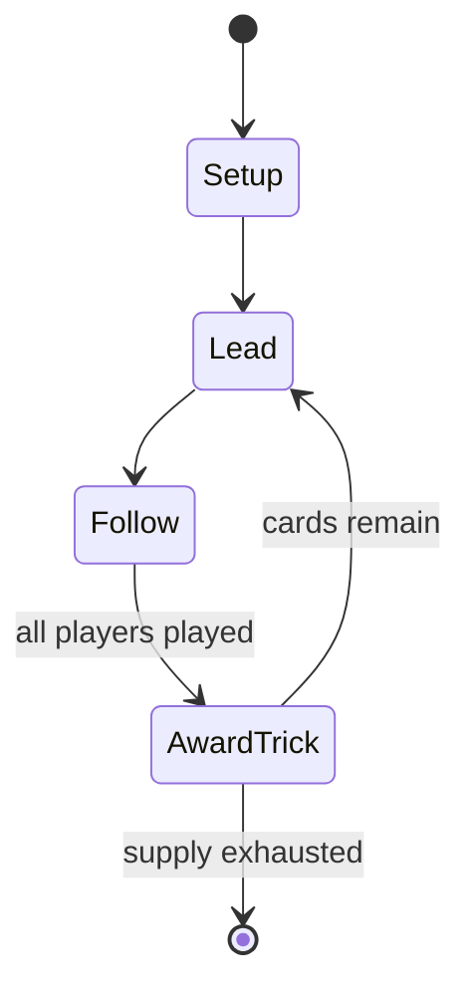

# Bohemian Schneider

*card game*

`bohemian_schneider` &nbsp; state: **DEEPENED** &nbsp; method: **heuristic**

## Found layer (recorded, not trusted)

| field | value |
| --- | --- |
| wikidata | Q25385754 |
| wikipedia | Bohemian Schneider |
| genres (source) | -- |
| instance of (source) | card game, trick-taking game |
| country of origin | -- |

## Declared layer (orders bench work)

| field | value |
| --- | --- |
| year created | -- |
| epoch | -- |
| region | -- |
| media | CARD, TRICK_TAKING |
| players | -- |
| age band | -- |
| exogenous process | DEPLETING_DECK |
| loss shape | -- |
| live axes | DISCARD |
| horizon | -- |
| scoring shape | WINNER_TAKE_ALL |
| information | -- |
| interaction | COMPETITIVE |
| turn structure | TRICK_ROUND |
| tractability | EXACT_WITH_CUT |
| randomness | DECK_DEPLETING, DECK_SHUFFLE, SIMULTANEOUS_CHOICE |
| luck factor | 0.48 |
| rules complexity | 2.17 |
| strategic depth | 2.25 |
| novelty | 0.7598 |
| solved status | -- |
| strategies | spatial_packing |
| algorithms | -- |

## Object model

```
Episode
  players      : ?
  turn_structure: TRICK_ROUND
  horizon       : ?
  scoring       : WINNER_TAKE_ALL

Deck           -- ordered multiset, drawn without replacement
Hand           -- private multiset held by one player
DiscardPile    -- public accumulation of spent cards
Trick          -- one card per player; a winner is determined
Trump          -- suit that dominates the ordering
DiscardChoice  -- what is given up to satisfy a limit
```

## State transition diagram



## Research item -- turn trace

```
# Bohemian Schneider -- simulated turn events
# generated from the DECLARED vector, not from a rulebook.
# structure: exo=DEPLETING_DECK loss=None horizon=None scoring=WINNER_TAKE_ALL axes=DISCARD

t=0    SETUP        players=2  pot=0  capacity=8
t=1    DRAW         p1 draw from deck -> outcome #6  (p=0.266)
t=2    FORCED       p1 single legal option taken (pot_gain=+1.2)
t=3    DISCARD      p1 discards to hand limit
t=4    ENDTURN      turn passes to p2
t=5    DRAW         p2 draw from deck -> outcome #6  (p=0.123)
t=6    FORCED       p2 single legal option taken (pot_gain=+0.9)
t=7    DRAW         p2 draw from deck -> outcome #5  (p=0.232)
t=8    FORCED       p2 single legal option taken (pot_gain=+1.7)
t=9    DRAW         p2 draw from deck -> outcome #1  (p=0.145)
t=10   FORCED       p2 single legal option taken (pot_gain=+1.6)
t=11   DRAW         p2 draw from deck -> outcome #3  (p=0.017)
t=12   FORCED       p2 single legal option taken (pot_gain=+1.1)
t=13   ENDTURN      turn passes to p1
t=14   DRAW         p1 draw from deck -> outcome #6  (p=0.190)
t=15   FORCED       p1 single legal option taken (pot_gain=+1.1)
t=16   DISCARD      p1 discards to hand limit
t=17   DRAW         p1 draw from deck -> outcome #6  (p=0.154)
t=18   FORCED       p1 single legal option taken (pot_gain=+1.1)
t=19   DRAW         p1 draw from deck -> outcome #2  (p=0.068)
t=20   FORCED       p1 single legal option taken (pot_gain=+1.3)
t=21   DISCARD      p1 discards to hand limit
t=22   DRAW         p1 draw from deck -> outcome #6  (p=0.039)
t=23   FORCED       p1 single legal option taken (pot_gain=+1.0)
t=24   DRAW         p1 draw from deck -> outcome #3  (p=0.122)
t=25   FORCED       p1 single legal option taken (pot_gain=+1.7)
t=26   DISCARD      p1 discards to hand limit
t=27   ENDTURN      turn passes to p2

terminal: VARIABLE
```

## Source extract

Bohemian Schneider (German: Böhmischer Schneider) is a card game for two people, which is played
with a German-suited Skat pack of 32 cards. Because it is a simple trick-taking game, it is
often played by older children and is recommended for age 8 upwards. It was probably developed
in Bohemia and spread from there across the south German region and Austria. The game is
sometimes called Bohemian Tailor, Schneider being German for "tailor".   == History == The game
was probably developed in Bohemia and spread from there to the South German region and Austria.
Traditionally it is played with a German pack of cards. Its rules appeared as early as 1860.
== Rules ==  Bohemian Schneider is played with a German deck of 32 cards (Skat deck). The cards
rank as follows: Deuce (~Ace) > King > Ober > Unter > Ten > Nine > Eight > Seven. Alternatively
a 32-card French or Piquet deck may be used.   === Playing === After the cards have been
shuffled each player is dealt six cards in two packets of three cards. The remaining cards are
placed face down on the table to form the talon. The opponent of the dealer begins the game and
leads a cards to the table. The dealer now tries to win the trick, b

<sub>Wikipedia, CC BY-SA. Retained as evidence for the structural
classification above. Every rule inferred from it is HYPOTHESIZED
until audited against a rulebook.</sub>
