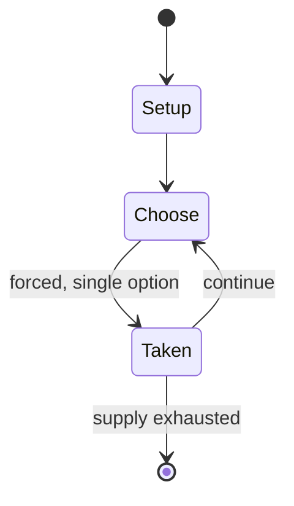

# Bolognese tarot

*62-suit deck of tarot cards*

`bolognese_tarot` &nbsp; state: **DEEPENED** &nbsp; method: **heuristic**

## Found layer (recorded, not trusted)

| field | value |
| --- | --- |
| wikidata | Q24906060 |
| wikipedia | Tarocco Bolognese |
| genres (source) | -- |
| instance of (source) | playing card, tarot card game, tarot deck |
| country of origin | -- |

## Declared layer (orders bench work)

| field | value |
| --- | --- |
| year created | -- |
| epoch | -- |
| region | -- |
| media | CARD |
| players | -- |
| age band | -- |
| exogenous process | -- |
| loss shape | -- |
| live axes | - |
| horizon | -- |
| scoring shape | SURVIVAL |
| information | -- |
| interaction | -- |
| turn structure | -- |
| tractability | SAMPLING_ONLY |
| randomness | -- |
| luck factor | 0.35 |
| rules complexity | 1.76 |
| strategic depth | 2.25 |
| novelty | 0.505 |
| solved status | -- |
| strategies | spatial_packing |
| algorithms | -- |

## Object model

```
Episode
  players      : ?
  turn_structure: ?
  horizon       : ?
  scoring       : SURVIVAL

Deck           -- ordered multiset, drawn without replacement
Hand           -- private multiset held by one player
DiscardPile    -- public accumulation of spent cards
```

## State transition diagram



## Research item -- turn trace

```
# Bolognese tarot -- simulated turn events
# generated from the DECLARED vector, not from a rulebook.
# structure: exo=None loss=None horizon=None scoring=SURVIVAL axes=-

t=0    SETUP        players=2  pot=0  capacity=4
t=1    FORCED       p1 single legal option taken (pot_gain=+0.9)
t=2    FORCED       p1 single legal option taken (pot_gain=+0.7)
t=3    FORCED       p1 single legal option taken (pot_gain=+1.5)
t=4    FORCED       p1 single legal option taken (pot_gain=+1.2)
t=5    FORCED       p1 single legal option taken (pot_gain=+1.8)
t=6    FORCED       p1 single legal option taken (pot_gain=+1.1)
t=7    ENDTURN      turn passes to p2
t=8    FORCED       p2 single legal option taken (pot_gain=+1.5)
t=9    FORCED       p2 single legal option taken (pot_gain=+1.8)
t=10   FORCED       p2 single legal option taken (pot_gain=+1.2)
t=11   FORCED       p2 single legal option taken (pot_gain=+2.0)
t=12   FORCED       p2 single legal option taken (pot_gain=+1.5)
t=13   ENDTURN      turn passes to p1
t=14   FORCED       p1 single legal option taken (pot_gain=+1.6)
t=15   FORCED       p1 single legal option taken (pot_gain=+1.6)
t=16   FORCED       p1 single legal option taken (pot_gain=+0.7)
t=17   FORCED       p1 single legal option taken (pot_gain=+0.8)
t=18   FORCED       p1 single legal option taken (pot_gain=+1.3)
t=19   ENDTURN      turn passes to p2
t=20   FORCED       p2 single legal option taken (pot_gain=+1.6)
t=21   FORCED       p2 single legal option taken (pot_gain=+1.4)
t=22   FORCED       p2 single legal option taken (pot_gain=+1.5)
t=23   FORCED       p2 single legal option taken (pot_gain=+1.0)
t=24   FORCED       p2 single legal option taken (pot_gain=+0.6)
t=25   FORCED       p2 single legal option taken (pot_gain=+1.2)
t=26   FORCED       p2 single legal option taken (pot_gain=+1.7)
t=27   ENDTURN      turn passes to p1

terminal: VARIABLE
```

## Conditions

| kind | threshold | effect | trigger |
| --- | --- | --- | --- |
| BOUNDARY | -- | -- | Local tradition dating from at least the 17th century, ascribes the invention of tarot to Prince Francesco Antelminelli Castracani Fibbia (1360-1419), great-grandson of Castruccio Castracani. |
| BOUNDARY | -- | -- | This is one of the oldest decks in continual use, dating back to at least the 15th century. |
| BOUNDARY | -- | -- | The Tarocco Bolognese is also the earliest tarot deck to be used in cartomancy, predating de Gébelin and Etteilla by at least thirty years. |

## Source extract

The Tarocco Bolognese is a tarot deck found in Bologna and is used to play tarocchini. It is a
62 card Italian suited deck which influenced the development of the Tarocco Siciliano and the
obsolete Minchiate deck.   == History == The earliest mention of tarocchi in connection to
Bologna was in 1442 when a Bolognese merchant sold two decks of trionfi in the city of Ferrara.
The earliest known mention of trionfi in Bologna itself dates to 1459. Local tradition dating
from at least the 17th century, ascribes the invention of tarot to Prince Francesco Antelminelli
Castracani Fibbia (1360-1419), great-grandson of Castruccio Castracani. This is one of the
oldest decks in continual use, dating back to at least the 15th century. The oldest surviving
uncut sheets, dating from the late 15th or early 16th century, are held in the Rothschild
Collection in the Louvre and in the École nationale supérieure des Beaux-Arts.  It is an
expansion of the pre-existing Bolognese deck by adding queens, the Fool, and an extra suit of 21
trumps. The regular and tarot decks began to diverge during the 16th century. The Tarocco set
removed ranks 2 to 5 bringing down the number of cards from 78 to the present

<sub>Wikipedia, CC BY-SA. Retained as evidence for the structural
classification above. Every rule inferred from it is HYPOTHESIZED
until audited against a rulebook.</sub>
