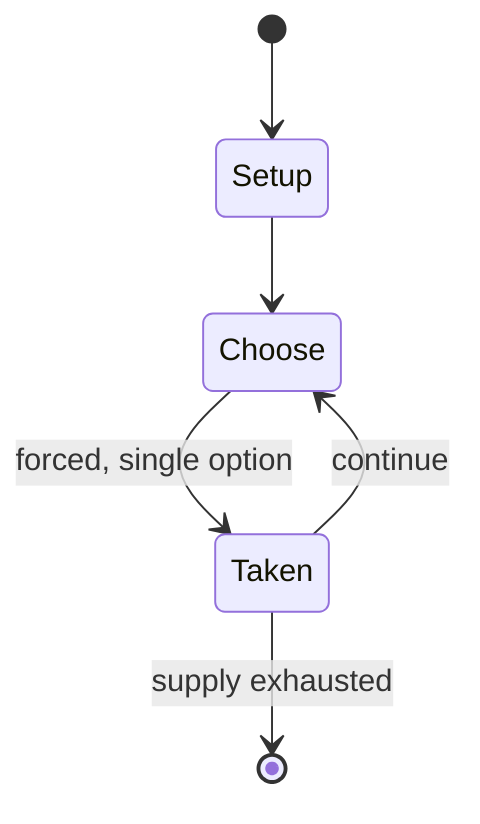

# Bonza

*2014 video game*

`bonza` &nbsp; state: **DEEPENED** &nbsp; method: **heuristic**

## Found layer (recorded, not trusted)

| field | value |
| --- | --- |
| wikidata | Q22662549 |
| wikipedia | Bonza (video game) |
| genres (source) | puzzle video game |
| instance of (source) | crossword |
| country of origin | -- |

## Declared layer (orders bench work)

| field | value |
| --- | --- |
| year created | -- |
| epoch | -- |
| region | -- |
| media | PUZZLE, VIDEO |
| players | -- |
| age band | -- |
| exogenous process | -- |
| loss shape | -- |
| live axes | - |
| horizon | -- |
| scoring shape | -- |
| information | -- |
| interaction | SOLITAIRE |
| turn structure | -- |
| tractability | SAMPLING_ONLY |
| randomness | -- |
| luck factor | 0.35 |
| rules complexity | 1.64 |
| strategic depth | 2.0 |
| novelty | 0.3965 |
| solved status | -- |
| strategies | -- |
| algorithms | -- |

## Object model

```
Episode
  players      : ?
  turn_structure: ?
  horizon       : ?
  scoring       : ?

Configuration  -- the arrangement to be resolved
Constraint     -- predicate a legal configuration must satisfy
WorldState     -- simulation state advanced by the engine
Avatar         -- player-controlled agent
Clock          -- frame or tick counter
```

## State transition diagram



## Research item -- turn trace

```
# Bonza -- simulated turn events
# generated from the DECLARED vector, not from a rulebook.
# structure: exo=None loss=None horizon=None scoring=None axes=-

t=0    SETUP        players=2  pot=0  capacity=6
t=1    FORCED       p1 single legal option taken (pot_gain=+1.1)
t=2    ENDTURN      turn passes to p2
t=3    FORCED       p2 single legal option taken (pot_gain=+1.8)
t=4    ENDTURN      turn passes to p1
t=5    FORCED       p1 single legal option taken (pot_gain=+1.3)
t=6    FORCED       p1 single legal option taken (pot_gain=+1.8)
t=7    FORCED       p1 single legal option taken (pot_gain=+1.0)
t=8    FORCED       p1 single legal option taken (pot_gain=+1.8)
t=9    FORCED       p1 single legal option taken (pot_gain=+1.5)
t=10   FORCED       p1 single legal option taken (pot_gain=+2.0)
t=11   FORCED       p1 single legal option taken (pot_gain=+1.4)
t=12   FORCED       p1 single legal option taken (pot_gain=+0.8)
t=13   FORCED       p1 single legal option taken (pot_gain=+0.8)
t=14   FORCED       p1 single legal option taken (pot_gain=+1.4)
t=15   FORCED       p1 single legal option taken (pot_gain=+1.3)
t=16   ENDTURN      turn passes to p2
t=17   FORCED       p2 single legal option taken (pot_gain=+0.7)
t=18   FORCED       p2 single legal option taken (pot_gain=+1.4)
t=19   FORCED       p2 single legal option taken (pot_gain=+1.2)
t=20   FORCED       p2 single legal option taken (pot_gain=+1.6)
t=21   FORCED       p2 single legal option taken (pot_gain=+1.5)
t=22   ENDTURN      turn passes to p1
t=23   FORCED       p1 single legal option taken (pot_gain=+1.0)
t=24   FORCED       p1 single legal option taken (pot_gain=+1.8)
t=25   FORCED       p1 single legal option taken (pot_gain=+1.7)
t=26   ENDTURN      turn passes to p2

terminal: VARIABLE
```

## Source extract

Bonza is a single-player crossword puzzle application developed by MiniMega, which was chosen by
Apple to become part of the App Store's Best of 2014 list.   == Gameplay == In Bonza, players
are given fragments of a crossword puzzle and tasked with fitting them back together. There are
no clues for each word, rather one clue for the puzzle setting its theme. In 2016, the
developers added a feature that allows players to create their own puzzles.   == Reception ==
Bonza was chosen by Apple as part of the App Store's Best of 2014 list. Bonza was described as a
"game with a strangely erratic rhythm", but received praise for its value in providing 70
puzzles for less than a dollar.   == References ==

<sub>Wikipedia, CC BY-SA. Retained as evidence for the structural
classification above. Every rule inferred from it is HYPOTHESIZED
until audited against a rulebook.</sub>
