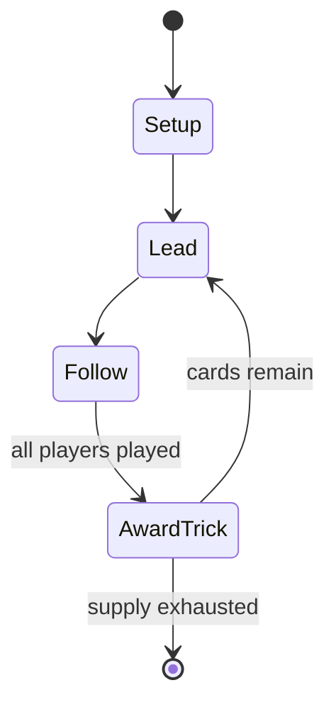

# Bottle Imp

*board game*

`bottle_imp` &nbsp; state: **DEEPENED** &nbsp; method: **heuristic**

## Found layer (recorded, not trusted)

| field | value |
| --- | --- |
| wikidata | Q18210345 |
| wikipedia | Bottle Imp (card game) |
| genres (source) | -- |
| instance of (source) | board game, trick-taking game |
| country of origin | -- |

## Declared layer (orders bench work)

| field | value |
| --- | --- |
| year created | 1995 |
| epoch | DIGITAL |
| region | -- |
| media | BOARD, TRICK_TAKING |
| players | -- |
| age band | -- |
| exogenous process | -- |
| loss shape | -- |
| live axes | DISCARD, SELECT |
| horizon | -- |
| scoring shape | -- |
| information | -- |
| interaction | -- |
| turn structure | TRICK_ROUND |
| tractability | SAMPLING_ONLY |
| randomness | -- |
| luck factor | 0.35 |
| rules complexity | 2.41 |
| strategic depth | 2.0 |
| novelty | 0.4772 |
| solved status | -- |
| strategies | -- |
| algorithms | -- |

## Object model

```
Episode
  players      : ?
  turn_structure: TRICK_ROUND
  horizon       : ?
  scoring       : ?

Board          -- spatial substrate; cells carry position and occupancy
Piece          -- movable token owned by a player
Trick          -- one card per player; a winner is determined
Trump          -- suit that dominates the ordering
DiscardChoice  -- what is given up to satisfy a limit
OptionSet      -- the choices available after an exogenous draw
```

## State transition diagram



## Research item -- turn trace

```
# Bottle Imp -- simulated turn events
# generated from the DECLARED vector, not from a rulebook.
# structure: exo=None loss=None horizon=None scoring=None axes=DISCARD,SELECT

t=0    SETUP        players=2  pot=0  capacity=6
t=1    SELECT       p1 4 options; take #3  (pot_gain=+1.3, capacity=-1)
t=2    DISCARD      p1 discards to hand limit
t=3    SELECT       p1 4 options; take #2  (pot_gain=+1.6, capacity=-0)
t=4    SELECT       p1 4 options; take #1  (pot_gain=+1.8, capacity=-1)
t=5    DISCARD      p1 discards to hand limit
t=6    SELECT       p1 3 options; take #2  (pot_gain=+3.4, capacity=-2)
t=7    SELECT       p1 1 options; take #1  (pot_gain=+2.8, capacity=-2)
t=8    SELECT       p1 4 options; take #3  (pot_gain=+0.9, capacity=-1)
t=9    SELECT       p1 1 options; take #1  (pot_gain=+1.6, capacity=-1)
t=10   SELECT       p1 1 options; take #1  (pot_gain=+3.0, capacity=-1)
t=11   SELECT       p1 4 options; take #3  (pot_gain=+2.3, capacity=-0)
t=12   DISCARD      p1 discards to hand limit
t=13   SELECT       p1 2 options; take #1  (pot_gain=+1.8, capacity=-2)
t=14   DISCARD      p1 discards to hand limit
t=15   ENDTURN      turn passes to p2
t=16   SELECT       p2 4 options; take #1  (pot_gain=+0.9, capacity=-2)
t=17   DISCARD      p2 discards to hand limit
t=18   SELECT       p2 2 options; take #1  (pot_gain=+0.6, capacity=-2)
t=19   DISCARD      p2 discards to hand limit
t=20   SELECT       p2 1 options; take #1  (pot_gain=+2.2, capacity=-0)
t=21   ENDTURN      turn passes to p1
t=22   SELECT       p1 1 options; take #1  (pot_gain=+0.5, capacity=-2)
t=23   SELECT       p1 2 options; take #1  (pot_gain=+3.4, capacity=-1)
t=24   DISCARD      p1 discards to hand limit
t=25   SELECT       p1 3 options; take #1  (pot_gain=+1.9, capacity=-1)
t=26   DISCARD      p1 discards to hand limit
t=27   ENDTURN      turn passes to p2

terminal: VARIABLE
```

## Source extract

The Bottle Imp (or Flaschenteufel) is a trick-taking card game designed by Günter Cornett and
based on the Robert Louis Stevenson short story “The Bottle Imp”. It was first published in 1995
by Bambus Spieleverlag, and was re-released by Z-Man Games in 2010 under the name "Bottle Imp."
It was re-published again by Stronghold Games in 2018.   == Rules == The game is played with a
bottle token and a proprietary deck of thirty-seven cards with a total ordering from 1 to 37. A
card will be one of three colors which act like suits and there is no trump. At the beginning of
the game, the token is not attached to any player. Card #19 is the price of the bottle. The rest
of the cards are dealt out equally to all players. After hands are dealt, each player discards
one card, passes one card left and one card right. The player to the left of the dealer leads
the first trick. Players must play a matching color card if they have one, otherwise they may
play any card. If a trick contains no cards lower than the price of the bottle then the highest
card takes the trick. If a trick contains a card lower than the price of the bottle, then the
highest card lower than the price takes the trick. Tha

<sub>Wikipedia, CC BY-SA. Retained as evidence for the structural
classification above. Every rule inferred from it is HYPOTHESIZED
until audited against a rulebook.</sub>
