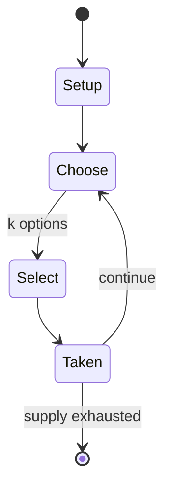

# Boule (gambling game)

`boule_gambling_game` &nbsp; state: **DEEPENED** &nbsp; method: **heuristic**

## Found layer (recorded, not trusted)

| field | value |
| --- | --- |
| wikidata | Q895059 |
| wikipedia | Boule (gambling game) |
| genres (source) | -- |
| instance of (source) | -- |
| country of origin | -- |

## Declared layer (orders bench work)

| field | value |
| --- | --- |
| year created | -- |
| epoch | -- |
| region | -- |
| media | GAMBLING |
| players | -- |
| age band | -- |
| exogenous process | -- |
| loss shape | -- |
| live axes | SELECT |
| horizon | -- |
| scoring shape | RACE_POSITION |
| information | -- |
| interaction | -- |
| turn structure | -- |
| tractability | SAMPLING_ONLY |
| randomness | DICE |
| luck factor | 0.58 |
| rules complexity | 2.15 |
| strategic depth | 2.12 |
| novelty | 0.4894 |
| solved status | -- |
| strategies | probability_estimation |
| algorithms | -- |

## Object model

```
Episode
  players      : ?
  turn_structure: ?
  horizon       : ?
  scoring       : RACE_POSITION

OptionSet      -- the choices available after an exogenous draw
```

## State transition diagram



## Research item -- turn trace

```
# Boule (gambling game) -- simulated turn events
# generated from the DECLARED vector, not from a rulebook.
# structure: exo=None loss=None horizon=None scoring=RACE_POSITION axes=SELECT

t=0    SETUP        players=2  pot=0  capacity=7
t=1    SELECT       p1 4 options; take #1  (pot_gain=+3.1, capacity=-2)
t=2    SELECT       p1 4 options; take #4  (pot_gain=+2.9, capacity=-1)
t=3    ENDTURN      turn passes to p2
t=4    SELECT       p2 3 options; take #1  (pot_gain=+0.6, capacity=-2)
t=5    SELECT       p2 4 options; take #1  (pot_gain=+2.0, capacity=-0)
t=6    SELECT       p2 4 options; take #1  (pot_gain=+3.1, capacity=-0)
t=7    SELECT       p2 4 options; take #4  (pot_gain=+3.3, capacity=-0)
t=8    ENDTURN      turn passes to p1
t=9    SELECT       p1 4 options; take #4  (pot_gain=+0.6, capacity=-1)
t=10   SELECT       p1 4 options; take #4  (pot_gain=+2.9, capacity=-1)
t=11   SELECT       p1 4 options; take #1  (pot_gain=+1.2, capacity=-0)
t=12   SELECT       p1 3 options; take #2  (pot_gain=+2.7, capacity=-1)
t=13   SELECT       p1 2 options; take #1  (pot_gain=+0.7, capacity=-1)
t=14   ENDTURN      turn passes to p2
t=15   SELECT       p2 3 options; take #2  (pot_gain=+3.1, capacity=-1)
t=16   SELECT       p2 3 options; take #3  (pot_gain=+2.5, capacity=-0)
t=17   ENDTURN      turn passes to p1
t=18   SELECT       p1 3 options; take #3  (pot_gain=+2.9, capacity=-0)
t=19   SELECT       p1 2 options; take #2  (pot_gain=+1.3, capacity=-0)
t=20   ENDTURN      turn passes to p2
t=21   SELECT       p2 4 options; take #4  (pot_gain=+3.4, capacity=-1)
t=22   SELECT       p2 2 options; take #2  (pot_gain=+2.1, capacity=-2)
t=23   SELECT       p2 1 options; take #1  (pot_gain=+1.6, capacity=-2)
t=24   SELECT       p2 1 options; take #1  (pot_gain=+2.0, capacity=-1)
t=25   SELECT       p2 4 options; take #4  (pot_gain=+2.5, capacity=-0)
t=26   SELECT       p2 3 options; take #2  (pot_gain=+0.7, capacity=-1)

terminal: VARIABLE
```

## Source extract

Boule (French for 'ball') is a gambling game, similar to roulette, that dates back to the
popular 19th-century game of Petits-Chevaux ('Little Horses').   == Playing == The wheel is
divided into 18 pockets which are numbered from 1 to 9, each number occurring twice. The numbers
1, 3, 6 and 8 are black, while the numbers 2, 4, 7 and 9 are red, and 5 is yellow. Instead of
the ivory ball used in roulette, a rubber ball is used in Boule.   === Betting options ===
==== Even odds ==== Rouge (red: 2, 4, 7, 9) - Noir (black: 1, 3, 6, 8) Pair (even: 2, 4, 6, 8) -
Impair (odd: 1, 3, 7, 9, except the 5) Manque (low: 1, 2, 3, 4) - Passe (high: 6, 7, 8, 9) The
number five corresponds to the zéro in roulette: if the boule falls on the five, all simple
chance bets are lost.   ==== Better than even odds ==== Plein: a bet on a single number, paid at
7:1. Cheval: a bet on any two numbers, paid at 3:1.   === House advantage === The overall house
advantage for all forms of betting in Boule is                                                 1
9                                     {\displaystyle {\frac {1}{9}}}     = 11.11%.  Boule is
thus rather disadvantageous for the punter; by comparis

<sub>Wikipedia, CC BY-SA. Retained as evidence for the structural
classification above. Every rule inferred from it is HYPOTHESIZED
until audited against a rulebook.</sub>
