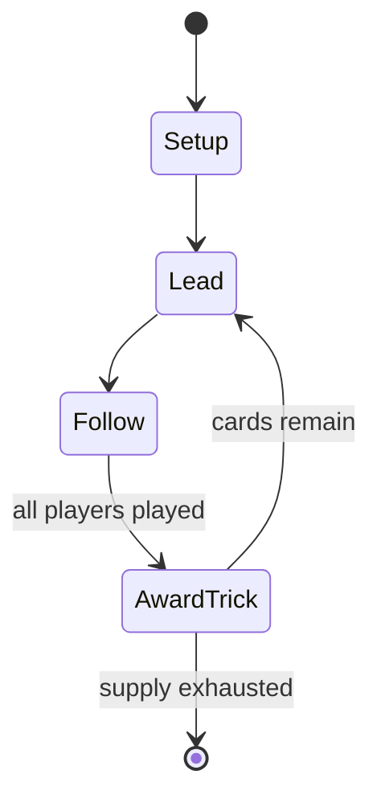

# Bourré

`bourr` &nbsp; state: **DEEPENED** &nbsp; method: **heuristic**

## Found layer (recorded, not trusted)

| field | value |
| --- | --- |
| wikidata | Q17115996 |
| wikipedia | Bourré |
| genres (source) | -- |
| instance of (source) | -- |
| country of origin | -- |

## Declared layer (orders bench work)

| field | value |
| --- | --- |
| year created | -- |
| epoch | -- |
| region | -- |
| media | CARD, GAMBLING, TRICK_TAKING |
| players | -- |
| age band | -- |
| exogenous process | DEPLETING_DECK |
| loss shape | -- |
| live axes | DISCARD |
| horizon | -- |
| scoring shape | -- |
| information | IMPERFECT |
| interaction | SOLITAIRE |
| turn structure | TRICK_ROUND |
| tractability | EXACT_WITH_CUT |
| randomness | DECK_SHUFFLE |
| luck factor | 0.08 |
| rules complexity | 2.36 |
| strategic depth | 2.0 |
| novelty | 0.7775 |
| solved status | -- |
| strategies | -- |
| algorithms | -- |

## Object model

```
Episode
  players      : ?
  turn_structure: TRICK_ROUND
  horizon       : ?
  scoring       : ?

Deck           -- ordered multiset, drawn without replacement
Hand           -- private multiset held by one player
DiscardPile    -- public accumulation of spent cards
Trick          -- one card per player; a winner is determined
Trump          -- suit that dominates the ordering
DiscardChoice  -- what is given up to satisfy a limit
```

## State transition diagram



## Research item -- turn trace

```
# Bourré -- simulated turn events
# generated from the DECLARED vector, not from a rulebook.
# structure: exo=DEPLETING_DECK loss=None horizon=None scoring=None axes=DISCARD

t=0    SETUP        players=2  pot=0  capacity=5
t=1    DRAW         p1 draw from deck -> outcome #5  (p=0.177)
t=2    FORCED       p1 single legal option taken (pot_gain=+1.4)
t=3    ENDTURN      turn passes to p2
t=4    DRAW         p2 draw from deck -> outcome #3  (p=0.253)
t=5    FORCED       p2 single legal option taken (pot_gain=+1.2)
t=6    DISCARD      p2 discards to hand limit
t=7    ENDTURN      turn passes to p1
t=8    DRAW         p1 draw from deck -> outcome #5  (p=0.220)
t=9    FORCED       p1 single legal option taken (pot_gain=+0.6)
t=10   DRAW         p1 draw from deck -> outcome #4  (p=0.049)
t=11   FORCED       p1 single legal option taken (pot_gain=+0.9)
t=12   DISCARD      p1 discards to hand limit
t=13   DRAW         p1 draw from deck -> outcome #1  (p=0.177)
t=14   FORCED       p1 single legal option taken (pot_gain=+0.8)
t=15   DRAW         p1 draw from deck -> outcome #1  (p=0.211)
t=16   FORCED       p1 single legal option taken (pot_gain=+0.7)
t=17   DRAW         p1 draw from deck -> outcome #1  (p=0.198)
t=18   FORCED       p1 single legal option taken (pot_gain=+1.3)
t=19   DRAW         p1 draw from deck -> outcome #6  (p=0.164)
t=20   FORCED       p1 single legal option taken (pot_gain=+0.9)
t=21   DRAW         p1 draw from deck -> outcome #2  (p=0.063)
t=22   FORCED       p1 single legal option taken (pot_gain=+1.3)
t=23   DRAW         p1 draw from deck -> outcome #4  (p=0.117)
t=24   FORCED       p1 single legal option taken (pot_gain=+1.9)
t=25   ENDTURN      turn passes to p2
t=26   DRAW         p2 draw from deck -> outcome #2  (p=0.245)
t=27   FORCED       p2 single legal option taken (pot_gain=+1.5)
t=28   DISCARD      p2 discards to hand limit

terminal: VARIABLE
```

## Conditions

| kind | threshold | effect | trigger |
| --- | --- | --- | --- |
| WIN | -- | -- | If it is a "cinch" that you will win, you must win immediately by laying down the winning cards all at once. |
| PENALTY | -- | -- | A bourré usually comes at a high penalty, including matching the amount of money in the pot. |

## Source extract

Bourré (French pronunciation: [buʁe] ; also commonly spelled Bouré or phonetically as Boo-Ray)
is a trick-taking gambling card game in the rams family, primarily played in the Acadiana region
of Louisiana in the United States of America. It is also played in the Greek island of Psara,
with the name Boureki (Μπουρέκι in Greek). Like many regional games, Bourré sports many variant
rules for both play and betting considerations.   == Object == The object of Bourré is to take a
majority of the tricks in each hand and thereby claim the money in the pot.  If a player cannot
take a majority of tricks, the secondary goal is to keep from going bourré, or taking no tricks
at all.  A bourré usually comes at a high penalty, including matching the amount of money in the
pot.   == Rules ==  The game is played with a standard 52-card deck, aces high and two to seven
players. With seven players, only three cards may be discarded (so as to not have to re-use them
for later players). After every player antes, the dealer passes out five cards to each player,
one at a time. In a traditional game, the dealer flips their own fifth card – the last dealt –
and that card's suit is considered trumps (in Bou

<sub>Wikipedia, CC BY-SA. Retained as evidence for the structural
classification above. Every rule inferred from it is HYPOTHESIZED
until audited against a rulebook.</sub>
