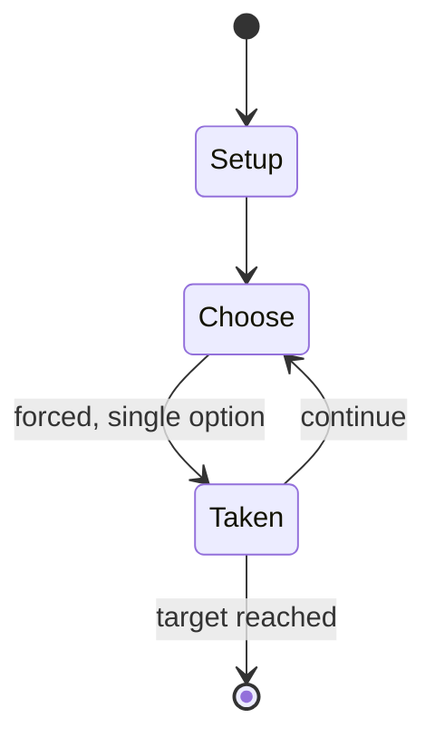

# Box hockey

`box_hockey` &nbsp; state: **DEEPENED** &nbsp; method: **heuristic**

## Found layer (recorded, not trusted)

| field | value |
| --- | --- |
| wikidata | Q17006194 |
| wikipedia | Box hockey |
| genres (source) | -- |
| instance of (source) | -- |
| country of origin | -- |

## Declared layer (orders bench work)

| field | value |
| --- | --- |
| year created | -- |
| epoch | -- |
| region | -- |
| media | - |
| players | -- |
| age band | -- |
| exogenous process | -- |
| loss shape | -- |
| live axes | - |
| horizon | RACE_TO_TARGET |
| scoring shape | -- |
| information | -- |
| interaction | COMPETITIVE |
| turn structure | -- |
| tractability | SAMPLING_ONLY |
| randomness | -- |
| luck factor | 0.35 |
| rules complexity | 1.8 |
| strategic depth | 2.0 |
| novelty | 0.546 |
| solved status | -- |
| strategies | -- |
| algorithms | -- |

## Object model

```
Episode
  players      : ?
  turn_structure: ?
  horizon       : RACE_TO_TARGET
  scoring       : ?

State          -- opaque; no medium or axis evidence was found
Player         -- an agent that selects among legal successors
```

## State transition diagram



## Research item -- turn trace

```
# Box hockey -- simulated turn events
# generated from the DECLARED vector, not from a rulebook.
# structure: exo=None loss=None horizon=RACE_TO_TARGET scoring=None axes=-

t=0    SETUP        players=2  pot=0  capacity=4
t=1    FORCED       p1 single legal option taken (pot_gain=+1.1)
t=2    FORCED       p1 single legal option taken (pot_gain=+1.9)
t=3    FORCED       p1 single legal option taken (pot_gain=+2.0)
t=4    FORCED       p1 single legal option taken (pot_gain=+1.3)
t=5    FORCED       p1 single legal option taken (pot_gain=+1.9)
t=6    FORCED       p1 single legal option taken (pot_gain=+1.9)
t=7    FORCED       p1 single legal option taken (pot_gain=+1.7)
t=8    ENDTURN      turn passes to p2
t=9    FORCED       p2 single legal option taken (pot_gain=+1.3)
t=10   FORCED       p2 single legal option taken (pot_gain=+1.0)
t=11   FORCED       p2 single legal option taken (pot_gain=+0.5)
t=12   ENDTURN      turn passes to p1
t=13   FORCED       p1 single legal option taken (pot_gain=+1.9)
t=14   ENDTURN      turn passes to p2
t=15   FORCED       p2 single legal option taken (pot_gain=+1.5)
t=16   ENDTURN      turn passes to p1
t=17   FORCED       p1 single legal option taken (pot_gain=+1.8)
t=18   FORCED       p1 single legal option taken (pot_gain=+1.6)
t=19   FORCED       p1 single legal option taken (pot_gain=+1.3)
t=20   FORCED       p1 single legal option taken (pot_gain=+0.9)
t=21   FORCED       p1 single legal option taken (pot_gain=+1.1)
t=22   FORCED       p1 single legal option taken (pot_gain=+1.9)
t=23   FORCED       p1 single legal option taken (pot_gain=+0.7)
t=24   FORCED       p1 single legal option taken (pot_gain=+1.1)
t=25   ENDTURN      turn passes to p2
t=26   FORCED       p2 single legal option taken (pot_gain=+1.6)

terminal: RACE_TO_TARGET
```

## Conditions

| kind | threshold | effect | trigger |
| --- | --- | --- | --- |
| WIN | 11 points | -- | The first player to score eleven points wins the game. |
| WIN | -- | -- | The first player to score the predetermined number of goals wins the game. |
| BOUNDARY | -- | -- | Box hockey has little known origin, but the game has been around since at least the late 19th century, as described in various game books, such as Games for the Playground, Home, School and Gym (Jessie H. |

## Source extract

Box hockey (or schlockey) is an active hand game played between two people with sticks, a puck
and a compartmented box (typically 5–8 feet or 1.5–2.4 meters long), and typically played
outdoors. The object of the game is to move a hockey puck through the center dividers of the
box, out through a hole placed at each end of the box, also known as the goal.  The two players
face one another on either side of the box, and each attempts to move the puck to their left. If
a player succeeds in getting the puck to exit the box through the goal, the player scores one
point (or goal). The first player to score the predetermined number of goals wins the game.   ==
History ==  Box hockey has little known origin, but the game has been around since at least the
late 19th century, as described in various game books, such as Games for the Playground, Home,
School and Gym (Jessie H. Bancroft, 1913) and 400 Games for School, Home, and Playground (F.A.
Owen Pub. Co., 1920). Box Hockey was listed as the "Game of the Month" as published in the 1914
Volume 2 of the "Recreational helps" by the New York State College of Agriculture Department of
Rural Sociology with the following description:  "Box hockey

<sub>Wikipedia, CC BY-SA. Retained as evidence for the structural
classification above. Every rule inferred from it is HYPOTHESIZED
until audited against a rulebook.</sub>
