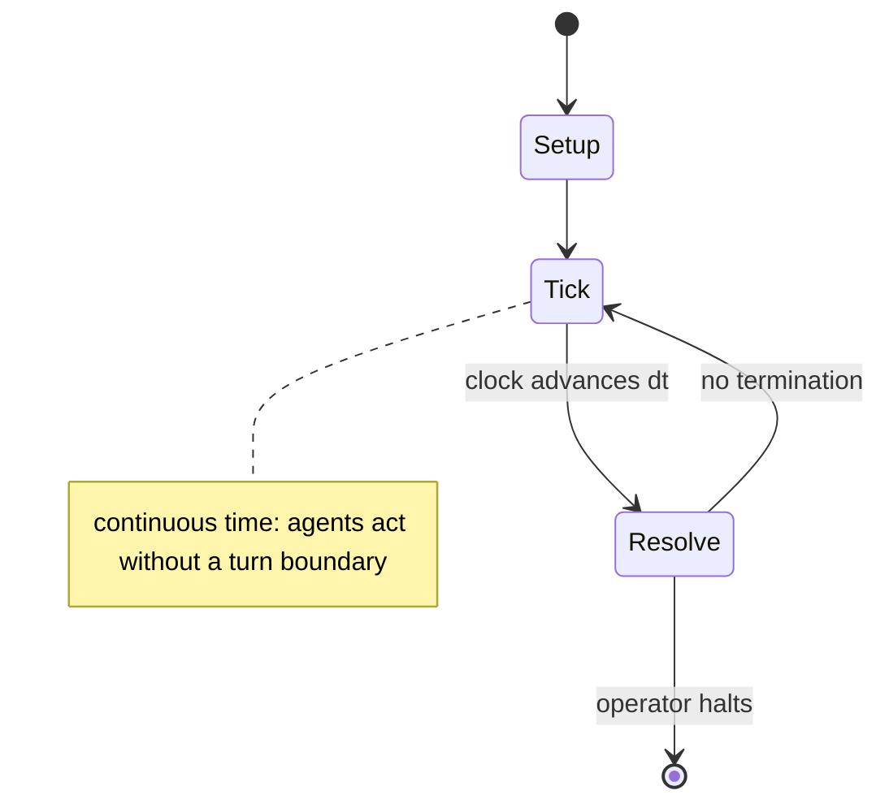

# Brain Age: Train Your Brain in Minutes a Day!

`brain_age_train_your_brain_in_minutes_a_day` &nbsp; state: **DEEPENED** &nbsp; method: **heuristic**

## Found layer (recorded, not trusted)

| field | value |
| --- | --- |
| wikidata | Q1773171 |
| wikipedia | Brain Age: Train Your Brain in Minutes a Day! |
| genres (source) | -- |
| instance of (source) | -- |
| country of origin | -- |

## Declared layer (orders bench work)

| field | value |
| --- | --- |
| year created | 2019 |
| epoch | CONTEMPORARY |
| region | -- |
| media | PUZZLE, VIDEO |
| players | -- |
| age band | -- |
| exogenous process | -- |
| loss shape | -- |
| live axes | SELECT |
| horizon | OPEN_ENDED |
| scoring shape | LINEAR_ACCUMULATION |
| information | -- |
| interaction | SOLITAIRE |
| turn structure | REAL_TIME |
| tractability | SAMPLING_ONLY |
| randomness | REAL_TIME_PHYSICAL |
| luck factor | 0.35 |
| rules complexity | 2.06 |
| strategic depth | 2.25 |
| novelty | 0.5646 |
| solved status | -- |
| strategies | memory_recall |
| algorithms | -- |

## Object model

```
Episode
  players      : ?
  turn_structure: REAL_TIME
  horizon       : OPEN_ENDED
  scoring       : LINEAR_ACCUMULATION

Configuration  -- the arrangement to be resolved
Constraint     -- predicate a legal configuration must satisfy
WorldState     -- simulation state advanced by the engine
Avatar         -- player-controlled agent
Clock          -- frame or tick counter
OptionSet      -- the choices available after an exogenous draw
```

## State transition diagram



## Research item -- clock trace

```
# Brain Age: Train Your Brain in Minutes a Day! -- simulated clock trace (no turn boundary)
# generated from the DECLARED vector, not from a rulebook.
# structure: exo=None loss=None horizon=OPEN_ENDED scoring=LINEAR_ACCUMULATION axes=SELECT

clk=0.000s  START        agents=4  clock=free running
clk=1.035s  INFRACTION   a1 commits infraction (count=1)
clk=1.472s  SCORE        a3 scores (+3)
clk=3.216s  ACTION       a3 acts continuously; no turn boundary crossed
clk=5.280s  INFRACTION   a2 commits infraction (count=1)
clk=7.253s  CONTEST      a4 and a1 contend for the same resource
clk=9.475s  ACTION       a2 acts continuously; no turn boundary crossed
clk=10.948s  INFRACTION   a4 commits infraction (count=1)
clk=13.878s  ACTION       a3 acts continuously; no turn boundary crossed
clk=16.776s  ACTION       a3 acts continuously; no turn boundary crossed
clk=17.060s  CONTEST      a2 and a3 contend for the same resource
clk=19.934s  SCORE        a1 scores (+3)
clk=21.602s  INFRACTION   a1 commits infraction (count=2)
clk=22.946s  SCORE        a4 scores (+1)
clk=25.634s  ACTION       a4 acts continuously; no turn boundary crossed
clk=27.445s  INFRACTION   a3 commits infraction (count=1)
clk=29.754s  CONTEST      a4 and a1 contend for the same resource
clk=31.623s  SCORE        a2 scores (+2)
clk=32.885s  ACTION       a4 acts continuously; no turn boundary crossed
clk=34.626s  CONTEST      a1 and a2 contend for the same resource
clk=37.124s  ACTION       a1 acts continuously; no turn boundary crossed
clk=38.444s  ACTION       a4 acts continuously; no turn boundary crossed
clk=41.278s  ACTION       a2 acts continuously; no turn boundary crossed
clk=43.612s  SCORE        a3 scores (+3)
clk=44.408s  SCORE        a3 scores (+3)
clk=47.398s  SCORE        a1 scores (+3)
clk=48.271s  SCORE        a1 scores (+3)

note: elapsed time, not move count, is the episode's ordering variable.
```

## Conditions

| kind | threshold | effect | trigger |
| --- | --- | --- | --- |
| BOUNDARY | -- | -- | Once the player completes at least one program, Kawashima awards them with a stamp, which he places on the current date. |
| BOUNDARY | -- | -- | If the player completes at least three programs, the stamp will expand in size. |
| BOUNDARY | -- | -- | Depending on if the player gets right or wrong the number of boxes increase or decrease, meaning that the game has an adaptive difficulty between at least 4 boxes to a maximum of 16. |
| BOUNDARY | -- | -- | However, the game states that the best indications of brain age are when the user is at least twenty years of age. |

## Source extract

Brain Age: Train Your Brain in Minutes a Day!, known as Dr Kawashima's Brain Training: How Old
Is Your Brain? in the PAL regions, is a 2005 edutainment puzzle video game by Nintendo for the
Nintendo DS. It is inspired by the work of Japanese neuroscientist Ryuta Kawashima, who appears
as a caricature of himself guiding the player. Brain Age features a variety of puzzles,
including Stroop tests, mathematical questions, and Sudoku puzzles, all designed to help keep
certain parts of the brain active. It was released as part of the Touch! Generations series of
video games, a series which features some games for a more casual gaming audience. Brain Age
uses the touch screen and microphone for many of its puzzles. It has received both commercial
and critical success, selling 19.01 million copies worldwide (as of September 30, 2015) and has
received multiple awards for its quality and innovation. There has been controversy over the
game's scientific effectiveness, as the game was intended to be played solely for entertainment.
The game was later released on the Nintendo eShop for the Wii U in Japan in mid-2014. It was
followed by a sequel titled Brain Age 2: More Training in Minutes a Day

<sub>Wikipedia, CC BY-SA. Retained as evidence for the structural
classification above. Every rule inferred from it is HYPOTHESIZED
until audited against a rulebook.</sub>
