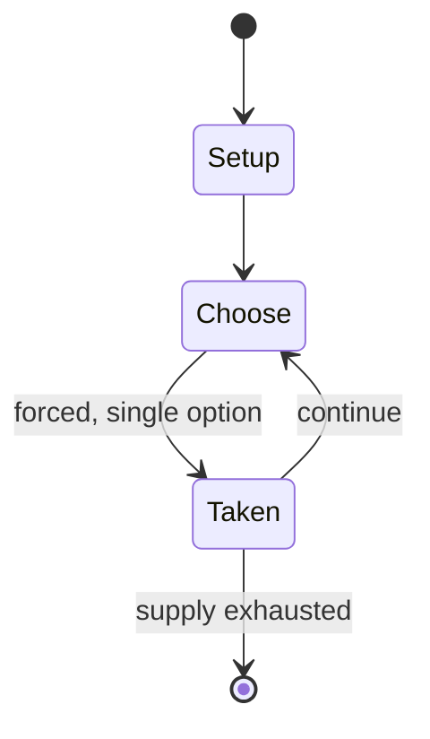

# Brede Mette

*Danish card game*

`brede_mette` &nbsp; state: **DEEPENED** &nbsp; method: **heuristic**

## Found layer (recorded, not trusted)

| field | value |
| --- | --- |
| wikidata | Q12304302 |
| wikipedia | Brede Mette |
| genres (source) | -- |
| instance of (source) | card game |
| country of origin | Denmark |

## Declared layer (orders bench work)

| field | value |
| --- | --- |
| year created | -- |
| epoch | -- |
| region | EUROPE_NORTH |
| media | CARD |
| players | -- |
| age band | -- |
| exogenous process | -- |
| loss shape | -- |
| live axes | - |
| horizon | -- |
| scoring shape | -- |
| information | -- |
| interaction | -- |
| turn structure | -- |
| tractability | SAMPLING_ONLY |
| randomness | -- |
| luck factor | 0.35 |
| rules complexity | 1.74 |
| strategic depth | 2.25 |
| novelty | 0.0896 |
| solved status | -- |
| strategies | spatial_packing |
| algorithms | -- |

## Object model

```
Episode
  players      : ?
  turn_structure: ?
  horizon       : ?
  scoring       : ?

Deck           -- ordered multiset, drawn without replacement
Hand           -- private multiset held by one player
DiscardPile    -- public accumulation of spent cards
```

## State transition diagram



## Research item -- turn trace

```
# Brede Mette -- simulated turn events
# generated from the DECLARED vector, not from a rulebook.
# structure: exo=None loss=None horizon=None scoring=None axes=-

t=0    SETUP        players=2  pot=0  capacity=5
t=1    FORCED       p1 single legal option taken (pot_gain=+1.6)
t=2    FORCED       p1 single legal option taken (pot_gain=+1.1)
t=3    FORCED       p1 single legal option taken (pot_gain=+1.4)
t=4    FORCED       p1 single legal option taken (pot_gain=+1.2)
t=5    ENDTURN      turn passes to p2
t=6    FORCED       p2 single legal option taken (pot_gain=+1.2)
t=7    FORCED       p2 single legal option taken (pot_gain=+0.8)
t=8    ENDTURN      turn passes to p1
t=9    FORCED       p1 single legal option taken (pot_gain=+0.8)
t=10   FORCED       p1 single legal option taken (pot_gain=+1.5)
t=11   FORCED       p1 single legal option taken (pot_gain=+1.9)
t=12   ENDTURN      turn passes to p2
t=13   FORCED       p2 single legal option taken (pot_gain=+0.9)
t=14   FORCED       p2 single legal option taken (pot_gain=+0.7)
t=15   FORCED       p2 single legal option taken (pot_gain=+1.6)
t=16   FORCED       p2 single legal option taken (pot_gain=+1.5)
t=17   FORCED       p2 single legal option taken (pot_gain=+1.9)
t=18   FORCED       p2 single legal option taken (pot_gain=+1.9)
t=19   FORCED       p2 single legal option taken (pot_gain=+1.3)
t=20   FORCED       p2 single legal option taken (pot_gain=+1.8)
t=21   FORCED       p2 single legal option taken (pot_gain=+1.2)
t=22   FORCED       p2 single legal option taken (pot_gain=+0.6)
t=23   FORCED       p2 single legal option taken (pot_gain=+1.2)
t=24   FORCED       p2 single legal option taken (pot_gain=+1.2)
t=25   ENDTURN      turn passes to p1
t=26   FORCED       p1 single legal option taken (pot_gain=+1.9)
t=27   ENDTURN      turn passes to p2

terminal: VARIABLE
```

## Conditions

| kind | threshold | effect | trigger |
| --- | --- | --- | --- |
| BOUNDARY | -- | -- | It has been played in Denmark since at least 1950. |

## Source extract

Brede Mette' or Bræ'e Mæt, is a Danish card game, originating in Funen for 2 or more players. It
is reminiscent of the North Jutland game of Rakker. It has been played in Denmark since at least
1950.   == Cards == The Jokers are removed from a standard 52-card Danish pattern pack. Aces are
high, 2s are low. The highest card is the trump Ace. The Queen of Diamonds cannot be beaten,
only passed on or picked up.   == Preliminaries == The first dealer is chosen by any agreed
means. The dealer shuffles the cards and deals each player 3 cards. The remainder are placed
face down as the stock and the top card is turned face up and placed next to it. This upcard
determines the trump suit. The cards of the trump suit can beat all the cards of any other suit
except ♦Q.   == Play == First hand (i.e. the one to the left of the dealer), starts by placing
one or more cards of equal rank on the table, e.g. two 5s. If any of the remaining players also
have a card of that rank, in this case another 5, it (or they) may be added before second hand
(card player) has played. Now second hand must either a) beat the cards played to the table
individually (in this case ♥5 and ♣5) or b) holding a card of th

<sub>Wikipedia, CC BY-SA. Retained as evidence for the structural
classification above. Every rule inferred from it is HYPOTHESIZED
until audited against a rulebook.</sub>
