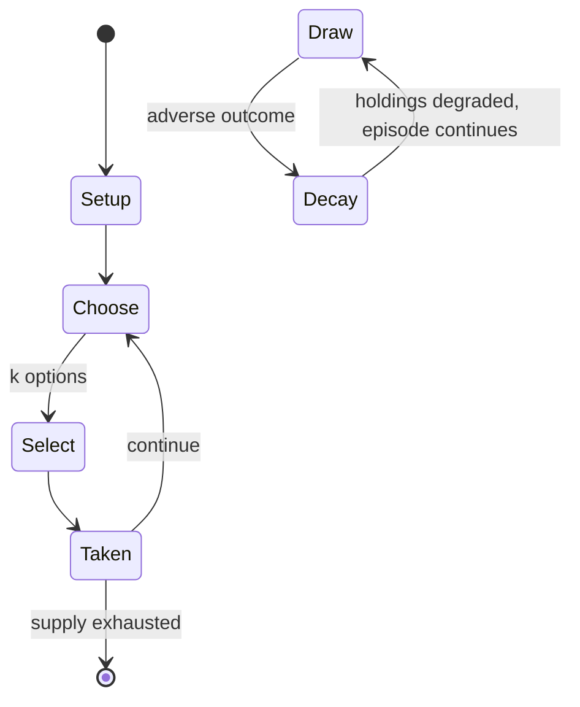

# Brides of Dracula

*1992 video game*

`brides_of_dracula` &nbsp; state: **DEEPENED** &nbsp; method: **heuristic**

## Found layer (recorded, not trusted)

| field | value |
| --- | --- |
| wikidata | Q126184218 |
| wikipedia | Brides of Dracula (video game) |
| genres (source) | -- |
| instance of (source) | video game |
| country of origin | -- |

## Declared layer (orders bench work)

| field | value |
| --- | --- |
| year created | 1992 |
| epoch | DIGITAL |
| region | -- |
| media | VIDEO |
| players | -- |
| age band | -- |
| exogenous process | -- |
| loss shape | PARTIAL_DECAY |
| live axes | SELECT |
| horizon | -- |
| scoring shape | RACE_POSITION |
| information | -- |
| interaction | -- |
| turn structure | -- |
| tractability | SAMPLING_ONLY |
| randomness | HIDDEN_INFO |
| luck factor | 0.35 |
| rules complexity | 2.06 |
| strategic depth | 2.0 |
| novelty | 0.6042 |
| solved status | -- |
| strategies | -- |
| algorithms | -- |

## Object model

```
Episode
  players      : ?
  turn_structure: ?
  horizon       : ?
  scoring       : RACE_POSITION

WorldState     -- simulation state advanced by the engine
Avatar         -- player-controlled agent
Clock          -- frame or tick counter
OptionSet      -- the choices available after an exogenous draw
```

## State transition diagram



## Research item -- turn trace

```
# Brides of Dracula -- simulated turn events
# generated from the DECLARED vector, not from a rulebook.
# structure: exo=None loss=PARTIAL_DECAY horizon=None scoring=RACE_POSITION axes=SELECT

t=0    SETUP        players=2  pot=0  capacity=3
t=1    SELECT       p1 4 options; take #2  (pot_gain=+1.5, capacity=-2)
t=2    SELECT       p1 4 options; take #4  (pot_gain=+0.9, capacity=-2)
t=3    SELECT       p1 4 options; take #1  (pot_gain=+1.9, capacity=-1)
t=4    SELECT       p1 3 options; take #3  (pot_gain=+3.4, capacity=-2)
t=5    SELECT       p1 3 options; take #1  (pot_gain=+3.2, capacity=-1)
t=6    ENDTURN      turn passes to p2
t=7    SELECT       p2 3 options; take #2  (pot_gain=+1.5, capacity=-1)
t=8    SELECT       p2 4 options; take #1  (pot_gain=+0.8, capacity=-2)
t=9    ENDTURN      turn passes to p1
t=10   SELECT       p1 4 options; take #3  (pot_gain=+1.0, capacity=-0)
t=11   SELECT       p1 4 options; take #3  (pot_gain=+2.8, capacity=-2)
t=12   SELECT       p1 1 options; take #1  (pot_gain=+1.0, capacity=-2)
t=13   ENDTURN      turn passes to p2
t=14   SELECT       p2 1 options; take #1  (pot_gain=+2.9, capacity=-2)
t=15   SELECT       p2 2 options; take #2  (pot_gain=+2.3, capacity=-2)
t=16   ENDTURN      turn passes to p1
t=17   SELECT       p1 1 options; take #1  (pot_gain=+1.4, capacity=-1)
t=18   SELECT       p1 1 options; take #1  (pot_gain=+1.3, capacity=-2)
t=19   SELECT       p1 1 options; take #1  (pot_gain=+1.5, capacity=-1)
t=20   SELECT       p1 1 options; take #1  (pot_gain=+2.6, capacity=-0)
t=21   SELECT       p1 3 options; take #3  (pot_gain=+0.8, capacity=-2)
t=22   SELECT       p1 4 options; take #3  (pot_gain=+2.6, capacity=-1)
t=23   SELECT       p1 3 options; take #1  (pot_gain=+2.1, capacity=-0)
t=24   SELECT       p1 2 options; take #2  (pot_gain=+0.8, capacity=-1)
t=25   ENDTURN      turn passes to p2
t=26   SELECT       p2 1 options; take #1  (pot_gain=+3.3, capacity=-2)

terminal: VARIABLE
```

## Source extract

Brides of Dracula is a 1992 action-platformer video game developed and published by Gonzo Games
for the Amiga and Atari ST. Playing as either Dracula or Van Helsing, players must race the
other character in a split screen to collect thirteen brides or items to defeat the other.
Developed by a team within Gonzo Games titled The Toast Factory, the game's design was inspired
by licensed horror titles. Upon release, Brides of Dracula received mixed reviews, with critics
faulting the game's graphics due to the split-screen design, and repetition of gameplay.    ==
Gameplay ==  Players choose one of two characters with a separate objective: Dracula, who aims
to find thirteen women as brides, bite them, and lead them back to his castle, and Van Helsing,
who must find thirteen items, such as a silver bullet or prayer book, that can destroy Dracula.
The chosen character must find each woman or item, and return it to their starting point; once
all thirteen have been collected, that character wins. The game is a side-scrolling split screen
title where the player controls their character on one end of the screen, and the opposing
character pursues their objectives on the other. Both characters

<sub>Wikipedia, CC BY-SA. Retained as evidence for the structural
classification above. Every rule inferred from it is HYPOTHESIZED
until audited against a rulebook.</sub>
