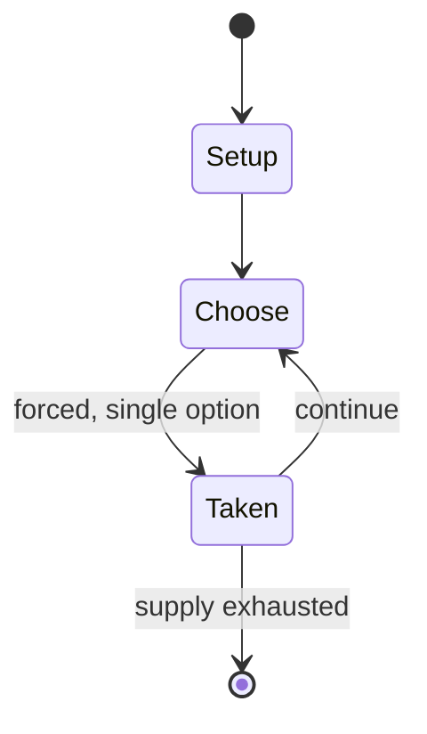

# Bridge Base Online

*bridge game service*

`bridge_base_online` &nbsp; state: **DEEPENED** &nbsp; method: **heuristic**

## Found layer (recorded, not trusted)

| field | value |
| --- | --- |
| wikidata | Q4176364 |
| wikipedia | Bridge Base Online |
| genres (source) | -- |
| instance of (source) | commercial organization, online gaming service, video game |
| country of origin | United States |

## Declared layer (orders bench work)

| field | value |
| --- | --- |
| year created | 1990 |
| epoch | DIGITAL |
| region | NORTH_AMERICA |
| media | EDUCATIONAL, VIDEO |
| players | -- |
| age band | -- |
| exogenous process | -- |
| loss shape | -- |
| live axes | BID |
| horizon | -- |
| scoring shape | -- |
| information | -- |
| interaction | TEAM |
| turn structure | -- |
| tractability | SAMPLING_ONLY |
| randomness | -- |
| luck factor | 0.35 |
| rules complexity | 2.18 |
| strategic depth | 2.25 |
| novelty | 0.5 |
| solved status | -- |
| strategies | memory_recall |
| algorithms | -- |

## Object model

```
Episode
  players      : ?
  turn_structure: ?
  horizon       : ?
  scoring       : ?

WorldState     -- simulation state advanced by the engine
Avatar         -- player-controlled agent
Clock          -- frame or tick counter
Auction        -- priced competition resolving to one winner
```

## State transition diagram



## Research item -- turn trace

```
# Bridge Base Online -- simulated turn events
# generated from the DECLARED vector, not from a rulebook.
# structure: exo=None loss=None horizon=None scoring=None axes=BID

t=0    SETUP        players=2  pot=0  capacity=3
t=1    FORCED       p1 single legal option taken (pot_gain=+1.7)
t=2    BID          p1 sealed bid of 4 against 1 rivals
t=3    ENDTURN      turn passes to p2
t=4    FORCED       p2 single legal option taken (pot_gain=+1.8)
t=5    BID          p2 sealed bid of 1 against 1 rivals
t=6    ENDTURN      turn passes to p1
t=7    FORCED       p1 single legal option taken (pot_gain=+0.7)
t=8    BID          p1 sealed bid of 1 against 1 rivals
t=9    FORCED       p1 single legal option taken (pot_gain=+1.4)
t=10   BID          p1 sealed bid of 1 against 1 rivals
t=11   FORCED       p1 single legal option taken (pot_gain=+0.5)
t=12   BID          p1 sealed bid of 6 against 1 rivals
t=13   FORCED       p1 single legal option taken (pot_gain=+1.4)
t=14   FORCED       p1 single legal option taken (pot_gain=+1.2)
t=15   FORCED       p1 single legal option taken (pot_gain=+1.9)
t=16   FORCED       p1 single legal option taken (pot_gain=+1.7)
t=17   BID          p1 sealed bid of 4 against 1 rivals
t=18   FORCED       p1 single legal option taken (pot_gain=+1.7)
t=19   BID          p1 sealed bid of 2 against 1 rivals
t=20   FORCED       p1 single legal option taken (pot_gain=+1.2)
t=21   FORCED       p1 single legal option taken (pot_gain=+0.7)
t=22   FORCED       p1 single legal option taken (pot_gain=+1.7)
t=23   BID          p1 sealed bid of 5 against 1 rivals
t=24   FORCED       p1 single legal option taken (pot_gain=+1.1)
t=25   FORCED       p1 single legal option taken (pot_gain=+1.7)
t=26   BID          p1 sealed bid of 1 against 1 rivals

terminal: VARIABLE
```

## Source extract

Bridge Base Online (BBO) is the world's largest bridge-playing online platform, with about 11.6
million monthly visits as of September 2024.   == History == In 1990, Bridge Base was founded by
Fred Gitelman and Sheri Winestock and released BASE II, an analytical tool for serious bridge
players that ran on MS-DOS. In 1992, teaching software titled Bridge Master, was released for
MS-DOS. In 1998, Bridge Master for Windows was released. Also in 1998, an online bridge offering
in Microsoft Gaming Zone, later MSN Games, was supplied by Bridge Base. Created by professional
bridge player Fred Gitelman, BBO was first available from Bridge Base in 2001 as a Windows
downloadable software offering free online multiplayer bridge rooms for practice and play.
Around 2008, BBO was ported to a web application to also support Linux and macOS users, as well
as mobile devices. In 2018, Bridge Base Online was inducted into the American Contract Bridge
League's Hall of Fame for its long-term commitment to bridge. As of February 2022, BBO was the
only organization ever inducted by the Hall of Fame. As of August 19th 2026, Bridge Base Online
has separated its membership into three tiers: Basic, Basic No

<sub>Wikipedia, CC BY-SA. Retained as evidence for the structural
classification above. Every rule inferred from it is HYPOTHESIZED
until audited against a rulebook.</sub>
