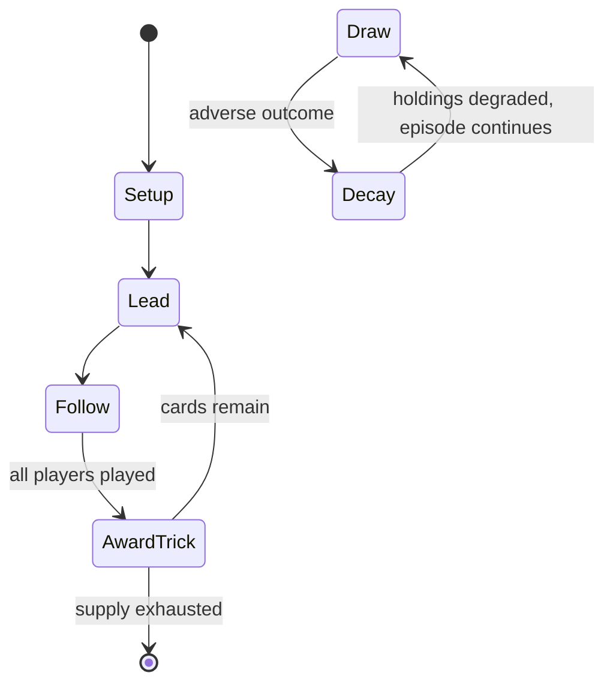

# Bridge (card game)

`bridge_card_game` &nbsp; state: **DEEPENED** &nbsp; method: **heuristic**

## Found layer (recorded, not trusted)

| field | value |
| --- | --- |
| wikidata | -- |
| wikipedia | Bridge (card game) |
| genres (source) | -- |
| instance of (source) | -- |
| country of origin | -- |

## Declared layer (orders bench work)

| field | value |
| --- | --- |
| year created | -- |
| epoch | -- |
| region | -- |
| media | CARD, TRICK_TAKING |
| players | -- |
| age band | -- |
| exogenous process | DEPLETING_DECK |
| loss shape | PARTIAL_DECAY |
| live axes | BID |
| horizon | -- |
| scoring shape | SET_COLLECTION_CONVEX |
| information | -- |
| interaction | TEAM |
| turn structure | TRICK_ROUND |
| tractability | EXACT_WITH_CUT |
| randomness | DECK_SHUFFLE |
| luck factor | 0.48 |
| rules complexity | 2.6 |
| strategic depth | 2.25 |
| novelty | 0.7786 |
| solved status | -- |
| strategies | spatial_packing |
| algorithms | -- |

## Object model

```
Episode
  players      : ?
  turn_structure: TRICK_ROUND
  horizon       : ?
  scoring       : SET_COLLECTION_CONVEX

Deck           -- ordered multiset, drawn without replacement
Hand           -- private multiset held by one player
DiscardPile    -- public accumulation of spent cards
Trick          -- one card per player; a winner is determined
Trump          -- suit that dominates the ordering
Auction        -- priced competition resolving to one winner
```

## State transition diagram



## Research item -- turn trace

```
# Bridge (card game) -- simulated turn events
# generated from the DECLARED vector, not from a rulebook.
# structure: exo=DEPLETING_DECK loss=PARTIAL_DECAY horizon=None scoring=SET_COLLECTION_CONVEX axes=BID

t=0    SETUP        players=2  pot=0  capacity=3
t=1    DRAW         p1 draw from deck -> outcome #6  (p=0.263)
t=2    FORCED       p1 single legal option taken (pot_gain=+1.5)
t=3    DRAW         p1 draw from deck -> outcome #1  (p=0.057)
t=4    FORCED       p1 single legal option taken (pot_gain=+1.6)
t=5    DRAW         p1 draw from deck -> outcome #5  (p=0.274)
t=6    FORCED       p1 single legal option taken (pot_gain=+1.9)
t=7    BID          p1 sealed bid of 4 against 1 rivals
t=8    ENDTURN      turn passes to p2
t=9    DRAW         p2 draw from deck -> outcome #2  (p=0.155)
t=10   FORCED       p2 single legal option taken (pot_gain=+1.3)
t=11   BID          p2 sealed bid of 6 against 1 rivals
t=12   DRAW         p2 draw from deck -> outcome #1  (p=0.132)
t=13   FORCED       p2 single legal option taken (pot_gain=+1.8)
t=14   BID          p2 sealed bid of 3 against 1 rivals
t=15   DRAW         p2 draw from deck -> outcome #5  (p=0.053)
t=16   FORCED       p2 single legal option taken (pot_gain=+0.9)
t=17   BID          p2 sealed bid of 1 against 1 rivals
t=18   DRAW         p2 draw from deck -> outcome #2  (p=0.059)
t=19   FORCED       p2 single legal option taken (pot_gain=+0.7)
t=20   DRAW         p2 draw from deck -> outcome #6  (p=0.106)
t=21   FORCED       p2 single legal option taken (pot_gain=+1.7)
t=22   BID          p2 sealed bid of 1 against 1 rivals
t=23   ENDTURN      turn passes to p1
t=24   DRAW         p1 draw from deck -> outcome #6  (p=0.081)
t=25   FORCED       p1 single legal option taken (pot_gain=+1.5)
t=26   ENDTURN      turn passes to p2

terminal: VARIABLE
```

## Conditions

| kind | threshold | effect | trigger |
| --- | --- | --- | --- |
| BOUNDARY | 5 cards | -- | South, next in turn, opens with the bid of 1♥, which denotes a reasonable heart suit (at least 4 or 5 cards long, depending on the bidding system) and at least 12 high card points. |
| ELIMINATE | -- | eliminated | The chance element is in the deal of the cards; in duplicate bridge some of the chance element is eliminated by comparing results of multiple pairs in identical situations. |
| TERMINATE | -- | -- | The auction ends when, after a player bids, doubles, or redoubles, every other player has passed, in which case the action proceeds to the play; or every player has passed and no bid has been made, in which case the roun |
| BOUNDARY | -- | -- | The object became to make at least as many tricks as were contracted for, and penalties were introduced for failing to do so. |
| BOUNDARY | -- | -- | If a partnership takes at least that many tricks, they receive points for the round; otherwise, they lose penalty points. |
| BOUNDARY | -- | -- | As a rule, a natural suit bid indicates a holding of at least four (or more, depending on the situation and the system) cards in that suit as an opening bid, or a lesser number when supporting partner; a natural NT bid i |
| BOUNDARY | -- | -- | Alternatively, many partnerships play this same bidding sequence as "Crawling Stayman" by which the responder shows a weak hand (less than eight high card points) with shortness in diamonds but at least four hearts and f |
| PENALTY | -- | -- | Players take turns to call in a clockwise order: each player in turn either passes, doubles – which increases the penalties for not making the contract specified by the opposing partnership's last bid, but also increases |
| PENALTY | -- | -- | If the last bid was by the opposing partnership, one may also double the opponents' bid, increasing the penalties for undertricks, but also increasing the reward for making the contract. |
| PENALTY | -- | -- | A player on the opposing partnership being doubled may also redouble, which increases the penalties and rewards further. |
| PENALTY | -- | -- | Partnerships can be vulnerable, increasing the rewards for making the contract, but also increasing the penalties for undertricks. |
| PENALTY | -- | -- | This hand is nearly valueless unless spades are trumps but it contains good enough spades that the penalty for being set should not be higher than the value of an opponent game. |
| PENALTY | -- | -- | A natural, or penalty double, is one used to try to gain extra points when the defenders are confident of setting (defeating) the contract. |
| PENALTY | -- | -- | Whether doubling a contract at the 1, 2 and sometimes higher levels signifies a belief that the opponents' contract will fail and a desire to raise the stakes (a penalty double), or an indication of strength but no bidda |

## Source extract

Contract bridge, or simply bridge, is a trick-taking card game using a standard 52-card deck. In
its basic format, it is played by four players in two competing partnerships, with partners
sitting opposite each other around a table. The game consists of a number of deals, each
progressing through four phases. The cards are dealt to the players; then the players call (or
bid) in an auction seeking to take the contract, specifying how many tricks the partnership
receiving the contract (the declaring side) needs to take to receive points for the deal. During
the auction, partners use their bids to exchange information about their hands, including
overall strength and distribution of the suits; no other means of conveying or implying any
information is permitted. The cards are then played, the declaring side trying to fulfill the
contract, and the defenders trying to stop the declaring side from achieving its goal. The deal
is scored based on the number of tricks taken, the contract, and various other factors which
depend to some extent on the variation of the game being played. Rubber bridge is the most
popular variation for casual play, but most club and tournament play involves some

<sub>Wikipedia, CC BY-SA. Retained as evidence for the structural
classification above. Every rule inferred from it is HYPOTHESIZED
until audited against a rulebook.</sub>
