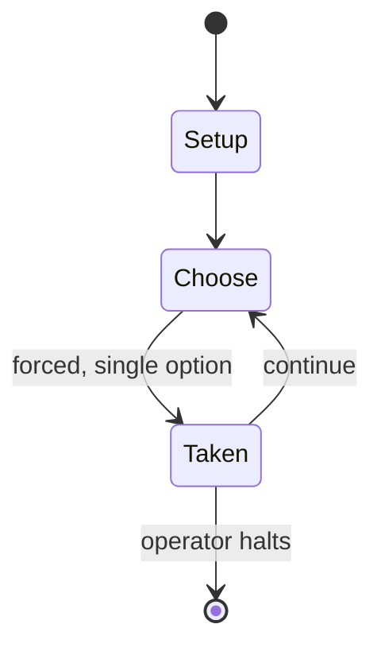

# Buck Rogers XXVC

*game setting*

`buck_rogers_xxvc` &nbsp; state: **DEEPENED** &nbsp; method: **heuristic**

## Found layer (recorded, not trusted)

| field | value |
| --- | --- |
| wikidata | Q1034664 |
| wikipedia | Buck Rogers XXVC |
| genres (source) | tabletop role-playing game |
| instance of (source) | campaign setting, tabletop role-playing game |
| country of origin | United States |

## Declared layer (orders bench work)

| field | value |
| --- | --- |
| year created | 1928 |
| epoch | MODERN |
| region | NORTH_AMERICA |
| media | BOARD, RPG |
| players | -- |
| age band | -- |
| exogenous process | -- |
| loss shape | -- |
| live axes | - |
| horizon | OPEN_ENDED |
| scoring shape | RACE_POSITION |
| information | -- |
| interaction | -- |
| turn structure | -- |
| tractability | SAMPLING_ONLY |
| randomness | -- |
| luck factor | 0.35 |
| rules complexity | 3.34 |
| strategic depth | 2.25 |
| novelty | 0.4677 |
| solved status | -- |
| strategies | signalling |
| algorithms | -- |

## Object model

```
Episode
  players      : ?
  turn_structure: ?
  horizon       : OPEN_ENDED
  scoring       : RACE_POSITION

Board          -- spatial substrate; cells carry position and occupancy
Piece          -- movable token owned by a player
Character      -- persistent stat block owned by a player
GameMaster     -- adjudicating agent outside the scoring loop
Scenario       -- authored state the players traverse
```

## State transition diagram



## Research item -- turn trace

```
# Buck Rogers XXVC -- simulated turn events
# generated from the DECLARED vector, not from a rulebook.
# structure: exo=None loss=None horizon=OPEN_ENDED scoring=RACE_POSITION axes=-

t=0    SETUP        players=2  pot=0  capacity=7
t=1    FORCED       p1 single legal option taken (pot_gain=+1.0)
t=2    ENDTURN      turn passes to p2
t=3    FORCED       p2 single legal option taken (pot_gain=+0.5)
t=4    FORCED       p2 single legal option taken (pot_gain=+1.1)
t=5    FORCED       p2 single legal option taken (pot_gain=+0.7)
t=6    ENDTURN      turn passes to p1
t=7    FORCED       p1 single legal option taken (pot_gain=+0.6)
t=8    FORCED       p1 single legal option taken (pot_gain=+1.9)
t=9    FORCED       p1 single legal option taken (pot_gain=+1.9)
t=10   ENDTURN      turn passes to p2
t=11   FORCED       p2 single legal option taken (pot_gain=+0.8)
t=12   FORCED       p2 single legal option taken (pot_gain=+1.2)
t=13   FORCED       p2 single legal option taken (pot_gain=+0.8)
t=14   ENDTURN      turn passes to p1
t=15   FORCED       p1 single legal option taken (pot_gain=+1.8)
t=16   ENDTURN      turn passes to p2
t=17   FORCED       p2 single legal option taken (pot_gain=+1.5)
t=18   FORCED       p2 single legal option taken (pot_gain=+1.2)
t=19   FORCED       p2 single legal option taken (pot_gain=+1.7)
t=20   ENDTURN      turn passes to p1
t=21   FORCED       p1 single legal option taken (pot_gain=+1.8)
t=22   FORCED       p1 single legal option taken (pot_gain=+1.2)
t=23   FORCED       p1 single legal option taken (pot_gain=+1.2)
t=24   FORCED       p1 single legal option taken (pot_gain=+1.6)
t=25   FORCED       p1 single legal option taken (pot_gain=+1.3)
t=26   FORCED       p1 single legal option taken (pot_gain=+1.4)

terminal: OPEN_ENDED
```

## Source extract

Buck Rogers XXVC (sometimes written as Buck Rogers in the 25th Century) is a game setting
created by TSR, Inc. in the late 1980s.  Products based on this setting include novels, graphic
novels, a role-playing game (RPG), board game, and video games.  The setting was active from
1988 until 1995.   == History == Buck Rogers is a fictional character created in 1928 by Philip
Francis Nowlan. A Buck Rogers comic strip written by Nowlan was syndicated by John F. Dille (who
may have contributed the nickname "Buck" to the character). Ownership of Buck Rogers and other
works passed into the hands of the Dille Family Trust. In the 1980s, John Dille's granddaughter,
Lorraine Williams, was the president of TSR.  In that decade, business for TSR was booming,
mainly as a result of their popular RPG, Advanced Dungeons & Dragons.  Lorraine Williams decided
to merge Buck Rogers and D&D to make the XXVc game setting. A board game was released in 1988,
followed by a role-playing game in 1990. The latter was based on the Advanced Dungeons & Dragons
Second Edition rules, with minor differences. It was a new incarnation of the Buck Rogers world
created by Williams' brother, Flint Dille. Its setting was

<sub>Wikipedia, CC BY-SA. Retained as evidence for the structural
classification above. Every rule inferred from it is HYPOTHESIZED
until audited against a rulebook.</sub>
