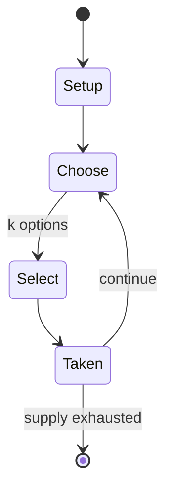

# bughouse chess

*chess variant played on two chessboards by four players in teams of two*

`bughouse_chess` &nbsp; state: **DEEPENED** &nbsp; method: **heuristic**

## Found layer (recorded, not trusted)

| field | value |
| --- | --- |
| wikidata | Q1161896 |
| wikipedia | Bughouse chess |
| genres (source) | -- |
| instance of (source) | chess variant, four-player chess |
| country of origin | -- |

## Declared layer (orders bench work)

| field | value |
| --- | --- |
| year created | -- |
| epoch | -- |
| region | -- |
| media | - |
| players | -- |
| age band | -- |
| exogenous process | NONE |
| loss shape | OPPORTUNITY_ONLY |
| live axes | SELECT, TRADE |
| horizon | -- |
| scoring shape | WINNER_TAKE_ALL |
| information | PERFECT |
| interaction | TEAM |
| turn structure | -- |
| tractability | EXACT_WITH_CUT |
| randomness | NONE |
| luck factor | 0.02 |
| rules complexity | 2.61 |
| strategic depth | 2.4 |
| novelty | 0.8363 |
| solved status | -- |
| strategies | -- |
| algorithms | -- |

## Object model

```
Episode
  players      : ?
  turn_structure: ?
  horizon       : ?
  scoring       : WINNER_TAKE_ALL

OptionSet      -- the choices available after an exogenous draw
Offer          -- proposed exchange between two agents
```

## State transition diagram



## Research item -- turn trace

```
# bughouse chess -- simulated turn events
# generated from the DECLARED vector, not from a rulebook.
# structure: exo=NONE loss=OPPORTUNITY_ONLY horizon=None scoring=WINNER_TAKE_ALL axes=SELECT,TRADE

t=0    SETUP        players=2  pot=0  capacity=5
t=1    SELECT       p1 4 options; take #2  (pot_gain=+1.8, capacity=-0)
t=2    TRADE        p1 offers 2:1 exchange to p2
t=3    SELECT       p1 2 options; take #2  (pot_gain=+1.3, capacity=-0)
t=4    TRADE        p1 offers 2:1 exchange to p2
t=5    SELECT       p1 4 options; take #3  (pot_gain=+1.4, capacity=-1)
t=6    ENDTURN      turn passes to p2
t=7    SELECT       p2 4 options; take #4  (pot_gain=+1.4, capacity=-1)
t=8    SELECT       p2 4 options; take #4  (pot_gain=+1.4, capacity=-0)
t=9    SELECT       p2 3 options; take #3  (pot_gain=+1.0, capacity=-1)
t=10   SELECT       p2 1 options; take #1  (pot_gain=+1.2, capacity=-0)
t=11   TRADE        p2 offers 2:1 exchange to p1
t=12   SELECT       p2 3 options; take #1  (pot_gain=+1.6, capacity=-2)
t=13   ENDTURN      turn passes to p1
t=14   SELECT       p1 2 options; take #2  (pot_gain=+2.8, capacity=-1)
t=15   SELECT       p1 2 options; take #2  (pot_gain=+0.8, capacity=-0)
t=16   TRADE        p1 offers 2:1 exchange to p2
t=17   SELECT       p1 3 options; take #1  (pot_gain=+1.1, capacity=-0)
t=18   TRADE        p1 offers 2:1 exchange to p2
t=19   ENDTURN      turn passes to p2
t=20   SELECT       p2 4 options; take #1  (pot_gain=+3.1, capacity=-0)
t=21   SELECT       p2 2 options; take #2  (pot_gain=+2.8, capacity=-2)
t=22   SELECT       p2 4 options; take #4  (pot_gain=+2.8, capacity=-1)
t=23   SELECT       p2 3 options; take #1  (pot_gain=+0.9, capacity=-1)
t=24   SELECT       p2 4 options; take #1  (pot_gain=+2.1, capacity=-2)
t=25   SELECT       p2 1 options; take #1  (pot_gain=+1.4, capacity=-2)
t=26   SELECT       p2 2 options; take #1  (pot_gain=+3.0, capacity=-1)
t=27   TRADE        p2 offers 2:1 exchange to p1

terminal: VARIABLE
```

## Conditions

| kind | threshold | effect | trigger |
| --- | --- | --- | --- |
| TERMINATE | -- | -- | The match ends when the game on either board ends. |

## Source extract

Bughouse chess is a popular chess variant played on two chessboards by four players in teams of
two. It is also known as exchange chess, tandem chess, transfer chess, double bughouse, doubles
chess, cross chess, swap chess, or simply bughouse, bugsy, or bug. The name Siamese chess is
also used but should not be confused with Thai chess. Normal chess rules apply, except that
captured pieces on one board are passed on to the teammate on the other board, who then has the
option of putting these pieces on their board. The game is usually played at a fast time
control. Together with the passing and dropping of pieces, this can make the game look chaotic
to the casual onlooker, hence the name bughouse, which is slang for mental hospital. Yearly,
several dedicated bughouse tournaments are organized on a national and an international level.
== Rules ==  Bughouse is a chess variant played on two boards by four players in teams of two.
Each team member faces one opponent of the other team. Partners sit next to each other and one
player per team has black pieces, while the other has white pieces. Each player plays the
opponent as in a standard chess game, with the exception of the rules spe

<sub>Wikipedia, CC BY-SA. Retained as evidence for the structural
classification above. Every rule inferred from it is HYPOTHESIZED
until audited against a rulebook.</sub>
