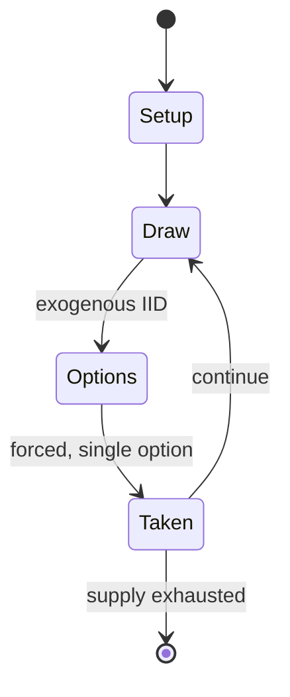

# Bul (game)

`bul_game` &nbsp; state: **DEEPENED** &nbsp; method: **heuristic**

## Found layer (recorded, not trusted)

| field | value |
| --- | --- |
| wikidata | Q3410789 |
| wikipedia | Bul (game) |
| genres (source) | -- |
| instance of (source) | -- |
| country of origin | -- |

## Declared layer (orders bench work)

| field | value |
| --- | --- |
| year created | -- |
| epoch | -- |
| region | -- |
| media | BOARD, DICE |
| players | -- |
| age band | -- |
| exogenous process | IID |
| loss shape | -- |
| live axes | - |
| horizon | VARIABLE |
| scoring shape | SURVIVAL |
| information | -- |
| interaction | TEAM |
| turn structure | -- |
| tractability | EXACT_WITH_CUT |
| randomness | DICE |
| luck factor | 0.58 |
| rules complexity | 1.95 |
| strategic depth | 1.87 |
| novelty | 0.7944 |
| solved status | -- |
| strategies | -- |
| algorithms | -- |

## Object model

```
Episode
  players      : ?
  turn_structure: ?
  horizon       : VARIABLE
  scoring       : SURVIVAL

Board          -- spatial substrate; cells carry position and occupancy
Piece          -- movable token owned by a player
DicePool       -- n dice, each an iid categorical draw
Roll           -- realised outcome of a pool
```

## State transition diagram



## Research item -- turn trace

```
# Bul (game) -- simulated turn events
# generated from the DECLARED vector, not from a rulebook.
# structure: exo=IID loss=None horizon=VARIABLE scoring=SURVIVAL axes=-

t=0    SETUP        players=2  pot=0  capacity=5
t=1    DRAW         p1 roll from d6 pool -> outcome #5  (p=0.235)
t=2    FORCED       p1 single legal option taken (pot_gain=+1.8)
t=3    DRAW         p1 roll from d6 pool -> outcome #6  (p=0.143)
t=4    FORCED       p1 single legal option taken (pot_gain=+1.1)
t=5    DRAW         p1 roll from d6 pool -> outcome #4  (p=0.286)
t=6    FORCED       p1 single legal option taken (pot_gain=+1.6)
t=7    DRAW         p1 roll from d6 pool -> outcome #6  (p=0.179)
t=8    FORCED       p1 single legal option taken (pot_gain=+1.6)
t=9    ENDTURN      turn passes to p2
t=10   DRAW         p2 roll from d6 pool -> outcome #2  (p=0.187)
t=11   FORCED       p2 single legal option taken (pot_gain=+1.1)
t=12   DRAW         p2 roll from d6 pool -> outcome #2  (p=0.042)
t=13   FORCED       p2 single legal option taken (pot_gain=+1.5)
t=14   DRAW         p2 roll from d6 pool -> outcome #2  (p=0.150)
t=15   FORCED       p2 single legal option taken (pot_gain=+0.8)
t=16   DRAW         p2 roll from d6 pool -> outcome #3  (p=0.073)
t=17   FORCED       p2 single legal option taken (pot_gain=+1.0)
t=18   DRAW         p2 roll from d6 pool -> outcome #6  (p=0.172)
t=19   FORCED       p2 single legal option taken (pot_gain=+1.8)
t=20   DRAW         p2 roll from d6 pool -> outcome #5  (p=0.230)
t=21   FORCED       p2 single legal option taken (pot_gain=+0.6)
t=22   DRAW         p2 roll from d6 pool -> outcome #3  (p=0.004)
t=23   FORCED       p2 single legal option taken (pot_gain=+1.2)
t=24   DRAW         p2 roll from d6 pool -> outcome #1  (p=0.157)
t=25   FORCED       p2 single legal option taken (pot_gain=+2.0)
t=26   DRAW         p2 roll from d6 pool -> outcome #4  (p=0.100)
t=27   FORCED       p2 single legal option taken (pot_gain=+1.3)

terminal: VARIABLE
```

## Conditions

| kind | threshold | effect | trigger |
| --- | --- | --- | --- |
| BOUNDARY | 4 players | -- | Verbeeck describes the game as played by two teams of at least four players per side. |
| TERMINATE | -- | -- | The game ends when a team runs out of men to enter the track, and the winning side counts its removed prisoners. |
| TERMINATE | -- | -- | In Bell's rules, the game ends when the losing side has no more men to move on the road. |

## Source extract

Bul (also called Buul, Boolik or Puluc) is a running-fight board game originating in
Mesoamerica, and is known particularly among several of the Maya peoples of Belize and the
Guatemalan highlands. It is uncertain whether this game dates back to the pre-Columbian Maya
civilization, or whether it developed in the post-colonial era after the arrival of the Spanish
conquistadores.   == Descriptions of the game == Stewart Culin described the game in the 24th
Annual Report of the Bureau of American Ethnology: Games of North American Indians published in
1907. R. C. Bell referred to the game in Board and Table Games from Many Civilizations. Bell's
description is based on Karl Sapper's published account. Lieve Verbeeck, a linguist studying
Mayan language, witnessed the modern version of the game being played by Mopan and Kekchi Maya
in Belize:  But neither can I give you hard evidence that the corn game, as it is now still
played by the Mopan and K'ekchi' Mayans, (who are neighbors), was known in ancient times. There
is linguistic evidence that the ancient Mayans used to play games of chance. The name BUL occurs
in several Mayan languages and always means to play with dice. Sometimes, by

<sub>Wikipedia, CC BY-SA. Retained as evidence for the structural
classification above. Every rule inferred from it is HYPOTHESIZED
until audited against a rulebook.</sub>
