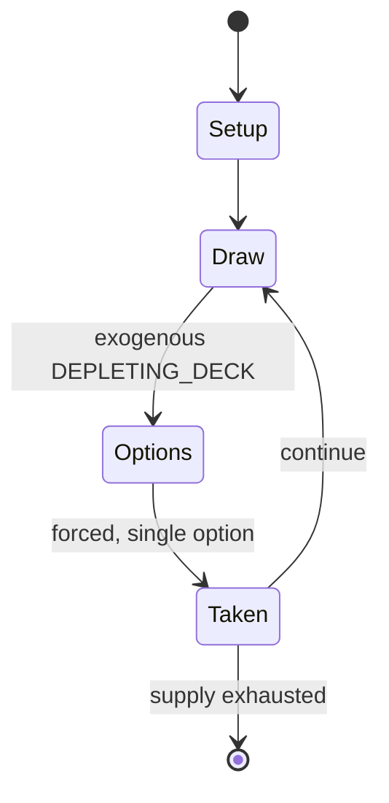

# Buraco

*card game*

`buraco` &nbsp; state: **DEEPENED** &nbsp; method: **heuristic**

## Found layer (recorded, not trusted)

| field | value |
| --- | --- |
| wikidata | Q1010167 |
| wikipedia | Buraco |
| genres (source) | -- |
| instance of (source) | card game |
| country of origin | -- |

## Declared layer (orders bench work)

| field | value |
| --- | --- |
| year created | -- |
| epoch | -- |
| region | -- |
| media | CARD, TILE |
| players | 4 |
| age band | -- |
| exogenous process | DEPLETING_DECK |
| loss shape | -- |
| live axes | DISCARD, ORDER |
| horizon | -- |
| scoring shape | SET_COLLECTION_CONVEX |
| information | -- |
| interaction | TEAM |
| turn structure | -- |
| tractability | EXACT_WITH_CUT |
| randomness | DECK_SHUFFLE |
| luck factor | 0.48 |
| rules complexity | 2.76 |
| strategic depth | 2.25 |
| novelty | 0.768 |
| solved status | -- |
| strategies | set_collection |
| algorithms | -- |

## Object model

```
Episode
  players      : 4
  turn_structure: ?
  horizon       : ?
  scoring       : SET_COLLECTION_CONVEX

Deck           -- ordered multiset, drawn without replacement
Hand           -- private multiset held by one player
DiscardPile    -- public accumulation of spent cards
TileBag        -- unordered draw source
Layout         -- placed tiles and their adjacencies
DiscardChoice  -- what is given up to satisfy a limit
Sequence       -- the permutation under the player's control
```

## State transition diagram



## Research item -- turn trace

```
# Buraco -- simulated turn events
# generated from the DECLARED vector, not from a rulebook.
# structure: exo=DEPLETING_DECK loss=None horizon=None scoring=SET_COLLECTION_CONVEX axes=DISCARD,ORDER

t=0    SETUP        players=4  pot=0  capacity=5
t=1    DRAW         p1 draw from deck -> outcome #6  (p=0.074)
t=2    FORCED       p1 single legal option taken (pot_gain=+1.0)
t=3    DISCARD      p1 discards to hand limit
t=4    DRAW         p1 draw from deck -> outcome #5  (p=0.079)
t=5    FORCED       p1 single legal option taken (pot_gain=+1.6)
t=6    DRAW         p1 draw from deck -> outcome #4  (p=0.117)
t=7    FORCED       p1 single legal option taken (pot_gain=+1.4)
t=8    DRAW         p1 draw from deck -> outcome #2  (p=0.104)
t=9    FORCED       p1 single legal option taken (pot_gain=+1.2)
t=10   DISCARD      p1 discards to hand limit
t=11   ENDTURN      turn passes to p2
t=12   DRAW         p2 draw from deck -> outcome #2  (p=0.143)
t=13   FORCED       p2 single legal option taken (pot_gain=+1.3)
t=14   ENDTURN      turn passes to p3
t=15   DRAW         p3 draw from deck -> outcome #2  (p=0.176)
t=16   FORCED       p3 single legal option taken (pot_gain=+1.8)
t=17   DRAW         p3 draw from deck -> outcome #2  (p=0.069)
t=18   FORCED       p3 single legal option taken (pot_gain=+1.1)
t=19   DISCARD      p3 discards to hand limit
t=20   DRAW         p3 draw from deck -> outcome #4  (p=0.262)
t=21   FORCED       p3 single legal option taken (pot_gain=+0.7)
t=22   DISCARD      p3 discards to hand limit
t=23   DRAW         p3 draw from deck -> outcome #2  (p=0.297)
t=24   FORCED       p3 single legal option taken (pot_gain=+1.8)
t=25   DRAW         p3 draw from deck -> outcome #6  (p=0.187)
t=26   FORCED       p3 single legal option taken (pot_gain=+1.2)

terminal: VARIABLE
```

## Conditions

| kind | threshold | effect | trigger |
| --- | --- | --- | --- |
| WIN | -- | -- | The first team to accumulate two thousand or more points wins the match. |
| TERMINATE | -- | -- | When the game is over, players with cards in their hand that were not melded count negatively against their team's total score for the match. |
| TERMINATE | -- | -- | If the game ends before any cards are played from a new hand picked up from the pot, then the player with that new hand will either: |
| TERMINATE | -- | -- | A player's turn ends when a card is discarded by that player from their hand. |
| TERMINATE | -- | -- | If a player plays all the cards in their hand and the team has taken a hand from the pot and the team has at least one clean meld (variation:or dirty meld), then the game ends. |
| TERMINATE | -- | -- | If the stock is empty and there are not any cards in the pot, then the game is over without either team earning additional points for ending that game. |
| TERMINATE | -- | -- | The game ends on either a clean run or dirty run. |
| BOUNDARY | -- | -- | A meld may have at most one wildcard, either a deuce or a joker. |
| BOUNDARY | -- | -- | If a team ends the game (If a player plays all the cards in their hand and the team has taken a hand from the pot and the team has at least one clean run), then that team adds one hundred points to their team's total sco |
| BOUNDARY | -- | -- | In this case, it is certain at least one team will need to subtract points from their total number earned for the match. |

## Source extract

Buraco is a Rummy-type card game in the Canasta family for four players in fixed partnerships in
which the aim is to lay down combinations in groups of cards of equal rank and suit sequences,
there being a bonus for combinations of seven cards or more. Buraco is a variation of Canasta
which allows both standard melds (groups of cards of the same value) as well as sequences (cards
in numerical order in the same suit). It originated from Uruguay and Argentina in the mid-1940s,
with apparent characteristics of simplicity and implications that are often unforeseeable and
absolutely involving. Its name derives from the "lunfardo", castellano word "buraco" which means
“hole”, applied to the minus score of any of the two partnerships. The game is also popular in
the Arab world, specifically in the Persian Gulf; where it is known as 'Baraziliya' (Brazilian).
Another popular variation of Buraco, called "Burraco" is played in Italy.   == Game rules as
played in the United States ==   === The Setup === Buraco is played with two 52-card decks of
standard playing cards, and 2 jokers for each deck, for a total of 108 cards. In Argentina it
can be played with a set of 106 Burako, Rummikub, or sim

<sub>Wikipedia, CC BY-SA. Retained as evidence for the structural
classification above. Every rule inferred from it is HYPOTHESIZED
until audited against a rulebook.</sub>
