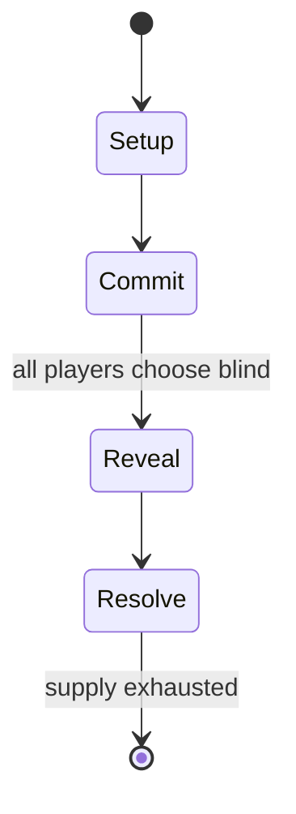

# Bushido

*tabletop role-playing game*

`bushido` &nbsp; state: **DEEPENED** &nbsp; method: **heuristic**

## Found layer (recorded, not trusted)

| field | value |
| --- | --- |
| wikidata | Q1017492 |
| wikipedia | Bushido (role-playing game) |
| genres (source) | tabletop role-playing game |
| instance of (source) | tabletop role-playing game |
| country of origin | United States |

## Declared layer (orders bench work)

| field | value |
| --- | --- |
| year created | 1980 |
| epoch | DIGITAL |
| region | NORTH_AMERICA |
| media | RPG |
| players | -- |
| age band | -- |
| exogenous process | -- |
| loss shape | -- |
| live axes | COMMIT_BLIND |
| horizon | -- |
| scoring shape | -- |
| information | SIMULTANEOUS |
| interaction | -- |
| turn structure | SIMULTANEOUS |
| tractability | SAMPLING_ONLY |
| randomness | HIDDEN_INFO, SIMULTANEOUS_CHOICE |
| luck factor | 0.35 |
| rules complexity | 3.71 |
| strategic depth | 2.0 |
| novelty | 0.6299 |
| solved status | -- |
| strategies | -- |
| algorithms | -- |

## Object model

```
Episode
  players      : ?
  turn_structure: SIMULTANEOUS
  horizon       : ?
  scoring       : ?

Character      -- persistent stat block owned by a player
GameMaster     -- adjudicating agent outside the scoring loop
Scenario       -- authored state the players traverse
SealedChoice   -- irrevocable choice made without observation
```

## State transition diagram



## Research item -- turn trace

```
# Bushido -- simulated turn events
# generated from the DECLARED vector, not from a rulebook.
# structure: exo=None loss=None horizon=None scoring=None axes=COMMIT_BLIND

t=0    SETUP        players=2  pot=0  capacity=8
t=1    FORCED       p1 single legal option taken (pot_gain=+0.9)
t=2    ENDTURN      turn passes to p2
t=3    FORCED       p2 single legal option taken (pot_gain=+1.5)
t=4    FORCED       p2 single legal option taken (pot_gain=+0.9)
t=5    FORCED       p2 single legal option taken (pot_gain=+1.5)
t=6    FORCED       p2 single legal option taken (pot_gain=+2.0)
t=7    FORCED       p2 single legal option taken (pot_gain=+1.3)
t=8    ENDTURN      turn passes to p1
t=9    FORCED       p1 single legal option taken (pot_gain=+1.8)
t=10   ENDTURN      turn passes to p2
t=11   FORCED       p2 single legal option taken (pot_gain=+0.6)
t=12   FORCED       p2 single legal option taken (pot_gain=+1.1)
t=13   ENDTURN      turn passes to p1
t=14   FORCED       p1 single legal option taken (pot_gain=+1.4)
t=15   FORCED       p1 single legal option taken (pot_gain=+0.6)
t=16   FORCED       p1 single legal option taken (pot_gain=+1.6)
t=17   FORCED       p1 single legal option taken (pot_gain=+1.6)
t=18   FORCED       p1 single legal option taken (pot_gain=+0.8)
t=19   ENDTURN      turn passes to p2
t=20   FORCED       p2 single legal option taken (pot_gain=+1.8)
t=21   ENDTURN      turn passes to p1
t=22   FORCED       p1 single legal option taken (pot_gain=+1.5)
t=23   FORCED       p1 single legal option taken (pot_gain=+1.8)
t=24   FORCED       p1 single legal option taken (pot_gain=+0.9)
t=25   FORCED       p1 single legal option taken (pot_gain=+1.0)
t=26   FORCED       p1 single legal option taken (pot_gain=+1.7)
t=27   ENDTURN      turn passes to p2

terminal: VARIABLE
```

## Source extract

Bushido is a Samurai role-playing game set in Feudal Japan, originally designed by Robert N.
Charrette and Paul R. Hume and published originally by Tyr Games, then Phoenix Games, and
subsequently by Fantasy Games Unlimited. The setting for the game is a land called Nippon, and
characters adventure in this heroic, mythic, and fantastic analogue of Japan's past. It is
thematically based on Chanbara movies, such as those made by Akira Kurosawa, in which the heroes
are modestly superhuman but not extraordinarily so.   == Overview == The Bushido role-playing
game was originally published in 1979 by Tyr Games (which quickly went out of business) but was
more widely released in 1980 by Phoenix Games as a boxed set.  This edition included a map of
Nippon, a tri-fold screen, a character sheet, Book I, The Heroes of Nippon, the Players
Guidebook and Book II, The Land of Nippon, the Gamesmaster's Guidebook. All illustrations in the
original boxed set are copyright by Robert N. Charrette. The game is now sold as a single book
in which the two original books are combined (otherwise unaltered). Bushido players define
characters with a series of attributes, skills, professions, and levels. The pr

<sub>Wikipedia, CC BY-SA. Retained as evidence for the structural
classification above. Every rule inferred from it is HYPOTHESIZED
until audited against a rulebook.</sub>
