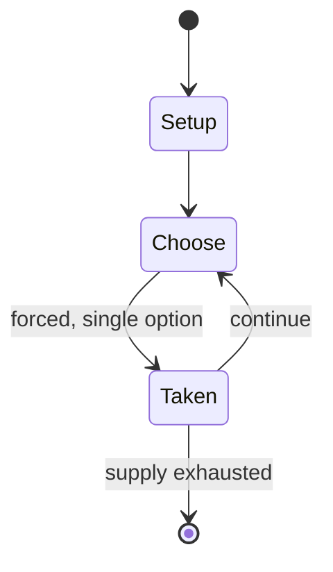

# Button, button, who's got the button?

`button_button_who_s_got_the_button` &nbsp; state: **DEEPENED** &nbsp; method: **heuristic**

## Found layer (recorded, not trusted)

| field | value |
| --- | --- |
| wikidata | Q982440 |
| wikipedia | Button, button, who's got the button? |
| genres (source) | -- |
| instance of (source) | -- |
| country of origin | -- |

## Declared layer (orders bench work)

| field | value |
| --- | --- |
| year created | -- |
| epoch | -- |
| region | -- |
| media | - |
| players | -- |
| age band | CHILD |
| exogenous process | -- |
| loss shape | -- |
| live axes | - |
| horizon | -- |
| scoring shape | -- |
| information | -- |
| interaction | -- |
| turn structure | -- |
| tractability | SAMPLING_ONLY |
| randomness | -- |
| luck factor | 0.35 |
| rules complexity | 1.77 |
| strategic depth | 2.0 |
| novelty | 0.0914 |
| solved status | -- |
| strategies | -- |
| algorithms | -- |

## Object model

```
Episode
  players      : ?
  turn_structure: ?
  horizon       : ?
  scoring       : ?

State          -- opaque; no medium or axis evidence was found
Player         -- an agent that selects among legal successors
```

## State transition diagram



## Research item -- turn trace

```
# Button, button, who's got the button? -- simulated turn events
# generated from the DECLARED vector, not from a rulebook.
# structure: exo=None loss=None horizon=None scoring=None axes=-

t=0    SETUP        players=2  pot=0  capacity=6
t=1    FORCED       p1 single legal option taken (pot_gain=+0.5)
t=2    FORCED       p1 single legal option taken (pot_gain=+1.5)
t=3    ENDTURN      turn passes to p2
t=4    FORCED       p2 single legal option taken (pot_gain=+0.9)
t=5    ENDTURN      turn passes to p1
t=6    FORCED       p1 single legal option taken (pot_gain=+1.0)
t=7    FORCED       p1 single legal option taken (pot_gain=+0.7)
t=8    ENDTURN      turn passes to p2
t=9    FORCED       p2 single legal option taken (pot_gain=+1.8)
t=10   FORCED       p2 single legal option taken (pot_gain=+0.6)
t=11   FORCED       p2 single legal option taken (pot_gain=+0.6)
t=12   FORCED       p2 single legal option taken (pot_gain=+0.9)
t=13   FORCED       p2 single legal option taken (pot_gain=+1.2)
t=14   FORCED       p2 single legal option taken (pot_gain=+1.5)
t=15   ENDTURN      turn passes to p1
t=16   FORCED       p1 single legal option taken (pot_gain=+1.9)
t=17   ENDTURN      turn passes to p2
t=18   FORCED       p2 single legal option taken (pot_gain=+0.7)
t=19   FORCED       p2 single legal option taken (pot_gain=+0.8)
t=20   ENDTURN      turn passes to p1
t=21   FORCED       p1 single legal option taken (pot_gain=+0.7)
t=22   FORCED       p1 single legal option taken (pot_gain=+0.5)
t=23   FORCED       p1 single legal option taken (pot_gain=+1.9)
t=24   ENDTURN      turn passes to p2
t=25   FORCED       p2 single legal option taken (pot_gain=+1.2)
t=26   FORCED       p2 single legal option taken (pot_gain=+0.8)
t=27   ENDTURN      turn passes to p1

terminal: VARIABLE
```

## Conditions

| kind | threshold | effect | trigger |
| --- | --- | --- | --- |
| WIN | -- | -- | The first one to reach the top step wins the game. |

## Source extract

Button, button, who's got the button is a children's game of ingenuity where players form a
circle with their hands out, palms together. One child, called the leader or 'it', takes an
object such as a button and goes around the circle. In one person's hands they drop the button,
though they continue to put their hands in the others' so that no one knows where the button is
except for the giver and receiver. The button may not be shown throughout the passing, if it is
then the game has to restart. The leader, or all the children in the circle, says "Button,
button, who's got the button?" and then each child in the circle guesses. The child guessing
replies with their choice, e.g. "Billy has the button!" Once the child with the button is
finally guessed, that child is the one to distribute the button and start a new round.   ==
Alternate versions ==   === Passing === A second similar version has the child who is "it" stand
in the center of the circle. The button is then passed behind the backs of the children in the
circle, stopping at random. "It" tries to guess where the button is and once the button is found
takes his or her place in the circle. Whoever had the button then becomes

<sub>Wikipedia, CC BY-SA. Retained as evidence for the structural
classification above. Every rule inferred from it is HYPOTHESIZED
until audited against a rulebook.</sub>
